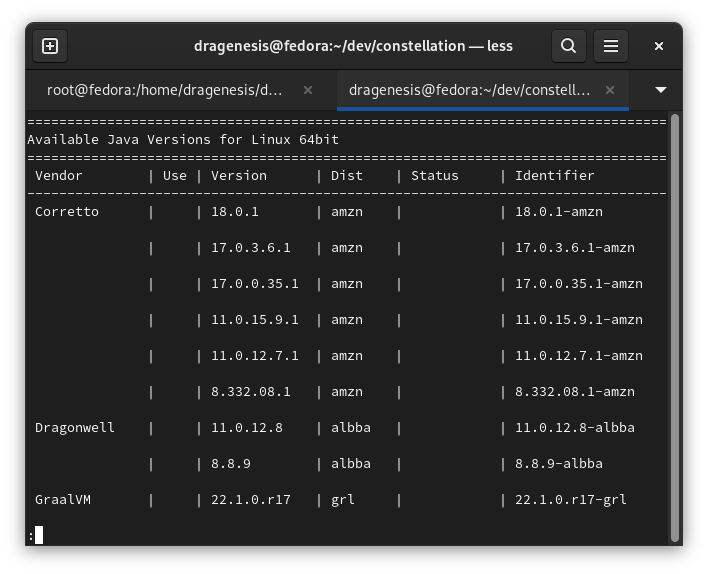
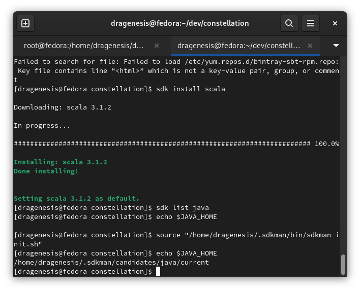
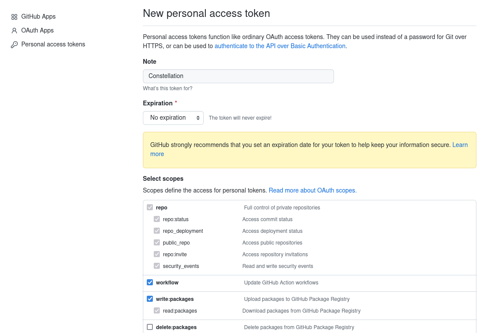
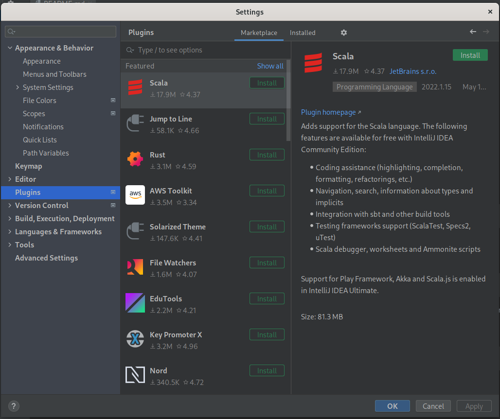
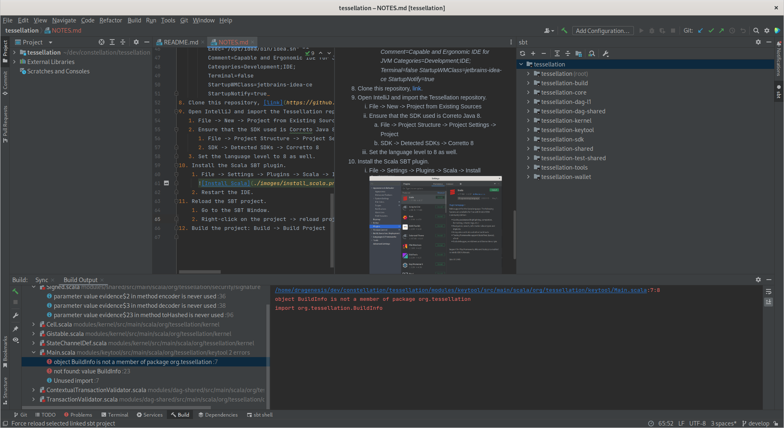

# Install Guide

**Date**: May 24, 2022

**Platform**: Fedora 35 64-bit

1. Install SDKMan, [link](https://sdkman.io/install)
   1. Run in a terminal: _curl -s "https://get.sdkman.io" | bash_
   2. Run in a terminal: _source "$HOME/.sdkman/bin/sdkman-init.sh"_
   3. Run in a terminal to verify the installation: _sdk version_
2. Install Correto Java 8, [link](https://sdkman.io/usage).
   1. List the versions available and find the appropriate one: _sdk list java_
      
   2. Install it: _sdk install java 8.332.08.1-amzn_
   3. If the _JAVA_HOME_ environment variable is not set, source the _sdkman-init.sh_ again: _source "$HOME/.sdkman/bin/sdkman-init.sh"_
      
3. Install Scala: _sdk install scala_
4. Install SBT: _sdk install sbt_
5. Install Docker Desktop, per [link](https://docs.docker.com/desktop/linux/install/fedora/).
   1. Setup the Docker repository, per [link](https://docs.docker.com/engine/install/fedora/#set-up-the-repository)
      1. _sudo dnf -y install dnf-plugins-core_
      2. _sudo dnf config-manager --add-repo https://download.docker.com/linux/fedora/docker-ce.repo_
   2. Download the Docker Desktop RPM package [link](https://docs.docker.com/desktop/release-notes/)
   3. Install the package: _sudo dnf install ./docker-desktop-<version>-<arch>.rpm_
   4. Enable Kubernetes.
      1. Start Docker Desktop via the Start Menu icon.
      2. Click on the **Gear** icon located in the top bar.
      3. Select **Kubernetes** in the left menu.
      4. Check the **Enable Kubernetes** checkbox.
      5. Click on the **Apply & Restart** button.
6. Do the post-install steps for Docker, [link](https://docs.docker.com/engine/install/linux-postinstall/)
   1. Enable the docker services and restart the machine: `sudo systemctl enable docker.service containerd.service`
   2. Add your user to the *docker* group and restart the machine: `sudo usermod -a -G docker < username >`
7. Setup Skaffold
   1. Download the standalone library [link](https://skaffold.dev/docs/install/#standalone-binary)
   2. Allow the binary to be executed: _chmod a+x skaffold-<version>-<arch>_
8. Install IntelliJ.
   1. Download the community version of IntelliJ, [link](https://www.jetbrains.com/idea/download)
   2. Extract it: _tar -xvzf idealC-<version>.tar.gz ideaIC-<version>_
   3. Make an _idea_ directory in _/opt_ and copy the extracted contents into it: _sudo mkdir /opt/idea; sudo cp ideaIC-<version>/idea-IC-<version>/\* /opt/idea_
   4. Link the executible into _/bin_: _sudo ln -sf /opt/idea/bin/idea.sh /bin/intellijidea-ce_
   5. Create a desktop entry for the IDE.
      1. `sudo nano /usr/share/applications/intellij-ce.desktop`
```
[Desktop Entry]
Version=1.0
Type=Application
Name=IntelliJ IDEA Community Edition
Icon=/opt/idea/bin/idea.svg
Exec="/opt/idea/bin/idea.sh" %f
Comment=Capable and Ergonomic IDE for JVM
Categories=Development;IDE;
Terminal=false
StartupWMClass=jetbrains-idea-ce
StartupNotify=true
```
8. Generate a Github Personal Access Token.
   1. Log in to your account.
   2. Go to your account's **Settings**.
   3. Click on **Developer Settings** on the left navigation bar.
   4. Click on **Personal Access Token**.
   5. Click on the **Generate new token** button.
   6. Give the token a descriptive name (e.g., Constellation) and no expiration date. Select all the scopes except for the delete ones. Generate the token.
   
9. Set your global SBT configurations.
   1. Create the file *~/.sbt/1.0/github.sbt*.
   2. Copy into it below and replace *"--- Token ---"* with the Personal Access Token you generated:
```
      credentials +=
      Credentials(
      "Github Package Registry",
      "maven.pkg.github.com",
      "cngo-github",
      "--- Token ---")

githubTokenSource := TokenSource.GitConfig("github.token")
```
10. Create the file *~/.sbt/1.0/plugins/plugins.sbt* and copy into it: `addSbtPlugin("com.codecommit" % "sbt-github-packages" % "0.5.3")`
11. Clone this repository, [link](https://github.com/Constellation-Labs/tessellation).
12. Open IntelliJ and import the Tessellation repository.
    1. File -> New -> Project from Existing Sources
    2. Ensure that the SDK used is Correto Java 8.
       1. File -> Project Structure -> Project Settings -> Project
       2. SDK -> Detected SDKs -> Corretto 8
    3. Set the language level to 8 as well.
13. Install the Scala SBT plugin.
    1. File -> Settings -> Plugins -> Scala -> Install
       
    2. Restart the IDE.
14. Reload the SBT project.
    1. Go to the SBT Window.
       
    2. Right-click on the project -> reload project
15. Build the project: _Build -> Build Project_
