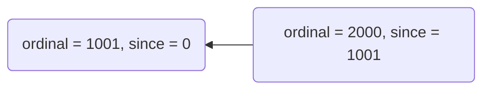
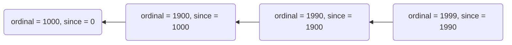

# 10. Reducing global snapshot size

Date: 2022-05-19

## Status

Proposed

## Context

Currently, the `GlobalSnapshotInfo` type represents an aggregated view of:

- balance,
- last transaction reference,
- last state channel snapshot hash

for every address ever used with a ledger.

Addresses that were not used with a ledger have default values implicitly assumed: 
- `Balance.empty`,
- `TransactionReference.empty`,
- `Hash.empty`.

The problem is that every single `GlobalSnapshot` contains all this data for all addresses ever used. This is suboptimal
because majority of this data never changes between two consecutive snapshots, and it causes an increasing-only size of
snapshots. In the long run this can cause issues with storage, network and memory.

## Decision

Replacing existing `GlobalSnapshotInfo` type with a type `GlobalSnapshotInfos` which is a product type of:
1. `SnapshotInfo` - Contains the same fields as the `GlobalSnapshotInfo` type and represents overrides to the 
    `balances`, `lastTransactionRef` and `lastStateChannelSnapshotHashes` that are applied by this snapshot. 
    Missing values for an address should be treated as lack of overrides - the value from previous snapshot still holds.
      
2. `AggregatedInfo` - Contains the same fields as `SnapshotInfo` plus one additional field `since` of type 
    `GlobalSnapshotReference` which contains a reference (ordinal and hash) to snapshot from which the aggregation 
    starts. The end point of aggregation is this snapshot. Aggregation range is inclusive on both ends. Missing values
    have similar meaning as in `SnapshotInfo` - lack of overrides - the values from snapshot previous to `since`
    still holds. If `since.ordinal` is equal to this snapshot ordinal, both `SnapshotInfo` and `AggregatedInfo` contain 
    the same data.

```json
{
  "ordinal": 1500,
  "infos": {
    "snapshot": {
      "balances": {},
      "lastTransactionRefs": {},
      "lastSnapshotHashes": {}
    },
    "aggregated": {
      "since": {
        "ordinal": 1001,
        "hash": "830c..."
      },
      "balances": {},
      "lastTransactionRefs": {},
      "lastSnapshotHashes": {}
    }
  }
}
```

### Aggregation schemes

One of the advantages of this representation are flexible aggregation schemes.

Simple scheme:
1. if snapshot satisfies `ordinal mod 1000 == 1` then aggregate since 0 (genesis)
2. otherwise aggregate since last snapshot satisfying predicate from pt. 1


More complicated scheme:
1. if snapshot satisfies `ordinal mod 1000 == 0` then aggregate since 0 (genesis)
2. if snapshot satisfies `ordinal mod 100 == 0` then aggregate since last snapshot satisfying predicate from pt. 1
3. if snapshot satisfies `ordinal mod 10 == 0` then aggregate since last snapshot satisfying predicate from pt. 2
4. otherwise, aggregate since last snapshot satisfying predicate from pt. 3


You may notice that in the **Simple scheme** the first predicate is `ordinal mod 1000 == 1` in contrast to
`ordinal mod 1000 == 0` from the **More complicated scheme**, that is because in the first scheme we 
do not want to aggregate the genesis (snapshot with ordinal 0) in first 1k snapshots. The genesis will be aggregated in
a snapshot with ordinal 1, but not in 2, 3, ..., 1000. It may save some resources if the genesis snapshot is large. 

### Aggregated view resolution

Algorithm for resolving an aggregated view of all data - from the genesis to the latest snapshot:
1. Variable initialization:
    * `snapshot := <latest-snapshot>`
    * `acc := snapshot.info.aggregated`
2. Loop:
    * if `snapshot.info.aggregated.since.ordinal` is equal to `0` return `acc`
    * otherwise, get the snapshot with ordinal `snapshot.info.aggregated.since.ordinal` 
    * if obtained snapshot hash is equal to `snapshot.info.aggregated.since.hash`, assign it to `snapshot`
    * otherwise, raise an error
    * combine `acc` with `snapshot.info.aggregated` and assign it to `acc`
    * go to the next iteration

### Example of first 2000 snapshots

This example uses a **Simple scheme** presented in section [Aggregation schemes](#aggregation-schemes). 

Simplifications:
* all snapshots that are not listed below didn't contain any transactions
* rewards were 0 for all snapshots
* some fields were omitted for clarity

Snapshots:
- [Snapshot 0 (genesis)](#snapshot-0)
- [Snapshot 1](#snapshot-1)
- [Snapshot 2](#snapshot-2)
- [Snapshot 1000](#snapshot-1000)
- [Snapshot 1001](#snapshot-1001)
- [Snapshot 1002](#snapshot-1002)
- [Snapshot 2000](#snapshot-2000)
- [Snapshot 2001](#snapshot-2001)

#### Snapshot 0

```json
{
  "ordinal": 0,
  "blocks": [],
  "infos": {
    "snapshot": {
      "balances": {
        "A": 20,
        "B": 20
      }
    },
    "aggregated": {
      "since": {
        "ordinal": 0,
        "hash": "0000..."
      },
      "balances": {
        "A": 20,
        "B": 20
      }
    }
  }
}
```

#### Snapshot 1

```json
{
  "ordinal": 1,
  "blocks": [
    {
      "transactions": [
        {
          "source": "B",
          "destination": "C",
          "amount": 10
        }
      ]
    }
  ],
  "infos": {
    "snapshot": {
      "balances": {
        "B": 10,
        "C": 10
      }
    },
    "aggregated": {
      "since": {
        "ordinal": 0,
        "hash": "8f17..."
      },
      "balances": {
        "A": 20,
        "B": 10,
        "C": 10
      }
    }
  }
}
```

#### Snapshot 2

```json
{
  "ordinal": 2,
  "blocks": [
    {
      "transactions": [
        {
          "source": "C",
          "destination": "D",
          "amount": 10
        }
      ]
    }
  ],
  "infos": {
    "snapshot": {
      "balances": {
        "C": 0,
        "D": 10
      }
    },
    "aggregated": {
      "since": {
        "ordinal": 1,
        "hash": "3c12..."
      },
      "balances": {
        "B": 10,
        "C": 0,
        "D": 10
      }
    }
  }
}
```

#### Snapshot 1000

```json
{
  "ordinal": 1000,
  "blocks": [
    {
      "transactions": [
        {
          "source": "D",
          "destination": "E",
          "amount": 10
        }
      ]
    }
  ],
  "infos": {
    "snapshot": {
      "balances": {
        "D": 0,
        "E": 10
      }
    },
    "aggregated": {
      "since": {
        "ordinal": 1,
        "hash": "3c12..."
      },
      "balances": {
        "B": 10,
        "C": 0,
        "D": 0,
        "E": 10
      }
    }
  }
}
```

#### Snapshot 1001

```json
{
  "ordinal": 1001,
  "blocks": [
    {
      "transactions": [
        {
          "source": "E",
          "destination": "F",
          "amount": 10
        }
      ]
    }
  ],
  "infos": {
    "snapshot": {
      "balances": {
        "E": 0,
        "F": 10
      }
    },
    "aggregated": {
      "since": {
        "ordinal": 0,
        "hash": "8f17..."
      },
      "balances": {
        "A": 20,
        "B": 10,
        "C": 0,
        "D": 0,
        "E": 0,
        "F": 10
      }
    }
  }
}
```

#### Snapshot 1002

```json
{
  "ordinal": 1002,
  "blocks": [
    {
      "transactions": [
        {
          "source": "F",
          "destination": "G",
          "amount": 10
        }
      ]
    }
  ],
  "infos": {
    "snapshot": {
      "balances": {
        "F": 0,
        "G": 10
      }
    },
    "aggregated": {
      "since": {
        "ordinal": 1001,
        "hash": "93ac..."
      },
      "balances": {
        "E": 0,
        "F": 0,
        "G": 10
      }
    }
  }
}
```

#### Snapshot 2000

```json
{
  "ordinal": 2000,
  "blocks": [],
  "infos": {
    "snapshot": {},
    "aggregated": {
      "since": {
        "ordinal": 1001,
        "hash": "93ac..."
      },
      "balances": {
        "E": 0,
        "F": 0,
        "G": 10
      }
    }
  }
}
```

#### Snapshot 2001

```json
{
  "ordinal": 2001,
  "blocks": [],
  "infos": {
    "snapshot": {},
    "aggregated": {
      "since": {
        "ordinal": 0,
        "hash": "8f17..."
      },
      "balances": {
        "A": 10,
        "B": 10,
        "C": 0,
        "D": 0,
        "E": 0,
        "F": 0,
        "G": 10
      }
    }
  }
}
```


## Consequences

- Initial download of `GlobalSnapshot` has to be adjusted on both L0 and L1.
- Properties of `GlobalSnapshot` that were previously accessed by the block explorer under `info` path have to updated
 to `infos.snapshot`.

