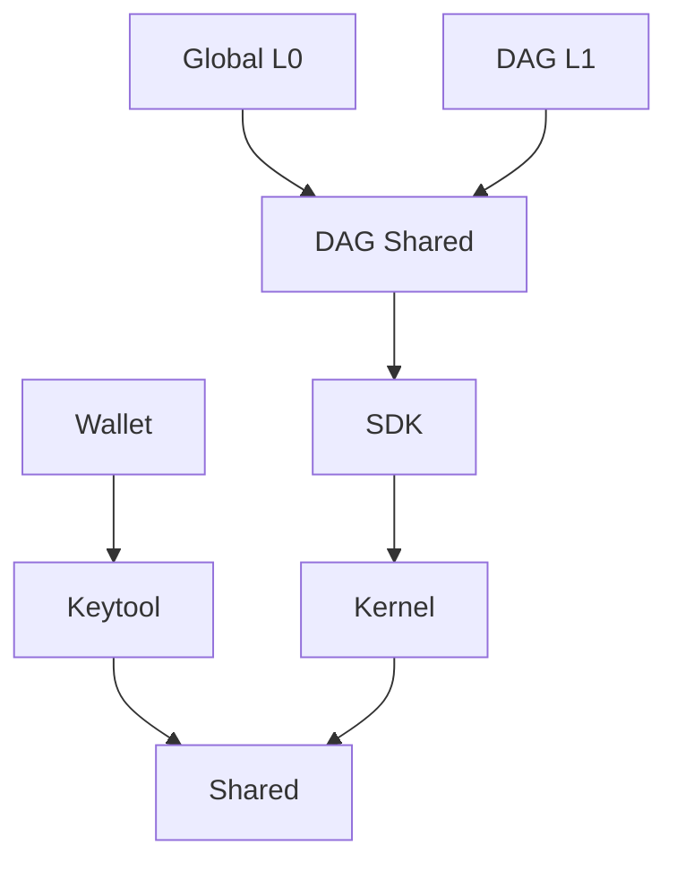
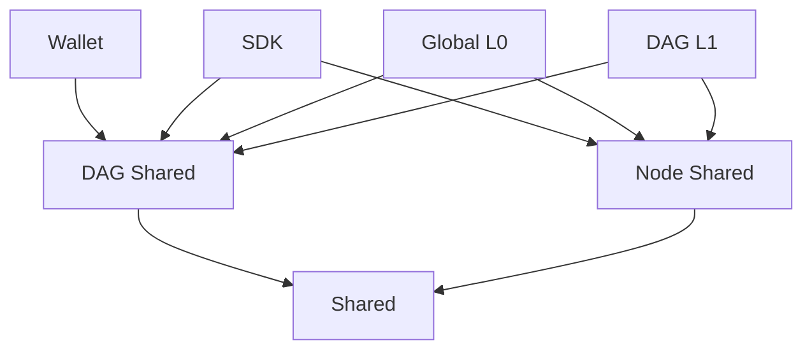

# 12. Modules' structure

Date: 2022-12-28

## Status

Accepted

## Context

The existing structure of tessellation modules was mixed, hence hard to maintain.

- `shared` contains both library extensions and tessellation schema,
- `keytool` contains key-pair generator and exposes key-related operations,
- `wallet` contains operations related to creating transactions (but also some parts that should be shared for other modules),
- `kernel` contains part of state channels (hylomorphism's idea),
- `sdk` contains all the things shared between Global L0 and DAG L1, but not the $DAG itself,
- `dag-shared` contains all the things shared between Global L0 and DAG L1 related to $DAG,
- `core` is the Global L0 module (but also contains state channels that must be extracted to be reused in other modules),
- `dag-l1` is the DAG L1 module ($DAG token Layer 1).

Furthermore, dependencies were partially explicitly declared and partially transient. After some time, it became unmaintainable.

The second (and main) reason for restructuring modules is the fact that 3rd parties cannot use the SDK module in the current form. It does not expose all required operations, so internal modules were used directly, leaking the project's internal structure and locking further internal changes.

## Decision

`keytool` module will be split into: operations/functions that we will put to `shared` and exposing an app that will be combined into `wallet` module.
Then, all the things related to node operations would be kept in `node-shared` module (including gossip protocol, consensus, etc.). This leads to emptying the `sdk` module, so we will be able to implement the `sdk` module as a proxy between the external world and the internal tessellation structure. `sdk` module should reexpose all necessary operations to be used by 3rd parties. For example - to create a keypair, global L0 can use the `shared` module directly, but 3rd party will use the `sdk` module that will reexpose keypair creation function. That way, the internal structure of tessellation will be kept hidden behind the facade.

Modules dependencies and libraries cannot be transient. We will use `% Optional` scope for all internal modules.

- `shared` - base internal library containing `GlobalSnapshot` schema as well as extensions for 3rd party libraries
- `dag-shared` - an internal library containing $DAG-related classes (like $DAG block or $DAG transaction)
- `node-shared` - an internal library containing all the classes necessary to launch a node (like base TessellationIO app, gossip protocol, cluster management or joining algorithm)
- `wallet` - an app for creating transactions and managing keys
- `global-l0` - the Global L0 node app (renamed from `core`)
- `dag-l1` - the DAG L1 node app (remains unchanged)
- `sdk` - a library exposing a set of functionalities as a Tessellation public interface (facade) for 3rd parties
- `tools` - an internal app used for generating transactions, state channel snapshots and other things needed for development, maintenance or testing

## Consequences

- Dependencies of internal modules are simplified and well-maintained,
- SDK can be implemented as a facade, so that 3rd parties can use it as a single dependency.
