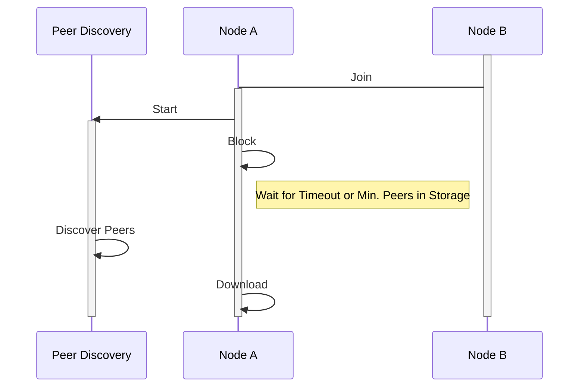

# 13. Delayed Download

Date: 2023-04-19

## Status

Accepted

## Context

In order to increase security, it is desirable to observe only peers that are on the majority fork.
This can be determined by querying discovered peers for their latest ordinal values prior to
selecting one to observe. Afterwards, the majority ordinal can be determined and each peer is queried
again for the `Signed[GlobalSnapshot]` corresponding to that ordinal. The hashes of the snapshots
are compared to determine the most prevelant hash among the peers. A peer with that snapshot is then
randomly chosen to be the one to be observed.

Right now, the peer discovery process is a non-terminating process that runs alongside the main
process. It listens to and processes peers that are put in a queue. Therefore, there is only 1 known
peer at the start of observation 99% of the time. In other words, determining the majority fork from
a list of 1 is not useful. So, it is imperative that there be multiple peers to choose from when
choosing one to observe.

## Decision

A simple solution is to delay the start of
observation until a certain number of peers have been discovered or until a timeout is reached. This
solution increases the odds that there will be multiple peers discovered at the start of
observation. For the initial
implementation, we will have a peer count threshold of 50 and a timeout of 15 seconds. This way, the
peer discovery process itself is unmodified.

The New Joining-Peer Discovery-Download Flow

Simply put, when `download` is called, we will block the
call to start observation until there are 50 peers in the Peer storage or until 15 seconds have
elapsed.

## Consequences

Adding a wait to the node joining process after joining and before download, will lengthen
that node joining process by, at most, the _timeout_ amount. For that increased time, we gain some
security by being able to determine the majority fork with higher confidence instead of completely
trusting the peer provided at the beginning of the bootstrap process.
