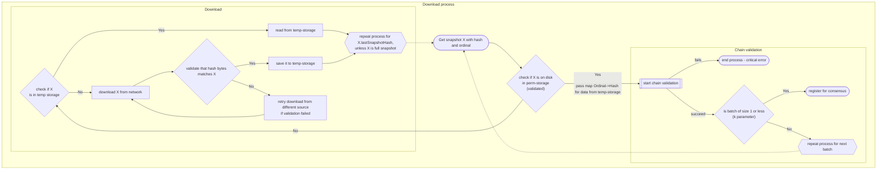

# 14. Download for incremental snapshots

Date: 2023-04-18

## Status

Accepted

## Context

Currently, the nodes joining the network are required to download the latest state of the network. However, in case of an extended absence, the node needs to have all incremental snapshots present on disk to determine the latest state of the network. This change requires a modification to the download process, as nodes need to fetch all missing incremental snapshots.

## Decision

After careful consideration of the current network state and the challenges of ensuring consistent and accurate data across all nodes, we have decided to modify the download process for joining nodes to fetch all missing incremental snapshots. This decision is based on the understanding that nodes need to have a complete and validated chain of incremental snapshots to determine the state of the network, especially when they have been absent for an extended period.

The modified download process involves several steps to ensure that nodes have a complete and validated chain of incremental snapshots. The first step is to determine the starting point by querying a peer node for the latest snapshot hash and ordinal. 

```mermaid
flowchart TD
  subgraph Determine starting point
    A[Get latest snapshot from the Joinee]
  end
  subgraph Download process
	B[Get snapshot with hash and ordinal X=(aaaa, 1234)]
  end
  A --> |latest snapshot: (aaaa, 1234)| B
```

The node then checks if it has all the incremental snapshots needed to reach the starting point and if not it begins downloading missing snapshots recursively from the latest snapshot to the genesis. All validated snapshots are stored in permanent storage, which contains a correct and validated chain of incremental snapshots. Temporary storage may contain potentially invalid or conflicting snapshots.

Once all the incremental snapshots have been downloaded, the node performs chain validation by applying subsequent incremental snapshots from the genesis to the latest snapshot to build the network state and validate the chain. If the latest snapshot on the network has been updated and the batch is not small enough (determined by the `k` parameter), the node repeats the download process for the next batch of snapshots. Otherwise, it can register for consensus.



This modified download process ensures that all joining nodes have a complete and validated chain of incremental snapshots and are able to determine the latest state of the network accurately. Although the initial node joining process may take longer, it ensures consistency and accuracy across all nodes and mitigates the risk of inconsistent and invalid data.

## Consequences

The modified download process for incremental snapshots will result in a longer initial node joining process. Fetching all missing incremental snapshots (and potentially the entire history in the worst case) will take longer than downloading a single latest snapshot.
