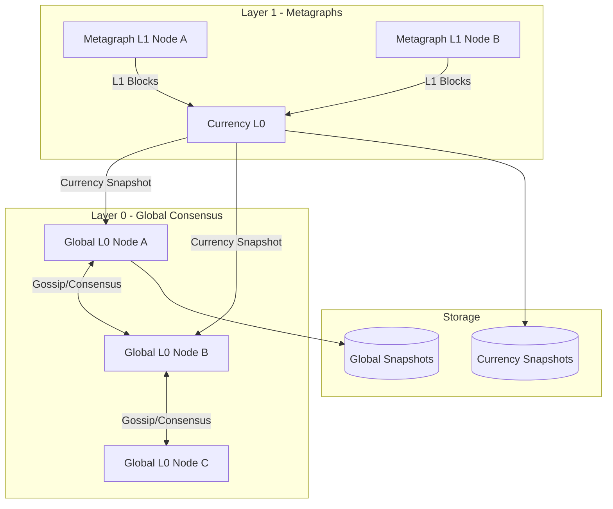
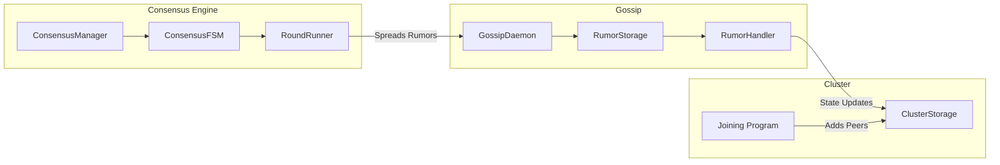
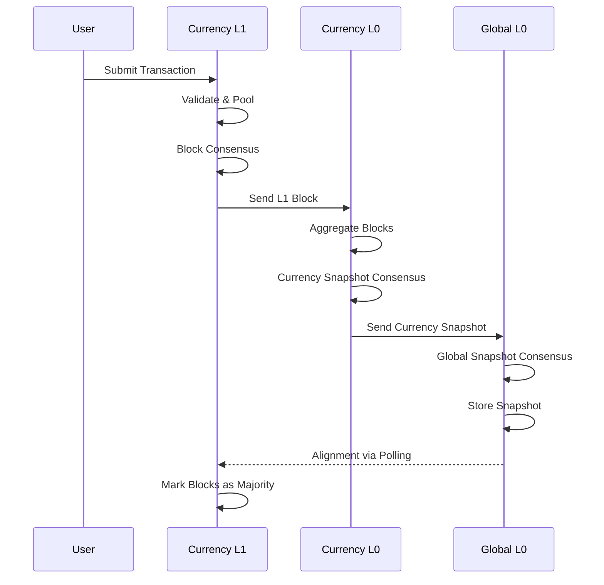
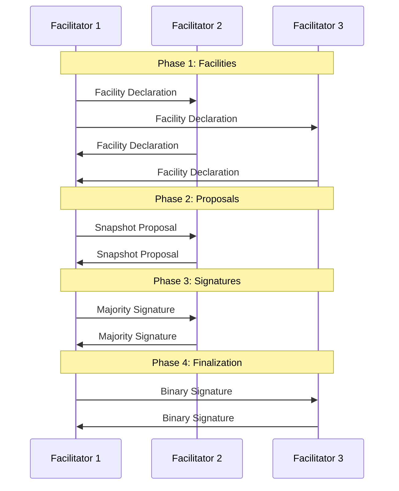

# Codebase Map

> Auto-generated by Cartographer. Last mapped: 2026-05-05 (manual touch-up: fork-recovery-followup branch new files).
>
> **Consensus, snapshot, and MPT sections manually refreshed 2026-06-16 for the v4.x rewrite** (tiers, certificates, quorum shrink, self-health, view-from-time, ordinal-gating, MPT savepoint/sync). See [Subsystem Deep-Dives](#subsystem-deep-dives) for the authoritative per-mechanism docs; treat [docs/consensus/README.md](consensus/README.md) as the definitive consensus reference.

## System Overview

Tessellation is the Constellation Network Node Software - a DAG-based distributed ledger with Layer 0 (L0) and Layer 1 (L1) validators. The system uses a hierarchical consensus model where L1 metagraphs create blocks that are aggregated into global snapshots by L0.



## Subsystem Deep-Dives

The detailed, code-accurate references for the rewritten subsystems live under `docs/`. This map is a navigation layer; the docs below are authoritative.

**Consensus** (`docs/consensus/`)
- [README.md](consensus/README.md) - the definitive consensus reference (round FSM, declarations, B1/B2 admission/eviction, recovery)
- [committee-tiers.md](consensus/committee-tiers.md) - Core/Tier-1/Witness committees, active-set admission, witness pool, chronic classification
- [timeout-certificate.md](consensus/timeout-certificate.md) - HotStuff-aligned Timeout Certificate (Track-2 view advance)
- [quorum-shrink.md](consensus/quorum-shrink.md) - QuorumDenominatorShrink (v33) liveness rung
- [signature-grace.md](consensus/signature-grace.md) - post-finalization signature grace
- [self-health-throttle.md](consensus/self-health-throttle.md) and [view-from-time-anchor.md](consensus/view-from-time-anchor.md) - leader-pool health gating and the pacemaker time anchor

**State / MPT** (`docs/mpt/`)
- [README.md](mpt/README.md), [architecture.md](mpt/architecture.md), [integration.md](mpt/integration.md) - Merkle Patricia Trie design and snapshot integration
- [savepoint-and-sync.md](mpt/savepoint-and-sync.md) - savepoint/restore, `syncFull`, content-aware `syncFullIfNeeded` divergence guard, order-independent root

**Operations / launch** (`docs/operations/`, `docs/release/`)
- [fields-added-ordinals.md](operations/fields-added-ordinals.md) - ordinal-gating, the no-env-gating principle, GSI dust sweep
- [consensus-config-reference.md](operations/consensus-config-reference.md) - operator config knobs + `CL_` overrides
- [v4-launch-runbook.md](release/v4-launch-runbook.md) - coordinated cold restart + gate-ordinal checklist

**Decisions**: [docs/adr/](adr/) (ADRs 0001-0015; 0005/0006 are superseded by the tier/committee rewrite).

## Directory Structure

```
tessellation/
├── modules/
│   ├── shared/           # Core data structures, crypto, serialization (164k tokens)
│   ├── kernel/           # Recursion schemes (Droste), category theory (4k tokens)
│   ├── keytool/          # Key management, PKCS12 keystores (4k tokens)
│   ├── wallet/           # CLI wallet operations (6k tokens)
│   ├── node-shared/      # P2P networking, consensus, gossip (419k tokens)
│   ├── dag-l0/           # Layer 0 validator - global consensus (157k tokens)
│   ├── dag-l1/           # Layer 1 validator - metagraph consensus (83k tokens)
│   ├── currency-l0/      # Currency metagraph L0 logic (59k tokens)
│   ├── currency-l1/      # Currency metagraph L1 logic (41k tokens)
│   ├── rosetta/          # Blockchain data standardization API (17k tokens)
│   ├── sdk/              # SDK for metagraph development (0.5k tokens)
│   ├── tools/            # CLI utilities for testing (4k tokens)
│   └── test-shared/      # Test utilities and generators (0.8k tokens)
├── docker/               # Docker configuration (27k tokens)
├── kubernetes/           # K8s deployment manifests (38k tokens)
├── .github/              # CI/CD workflows (77k tokens)
├── doc/                  # API documentation (82k tokens)
└── project/              # SBT build configuration (4k tokens)
```

## Module Guide

### shared (Core)

**Purpose**: Foundation layer with core data structures, cryptography, and serialization.

**Entry points**: All other modules depend on this.

**Key files**:
| File | Purpose |
|------|---------|
| `schema/transaction.scala` | Transaction types with amount, fee, parent reference |
| `schema/Block.scala` | Block structure with DAG parent references |
| `schema/GlobalSnapshot.scala` | Full snapshot with balances, blocks, state channels |
| `schema/GlobalIncrementalSnapshot.scala` | Delta snapshots between ordinals; carries `peerHistory: Option[ConsensusOperationalState]` (committee/tier/penalty state surviving cold restart) |
| `schema/ConsensusOperationalState.scala` | Signed per-peer operational record (quality, penalty, tier, view-changes) re-derived identically by validators |
| `schema/address.scala` | DAG address format with checksum validation |
| `security/Hash.scala` | SHA-256 hashing with cache |
| `security/signature/Signed.scala` | Multi-signature support with ECDSA |
| `security/mpt/` | Merkle Patricia Trie primitives (nodes, proofs, commitments) |
| `schema/mpt/MptStore.scala` | Operational MPT store: savepoint/restore + `syncFull` / content-aware `syncFullIfNeeded` divergence guard (see [mpt/savepoint-and-sync](mpt/savepoint-and-sync.md)) |
| `kryo/KryoSerializer.scala` | Binary serialization |
| `json/JsonSerializer.scala` | JSON serialization with Brotli compression |

**Key patterns**:
- Newtype pattern for zero-cost type wrappers
- Refined types for compile-time validation (`PosLong`, `NonNegLong`)
- `Fiber[Reference, Data]` trait for reference/data separation
- Derevo derivations for automatic typeclass instances

---

### node-shared (P2P & Consensus)

**Purpose**: Core distributed systems infrastructure shared by L0 and L1.

**Entry points**: `app/NodeShared.scala`, `modules/SharedServices.scala`

**Key files**:
| File | Purpose |
|------|---------|
| `infrastructure/consensus/state/ConsensusState.scala` | Per-round FSM state: `roundStartFacilitators` (canonical committee), `coreFacilitators` (quorum denominator), tier1/eligible sets, `leader`, `viewNumber`, certificate + self-health fields (see [committee-tiers](consensus/committee-tiers.md)) |
| `infrastructure/consensus/engine/ConsensusCommand.scala` | Parameterized command ADT (no `Any` payloads) |
| `infrastructure/consensus/engine/ConsensusRoundRunner.scala` | Round execution and stall detection |
| `infrastructure/consensus/engine/EvictionVoter.scala` | Trait + no-op default for emitting `EvictionVote` |
| `infrastructure/consensus/engine/GossipingEvictionVoter.scala` | Concrete eviction voter (sign + store + gossip) |
| `infrastructure/consensus/engine/GossipingAdmissionVoter.scala` | Concrete admission voter for B1/B2 re-admission |
| `infrastructure/consensus/engine/GossipingViewChangeVoter.scala` | Concrete view-change voter |
| `infrastructure/consensus/engine/EvictionCertificateBuilder.scala` | Assembles `EvictionCertificate` from collected votes |
| `infrastructure/consensus/engine/ViewChangeCertificateBuilder.scala` | Assembles `ViewChangeCertificate` for `(fromView, toView)` |
| `infrastructure/consensus/state/ReadmissionMaintenance.scala` | Per-round B2 sticky-probation countdown maintenance |
| `infrastructure/consensus/state/ProposalRejection.scala` | Typed rejection reasons for `resolveLeaderProposal` |
| `infrastructure/consensus/CommitteeBuilder.scala` | Builds the round committee: Core/Tier-1/Witness tier assignment + chronic ladder |
| `infrastructure/consensus/TierTransitions.scala` | Windowed promotion/demotion thresholds between tiers |
| `infrastructure/consensus/FacilitatorSelector.scala` | Deterministic leader/subset selection (`selectLeaderWeighted`, self-health gating) |
| `infrastructure/consensus/SignatureGraceDecision.scala` | Post-finalization signature-grace state machine |
| `infrastructure/consensus/state/StateTransitions.scala` | Certificate-assembly hub (eviction / admission / view-change / timeout) |
| `infrastructure/consensus/state/QuorumDenominatorShrink.scala` | v33 deterministic quorum-denominator shrink (liveness rung) |
| `infrastructure/consensus/state/WitnessPool.scala` | Deterministic witness pool widening the signer / certificate set |
| `infrastructure/gossip/GossipDaemon.scala` | Anti-entropy gossip protocol |
| `infrastructure/gossip/RumorHandler.scala` | Kleisli-based rumor processing |
| `infrastructure/gossip/event/RecoveryPeerHint.scala` | Preferred-peer hint biasing recovery downloads |
| `infrastructure/snapshot/daemon/RecoveryFallbackEligible.scala` | Marker trait switching full-download to incremental-recovery |
| `infrastructure/cluster/storage/ClusterStorage.scala` | Peer membership tracking |
| `domain/cluster/programs/Joining.scala` | Two-way handshake join protocol |
| `http/p2p/middlewares/PeerAuthMiddleware.scala` | Signature-based authentication |

**Architecture**:



**Consensus phases** (Global L0): CollectingFacilities → CollectingProposals → CollectingSignatures → Finished. Currency L0 adds CollectingBinarySignatures before Finished. Rounds are leader-driven with quorum-certified view-change / timeout certificates; the mermaid above shows only the gossip/FSM scaffold, not the committee/certificate engine (see [Subsystem Deep-Dives](#subsystem-deep-dives)).

**Gossip types**:
- Peer rumors: Origin-specific with consecutive ordinals
- Common rumors: Content-addressed by hash

---

### dag-l0 (Global L0 Validator)

**Purpose**: Global consensus layer that aggregates all metagraph state channels.

**Entry point**: `Main.scala` → `TessellationIOApp`

**Key files**:
| File | Purpose |
|------|---------|
| `Main.scala` | Application entry point (Cluster ID: `6d7f1d6a-...`) |
| `infrastructure/snapshot/GlobalSnapshotConsensus.scala` | Factory for consensus engine |
| `infrastructure/snapshot/GlobalSnapshotConsensusFunctions.scala` | Snapshot creation/validation |
| `domain/cell/L0Cell.scala` | Hylomorphism for event processing |
| `infrastructure/rewards/Rewards.scala` | Classic + delegated rewards |
| `infrastructure/trust/` | EigenTrust, DATT, Self-Avoiding Walk |
| `modules/Services.scala` | Service wiring |
| `modules/Storages.scala` | Storage wiring |

**Key APIs**:
- `POST /state-channels/{address}/snapshot` - Receive metagraph snapshots
- `POST /dag/l1-output` - Receive L1 blocks
- `GET /global-snapshots/{ordinal}` - Query snapshots

**Snapshot creation flow**:
1. Events (L1 blocks, state channels) enqueued via L0Cell
2. Consensus daemon publishes events to facilitators
3. Facilitators create proposal artifacts
4. Signatures collected, snapshot finalized
5. Rewards distributed (signer-based: classic or delegated by epoch)
6. At a configured ordinal, an ordinal-gated GSI dust sweep deflates global state and rebuilds the MPT in one shot (`GlobalSnapshotDustSweep`; deterministic, every node computes the identical swept state). See [operations/fields-added-ordinals](../operations/fields-added-ordinals.md)

---

### dag-l1 (L1 Validator)

**Purpose**: Metagraph-specific block creation and consensus.

**Entry point**: `Main.scala` (Cluster ID: `17e78993-...`)

**Key files**:
| File | Purpose |
|------|---------|
| `StateChannel.scala` | Block creation/acceptance runtime |
| `domain/consensus/block/BlockConsensusInput.scala` | Consensus input types |
| `domain/consensus/block/RoundData.scala` | Round state tracking |
| `domain/block/BlockService.scala` | Block validation and acceptance |
| `domain/snapshot/programs/SnapshotProcessor.scala` | L0 snapshot alignment |

**Block creation flow**:
1. Own round trigger fires (every 5s if transactions available)
2. Proposal exchanged with facilitator peers
3. Transactions merged and validated
4. Multi-signed block created
5. Block gossiped and sent to L0
6. Background daemon accepts blocks into local state

**L1-L0 interaction**:
- L1 → L0: `L0BlockOutputClient.sendL1Output()`
- L0 → L1: `GlobalL0Service.pullGlobalSnapshot()` for alignment

---

### currency-l0 / currency-l1

**Purpose**: Currency-specific metagraph logic extending dag-l0/l1.

**Entry points**: `CurrencyL0App.scala`, `CurrencyL1App.scala`

**Key differences from DAG modules**:
| Aspect | DAG-L0/L1 | Currency-L0/L1 |
|--------|-----------|----------------|
| Snapshot type | `GlobalIncrementalSnapshot` | `CurrencyIncrementalSnapshot` |
| State | Global (all metagraphs) | Single metagraph |
| Data application | N/A | Optional custom consensus |
| Extension points | Minimal | Rewards, validators, data apps |

**Extension points for metagraph developers**:
- `dataApplication`: Custom data block processing
- `rewards`: Custom reward distribution
- `transactionValidator`: Custom validation logic
- `customArtifacts`: Additional snapshot artifacts

---

### kernel (Recursion Schemes)

**Purpose**: Category theory abstractions using Droste.

**Key exports**:
- `Cell[M, F, A, B, S]` - Hylomorphism container
- `Ω` - Terminal object
- `StackF` - Computation stack functor
- `PipeArrow` - Arrow instance for FS2 Pipes

---

### keytool & wallet (CLI Tools)

**keytool commands**:
- `generate` - Generate key pair to .p12 keystore
- `migrate` - Migrate legacy keystores
- `export` - Export private key as hex

**wallet commands**:
- `show-address`, `show-id`, `show-public-key`
- `create-transaction` - Sign and create transactions
- `create-delegated-stake`, `withdraw-delegated-stake`
- `create-token-lock`, `create-node-params`

---

### rosetta (API Standardization)

**Purpose**: Coinbase Rosetta API implementation (v1.4.14).

**Key services**:
- `NetworkApiService` - Network status, options, peers
- `ConstructionService` - Transaction construction (derive, combine, parse)

---

### sdk (Metagraph Development)

**Purpose**: Stable API facade for external metagraph developers.

**Usage**: Add as dependency with `provided` scope to access all Tessellation functionality.

**Key exports**:
- `SecurityProvider[F]` - Cryptographic operations
- `keypair.generate[F]` - Key generation

---

## Data Flow

### Transaction Lifecycle



### Consensus Round



> The sequence above is a simplified pre-rewrite sketch. The live Global L0 round is leader-driven (no "Binary Signature" phase at global L0) with quorum-certified view-change / timeout certificates and committee tiers. See [docs/consensus/README.md](consensus/README.md) and [docs/consensus/diagrams/](consensus/diagrams/).

## Conventions

### Code Style
- **Functional**: Tagless final with `F[_]` effect types
- **Resource management**: `Resource[F, A]` for lifecycle
- **State**: `Ref`, `MapRef`, `Queue` from Cats Effect
- **Composition**: Kleisli chains for handlers
- **Optics**: Monocle lenses for immutable updates

### Naming
- `*Storage` - Data access layer
- `*Service` - Business logic
- `*Client` - HTTP client
- `*Routes` - HTTP endpoints
- `*Daemon` - Background processes
- `*Program` - High-level orchestration

### Types
- Extensive use of refined types (`PosLong`, `NonNegLong`)
- Newtype wrappers for type safety
- `NonEmpty*` collections for guarantees
- `Sorted*` collections for determinism

## Gotchas

1. **Kryo serialization**: Requires `setReferences=true` for transactions (backward compatibility)
2. **Hash caching**: Uses `System.identityHashCode()` - object identity, not equality
3. **Consensus stalls**: leader-driven rounds with view-change / timeout certificates and a stall detector (the old lock + ack-spread model is gone); see [docs/consensus/README.md](consensus/README.md) sections 11-12
4. **L1 alignment**: Polls L0, doesn't push - eventual consistency model
5. **State proofs**: MPT roots computed on snapshot, not per-transaction
6. **Trust algorithms**: Combined score from EigenTrust + DATT + Self-Avoiding Walk
7. **Java 21 required**: Enforced at build time, needed for Kryo reflection

## Navigation Guide

**To add a new transaction type**:
1. Define in `modules/shared/src/main/scala/io/constellationnetwork/schema/`
2. Add serialization in `kryo/` and `json/`
3. Update validators in `modules/node-shared/domain/transaction/`
4. Add to snapshot processing in `dag-l0/infrastructure/snapshot/`

**To add a new HTTP endpoint**:
1. Define route in `modules/{module}/http/routes/`
2. Wire in `modules/{module}/modules/HttpApi.scala`
3. Add client in `http/p2p/clients/` if P2P

**To modify consensus** (treat [docs/consensus/README.md](consensus/README.md) as the authoritative walkthrough):
1. FSM state + transitions: `consensus/state/ConsensusState.scala`, `state/StateTransitions.scala`
2. Committee / tier / leader selection: `CommitteeBuilder.scala`, `TierTransitions.scala`, `FacilitatorSelector.scala`, `LeaderEligibility.scala`
3. Certificates (eviction / admission / view-change / timeout): the `engine/*CertificateBuilder.scala` + `engine/*Voter.scala`, assembled in `state/StateTransitions.scala`
4. Quorum sizing + liveness: `coreFacilitators` quorum + `state/QuorumDenominatorShrink.scala`; grace in `SignatureGraceDecision.scala`
5. Declarations (wire shapes): `consensus/declaration.scala`
6. Signed peer-behavior carry across cold restart: `schema/ConsensusOperationalState.scala`

**To add a new metagraph feature**:
1. Extend `CurrencyL0App` / `CurrencyL1App`
2. Override extension points (dataApplication, rewards, validators)
3. Use SDK as dependency for stable API

**To run tests locally**:
```bash
just test                    # Full: compile + docker + tests
just test --skip-assembly    # Reuse JARs
sbt "dagL0/test"             # Single module
```

## Build & Deploy

### Local Development
```bash
sbt compile                  # Compile all
sbt runLinter                # Format + lint
just test                    # Full E2E test
just up                      # Start environment
just down                    # Stop environment
```

### CI Pipeline
1. `check-scala-code.yml` - Quality gate (lint + tests)
2. `e2e-functionality-tests.yml` - 8 parallel test scenarios
3. `release.yml` - Version, tag, build JARs, publish SDK

### Deployment Targets
- **Docker**: `docker-compose.yaml` with profiles
- **Kubernetes**: Kustomize overlays in `kubernetes/`
- **Skaffold**: Local K8s development

### Ordinal-Gated Rollouts (FieldsAddedOrdinals)

New or changed deterministic behavior is fenced behind a per-environment activation ordinal (`FieldsAddedOrdinals`, a `Map[AppEnvironment, SnapshotOrdinal]` in `config/types.scala`): below the gate, already-signed history re-derives byte-identically; at or after it the new behavior applies. The code checks `ordinal >= gate`, never the environment. The values have no environment-variable overrides and are packaged into the assembly jar, so they must be finalized before assembly and deployed identically across the cluster. They are not part of `deterministicConfigHash`, and joining does not compare the advertised jar hash; a mismatch is not caught before the gate and can fork the chain. At launch, operators set each target-network gate (e.g. `sc-fee-balance-from-context`, `sub-trie-roots`) to the coordinated activation ordinal. See [operations/fields-added-ordinals.md](operations/fields-added-ordinals.md) and [release/v4-launch-runbook.md](release/v4-launch-runbook.md).
