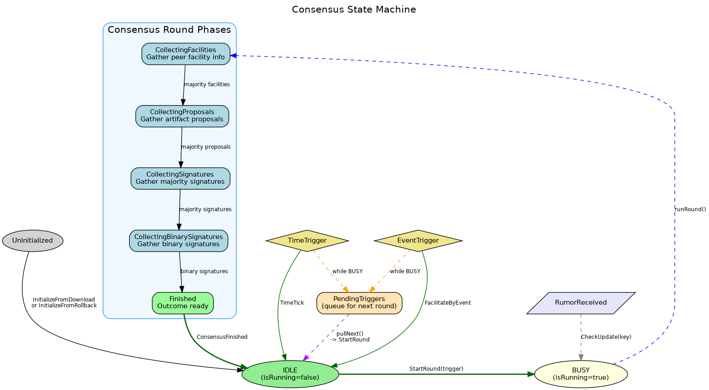
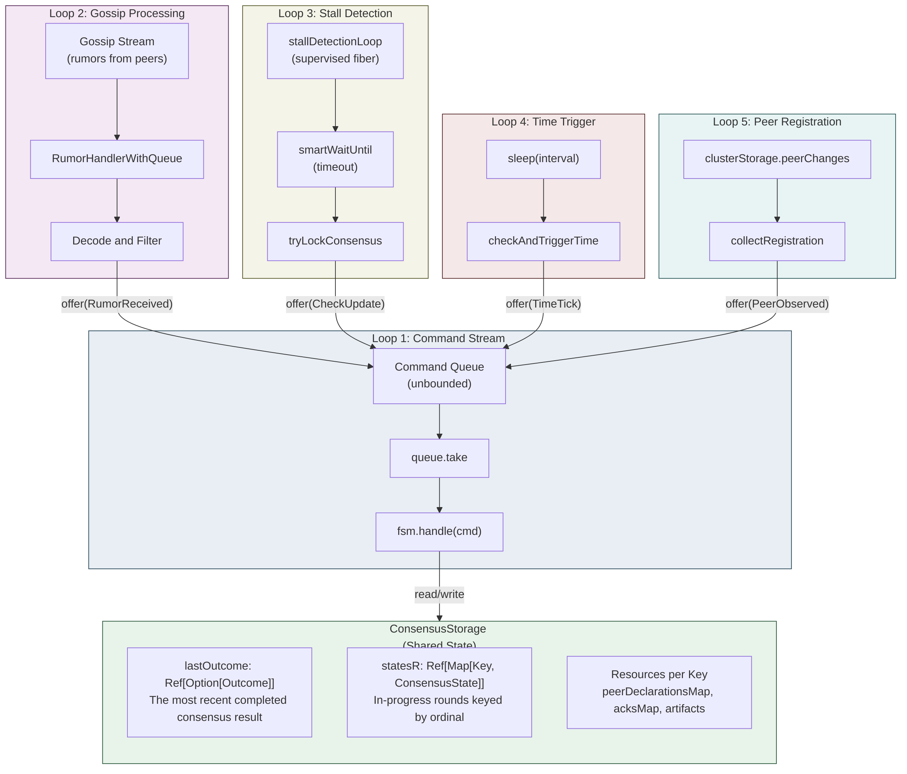
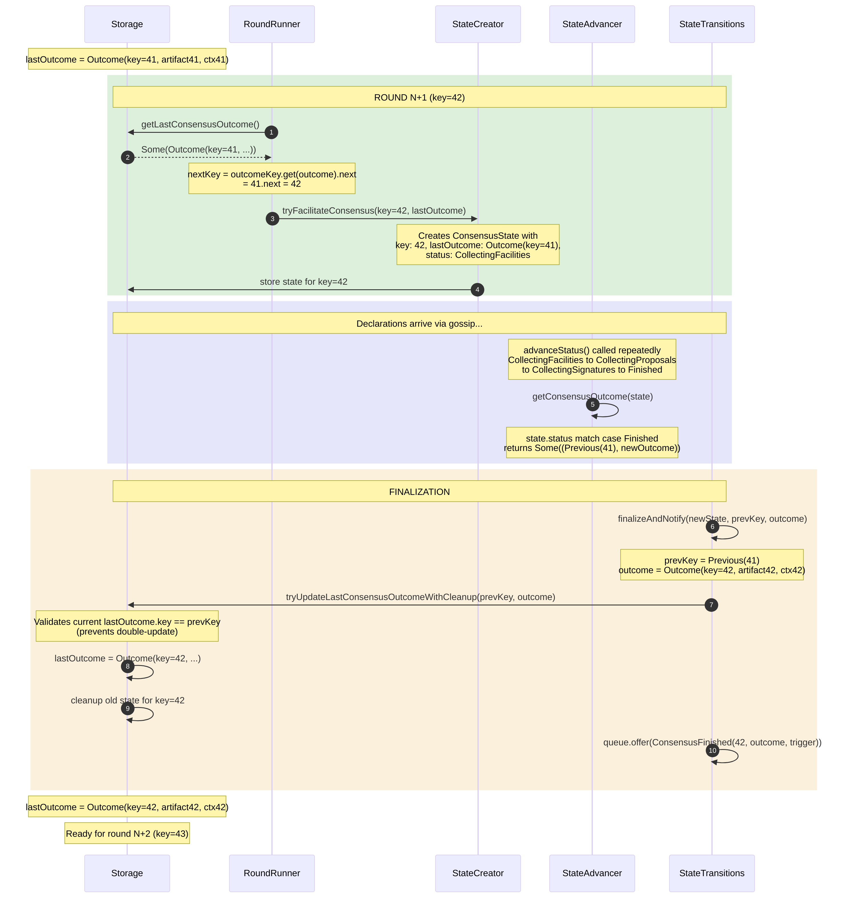
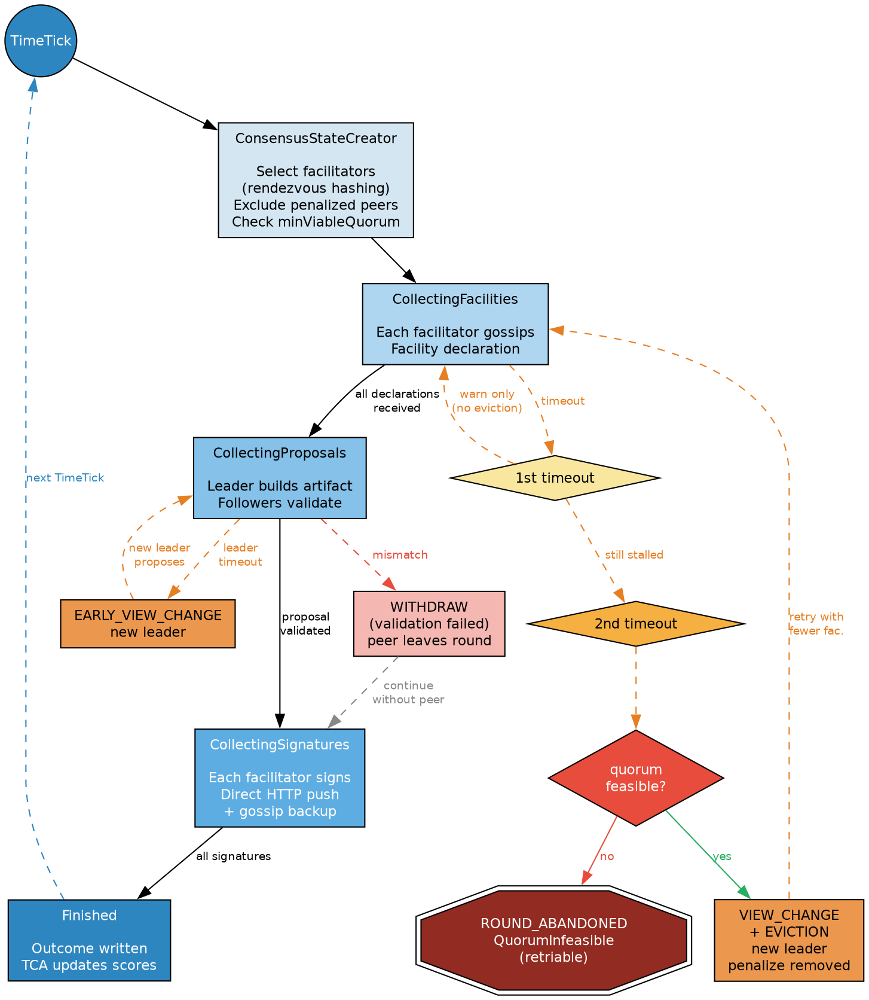
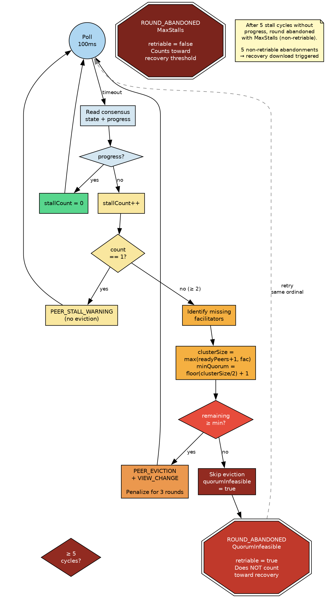
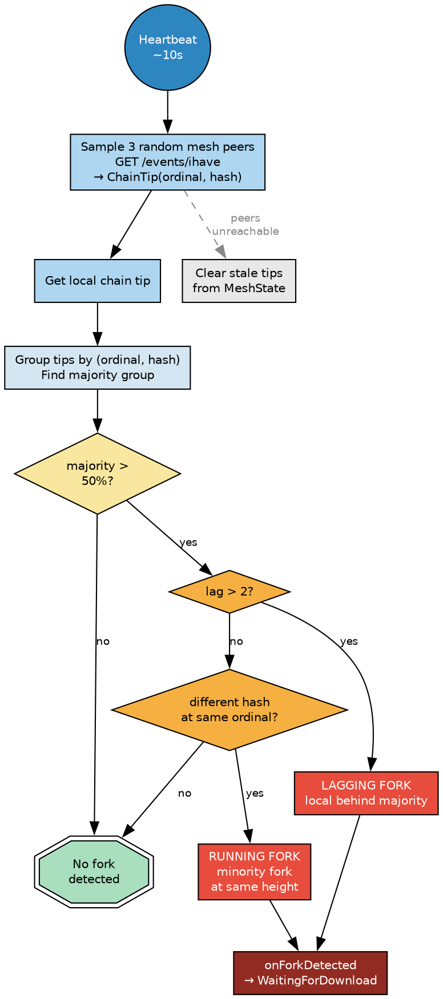
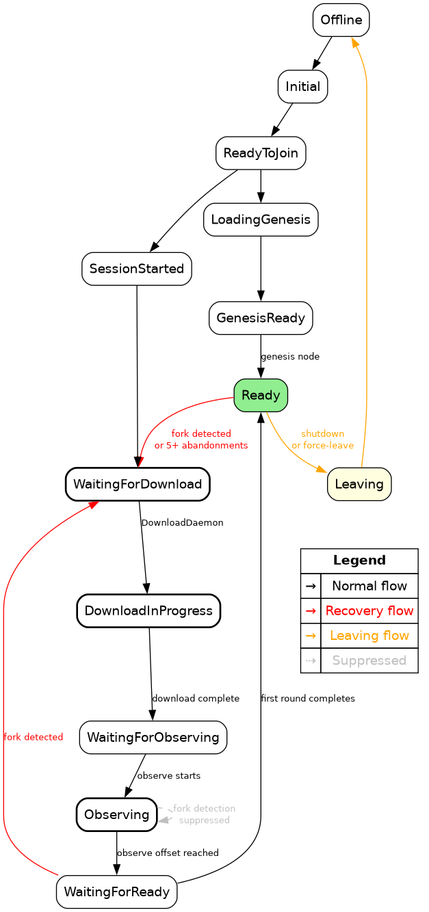
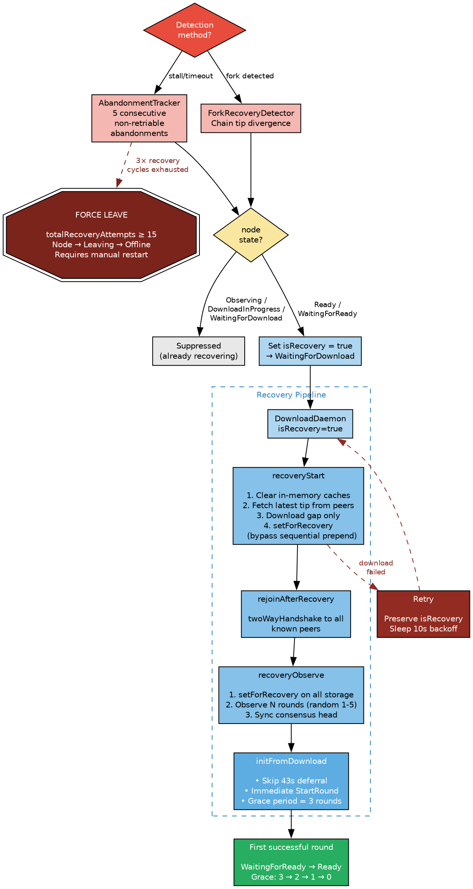
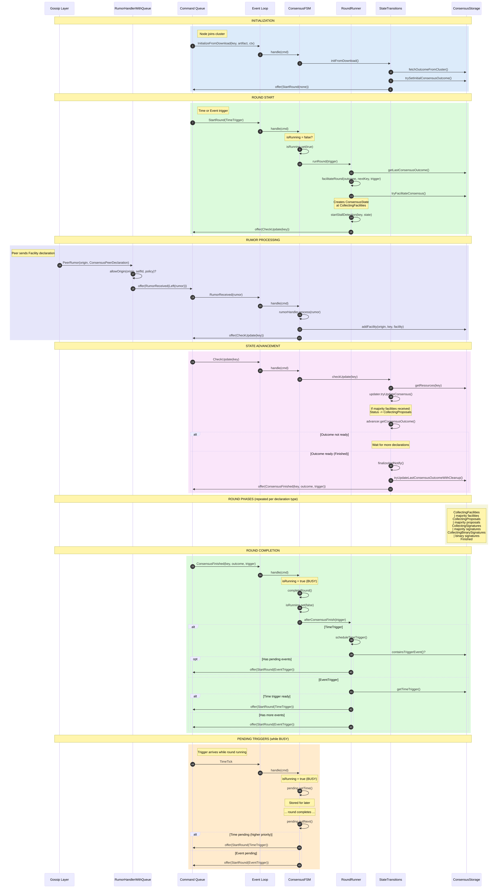

# Tessellation Consensus Process

This document provides an in-depth walkthrough of the Tessellation consensus mechanism. It is the definitive reference for how Tessellation consensus works.

## Table of Contents

1. [High-Level Architecture](#1-high-level-architecture)
2. [Concurrent Loops & Command Queue](#2-concurrent-loops--command-queue)
3. [FSM States: IDLE vs BUSY](#3-fsm-states-idle-vs-busy)
4. [Outcome and Key Tracking](#4-outcome-and-key-tracking)
5. [Consensus Round Phases](#5-consensus-round-phases)
6. [Declaration Types](#6-declaration-types)
7. [Detailed Phase Transitions](#7-detailed-phase-transitions)
8. [Trigger System](#8-trigger-system)
9. [Facilitator Selection](#9-facilitator-selection)
10. [Leader Election & View Changes](#10-leader-election--view-changes)
11. [Stall Detection & Eviction](#11-stall-detection--eviction)
12. [Fork Detection](#12-fork-detection)
13. [Recovery Pipeline](#13-recovery-pipeline)
14. [Recovery Scenarios](#14-recovery-scenarios)
15. [Signature Threshold](#15-signature-threshold)
16. [MPT Sync Lifecycle](#16-mpt-sync-lifecycle)
17. [Validator Solo Block](#17-validator-solo-block)
18. [Key Files Reference](#18-key-files-reference)

---

## 1. High-Level Architecture

The consensus engine follows an **event-driven architecture** with a central command queue. All state changes happen in response to commands, making the system deterministic and easier to test.



### Core Components

| Component | File | Purpose |
|-----------|------|---------|
| `ConsensusFSM` | `state/ConsensusFSM.scala` | Routes commands based on IDLE/BUSY state |
| `ConsensusEventLoop` | `engine/ConsensusEventLoop.scala` | Builds engine, runs command stream |
| `ConsensusManager` | `engine/ConsensusManager.scala` | External API (facade) |
| `ConsensusRoundRunner` | `engine/ConsensusRoundRunner.scala` | Round facilitation, trigger scheduling |
| `StallDetector` | `engine/StallDetector.scala` | Monitors round progress, triggers eviction |
| `ViewChangeManager` | `engine/ViewChangeManager.scala` | Two-track leader re-election (emits VCC + TimeoutCertificate votes) |
| `AbandonmentTracker` | `engine/AbandonmentTracker.scala` | Recovery download triggering |
| `ConsensusStateAdvancer` | `state/ConsensusStateAdvancer.scala` | Phase transitions within a round |
| `ConsensusStateCreator` | `state/ConsensusStateCreator.scala` | Creates new round states |

`ConsensusCommand` is now parameterized over the artifact / context types (no `Any` payloads); see `engine/ConsensusCommand.scala`.

---

## 2. Concurrent Loops & Command Queue

The consensus engine uses an **unbounded command queue** to coordinate **5 concurrent streams**. All event sources feed commands into the queue, and the FSM processes them sequentially.



### Command Types

`ConsensusCommand` is parameterized on `[+Key, +Artifact, +Ctx, +Outcome]` (commit `d62e33e05`) so payload-bearing variants surface real types instead of `Any`. No-payload variants extend `ConsensusCommand[Nothing, Nothing, Nothing, Nothing]` and remain assignable into any specialized queue. See `engine/ConsensusCommand.scala`.

```scala
sealed trait ConsensusCommand[+Key, +Artifact, +Ctx, +Outcome]

// Round control
final case class StartRound(trigger: Option[ConsensusTrigger])
case object TimeTick
case object FacilitateByEvent
final case class ConsensusFinished[Key, Outcome](key: Key, outcome: Outcome, trigger: ConsensusTrigger)

// RoundCompleted carries an optional attempt id snapshot. The FSM drops it if the round's
// `roundAttemptId` has advanced since emission - prevents an abandonment-queued completion
// from wiping a round that just view-changed forward. `None` is the unconditional path
// reserved for force-recovery in the event-loop error handler.
final case class RoundCompleted(expectedAttemptId: Option[Long] = None)

// Rumor / state-advance
final case class RumorReceived(rumor: Either[PeerRumor[_], CommonRumor[_]])
final case class CheckUpdate[Key](key: Key)

// Quorum-certified assembly / apply checks. Each is queued whenever a vote of the relevant
// type has been locally stored and the state-transitions path should attempt cert assembly,
// or whenever an embedded certificate should be applied at a view advance.
final case class CheckViewChangeAssembly[Key](key: Key)
final case class CheckViewChangeApply[Key](key: Key, fromView: Long, toView: Long)
final case class CheckTimeoutCertificateAssembly[Key](key: Key)           // Track 2 (TC)
final case class CheckTimeoutCertificateApply[Key](key: Key, fromView: Long, toView: Long)
final case class CheckEvictionAssembly[Key](key: Key, target: PeerId)   // per-target
final case class CheckAdmissionAssembly[Key](key: Key, target: PeerId)  // per-target

// Wrapper for delayed re-queues - InternalScheduled(inner) just re-handles `inner`.
final case class InternalScheduled[K, A, C, O](inner: ConsensusCommand[K, A, C, O])

// Lifecycle
final case class InitializeFromDownload[Key, Artifact, Ctx](
  key: Key, artifact: Signed[Artifact], context: Ctx, isRecovery: Boolean = false
)
final case class InitializeFromRollback[Key, Outcome](
  key: Key, outcome: Outcome, deferFirstRound: Boolean = false
)
case object WithdrawFromConsensus
final case class PeerObserved(peer: Peer)
```

### Stream 1: Command Stream (Main Event Loop)

The heart of the system — consumes commands and routes to FSM:

```scala
val commandStream: Stream[F, Unit] =
  Stream.repeatEval(queue.take).evalMap { cmd =>
    nodeStorage.getNodeState.flatMap { currentState =>
      // Skip stale commands during recovery
      val isRecovering = currentState === NodeState.WaitingForDownload ||
        currentState === NodeState.DownloadInProgress ||
        currentState === NodeState.WaitingForObserving
      val isStaleCommand = cmd match {
        case _: CheckUpdate | _: ConsensusFinished | RoundCompleted | TimeTick => true
        case _ => false
      }
      if (isRecovering && isStaleCommand) {
        logger.debug(s"Discarding stale ${cmd.getClass.getSimpleName}: node in $currentState")
      } else {
        fsm.handle(cmd)
      }
    }
  }
```

> **Note (v2 change):** The stale command guard prevents gossip/stall declarations from the previous round from crashing the event loop during recovery states.

### Stream 2: Gossip Processing

The `RumorHandlerWithQueue` receives rumors from the gossip layer and enqueues them:

```scala
// For each rumor type (Facility, Proposal, Signature, etc.)
RumorHandlerWithQueue.peer[F, ConsensusPeerDeclaration](queue)

// Flow: GossipStream → RumorHandlerWithQueue → queue.offer(RumorReceived(...))
```

**Note**: Rumors are stored immediately, but state updates happen via `CheckUpdate` commands.

### Stream 3: Peer Registration

Watches for new peers entering `Observing` state and collects their registration info:

```scala
clusterStorage.peerChanges.mapFilter {
  case Ior.Both(_, peer) if peer.state === NodeState.Observing => Some(peer)
  case Ior.Right(peer) if peer.state === NodeState.Observing   => Some(peer)
  case _ => None
}.evalMap(peer => collectRegistration(peer))
```

### Stream 4: Leaving Stream

Watches for node entering `Leaving` state to trigger withdrawal:

```scala
nodeStorage.nodeStates
  .filter(_ === NodeState.Leaving)
  .evalMap(_ => manager.withdrawFromConsensus)
```

### Stream 5: Stall Detection (Per Round)

Each active round spawns a supervised stall detection fiber that monitors for missing declarations. This is started by `ConsensusRoundRunner.startRoundMonitor()`:

```scala
def startRoundMonitor(key: Key): F[Unit] =
  for {
    signal <- Deferred[F, Unit]
    _ <- cancelSignalRef.set(Some(signal))
    _ <- spawnTracked {
      stallDetector.monitor(key, signal)
    }
  } yield ()
```

### Coordination

All streams feed commands into the same queue, and the FSM processes them sequentially:

```
Gossip    ──┐
Peers     ──┼──▶ Queue ──▶ FSM (sequential)
Leaving   ──┤
Timer     ──┘
```

This design means:
- **No race conditions** on consensus state
- **Deterministic** command processing order
- **Easy to test** by injecting commands directly

### RumorHandler: Store and Signal

The `RumorHandler` is a **receiver/dispatcher** that does no decision-making. It only:

1. **Stores data** in `ConsensusStorage`
2. **Signals the queue** to trigger processing

```
Gossip Layer
    │
    ▼
RumorHandler.process(rumor)
    │
    ├──► storage.addXxx()     ← Store the data
    │
    └──► queue.offer(...)     ← Signal FSM to process it
             │
             ▼
         FSM handles CheckUpdate → StateTransitions.checkUpdate()
                                       │
                                       ▼
                              ConsensusStateAdvancer (actual logic)
```

**Storage dispatch by rumor type** (see `state/RumorHandler.scala`):

| Rumor Wire Type | Inner Type | Storage Method | Follow-up Command |
|-----------------|------------|----------------|-------------------|
| `ConsensusPeerDeclaration` | `Facility` | `storage.addFacility(origin, key, f)` | `CheckUpdate(key)` |
| `ConsensusPeerDeclaration` | `Proposal` | `storage.addProposal(origin, key, p)` | `CheckUpdate(key)` |
| `ConsensusPeerDeclaration` | `MajoritySignature` | `storage.addSignature(origin, key, s)` | `CheckUpdate(key)` |
| `ConsensusPeerDeclaration` | `BinarySignature` | `storage.addBinarySignature(origin, key, b)` | `CheckUpdate(key)` |
| `ConsensusPeerVote` | `ViewChangeVote` | `storage.addViewChangeVote(origin, key, fromView, toView, signed)` | `CheckUpdate` + `CheckViewChangeAssembly(key)` |
| `ConsensusPeerEvictionVote` | — (B1) | `storage.addEvictionVote(origin, key, signed)` | `CheckUpdate` + `CheckEvictionAssembly(key, target)` |
| `ConsensusPeerAdmissionVote` | — (B2) | `storage.addAdmissionVote(origin, key, signed)` | `CheckUpdate` + `CheckAdmissionAssembly(key, target)` |
| `ConsensusPeerDeclarationAck` | — | `storage.addPeerDeclarationAck(origin, key, kind, ack)` | `CheckUpdate(key)` |
| `ConsensusWithdrawPeerDeclaration` | — | `storage.addWithdrawPeerDeclaration(origin, key, kind)` | `CheckUpdate(key)` |
| `ConsensusArtifact` (peer or common) | — | `storage.addArtifact(key, artifact)` | `CheckUpdate(key)` |

Every peer rumor (and every keyed declaration) also calls `storage.observePeerAtKey(origin, key)` *before* the storage write, so the live "peer is at key X" map (`peerCurrentKeys`) is updated even if the declaration itself is later filtered. This is what `AbandonmentTracker` and `StallDetector` consume for lagging-detection — `peerRegistrations` alone is set-once and goes stale.

`EvictionVote`/`AdmissionVote` rumors are rejected if the gossip `origin` differs from the vote signer (`SignedValue.proofs.head.id`); B1/B2 votes arrive via `spreadDirect` straight from the signer, so a relayed vote is either buggy or adversarial. Rejection logs `rejected=origin_signer_mismatch` and the storage slot is not written.

> Events used to flow through this dispatcher; they now propagate via `EventMempool` + `EventGossipDaemon` and never enter the consensus rumor path. See the comment block at the top of `RumorHandler.scala`.

---

## 3. FSM States: IDLE vs BUSY

The FSM tracks whether a consensus round is running via `isRunning: Ref[F, Boolean]`.

### IDLE State (isRunning = false)

When idle, the FSM can:
- **Start a new round** on `StartRound`, `TimeTick`, or `FacilitateByEvent`
- **Initialize** from download or rollback
- **Withdraw** from consensus
- **Process rumors and assembly-checks** (always)

### BUSY State (isRunning = true)

When busy, the FSM:
- **Queues triggers** for later via `PendingTriggers`
- **Completes rounds** on `ConsensusFinished` (with cleanup) or `RoundCompleted` (when no outcome was produced; `expectedAttemptId` may cause it to be dropped if the round advanced since the command was queued)
- **Processes rumors and quorum-assembly checks** (always)

```scala
def handle(cmd: ConsensusCommand[Key, Artifact, Ctx, Outcome]): F[Unit] =
  isRunning.get.flatMap { running =>
    cmd match {
      // Always — independent of IDLE/BUSY
      case RumorReceived(r)                            => rumorHandler.process(r)
      case CheckUpdate(key)                            => transitions.checkUpdate(key)
      case CheckViewChangeAssembly(key)                => transitions.checkViewChangeAssembly(key)
      case CheckViewChangeApply(key, from, to)         => transitions.checkViewChangeApply(key, from, to)
      case CheckTimeoutCertificateAssembly(key)        => transitions.checkTimeoutCertificateAssembly(key)
      case CheckTimeoutCertificateApply(key, from, to) => transitions.checkTimeoutCertificateApply(key, from, to)
      case CheckEvictionAssembly(key, target)          => transitions.checkEvictionAssembly(key, target)
      case CheckAdmissionAssembly(key, target)         => transitions.checkAdmissionAssembly(key, target)
      case InternalScheduled(inner)                    => handle(inner)
      case PeerObserved(peer)                          => transitions.registerPeer(peer)

      case _ if running                                => handleWhileBusy(cmd)
      case _                                           => handleWhileIdle(cmd)
    }
  }
```

The "always-handled" cases (rumors, `CheckUpdate`, `PeerObserved`, and the cert assembly/apply checks) are intentionally allowed in both IDLE and BUSY: they only attempt to update state for an actively-tracked round and are no-ops when the round is gone. This is what lets a quorum-certified VCC / TimeoutCertificate / EvictionCertificate / AdmissionCertificate assemble (and then apply at a view advance) even while the FSM is processing the *current* phase of the same round. The view-advance pipeline runs on two parallel tracks: `CheckViewChangeAssembly` / `CheckViewChangeApply` for the VCC track, and `CheckTimeoutCertificateAssembly` / `CheckTimeoutCertificateApply` for the TimeoutCertificate track (see [§10](#10-leader-election--view-changes) and [timeout-certificate.md](timeout-certificate.md)). See `state/ConsensusFSM.scala`.

The handler also force-completes a stuck round when an `InitializeFromDownload` arrives in `Observing` while still BUSY (recovery's stale-round escape hatch); under any other node state it re-queues the command after 1s without blocking the event loop.

### Currency L0 rollback committee recovery

Currency L0 rollback normally initializes the next consensus outcome from the
rolled-back snapshot's proof signers. A fully stopped metagraph can use
`run-rollback --allow-solo-consensus` on exactly one coordinated recovery node
to bootstrap progress before the other nodes rejoin as ordinary validators.
The flag is off by default and two isolated uses can create conflicting
histories. See the
[Currency L0 single-node rollback recovery runbook](../operations/currency-l0-solo-rollback.md)
for the compatibility boundary, committee-regrowth trace, metrics, and rollout
procedure, and distribute the corresponding
[operator release note](../release/currency-l0-solo-rollback.md) before use.

### Global L0 anchor-bound committee recovery

Global L0 can replace an unrecoverable rollback anchor's dead committee with a
lead-signed, anchor-bound recovery plan during a coordinated full-fleet cold
restart. Exactly one controlled node consumes the plan with
`run-rollback --recovery-plan`; every other named committee member verifies
and consumes the same plan with `run-validator --recovery-plan`. Unnamed peers
remain ordinary validators. The option is inert by default and changes no public
snapshot, state-proof, or consensus-message schema. See the
[Global L0 recovery-plan runbook](../operations/global-l0-recovery-plan.md) for
the signed domain, fail-closed checks, first-round alignment gate, and removal
of the one-shot option after recovery.

The schema-compatible retry and legacy-view safety boundary shipped with that
operator tool is documented in the
[v4.1.0-rc.8 IntegrationNet bridge release note](../release/v4.1.0-rc.8-integrationnet-bridge.md).

### Round-Blocked States

> **Note (v2 change):** The FSM blocks round starts when the node is in recovery or leaving states to prevent infinite loops.

```scala
private val roundBlockedStates: Set[NodeState] =
  Set(NodeState.WaitingForDownload, NodeState.DownloadInProgress, NodeState.Leaving)

private def startRound(trigger: Option[ConsensusTrigger]): F[Unit] =
  nodeStorage.getNodeState.flatMap { state =>
    if (!roundBlockedStates.contains(state))
      isRunning.set(true) >> roundRunner.runRound(trigger)
    else
      logger.warn(s"ROUND_BLOCKED_BY_STATE: nodeState=$state")
  }
```

### Pending Triggers

If a trigger arrives while BUSY, it's stored for the next round:

```scala
// While BUSY:
case TimeTick                      => pending.setTime()
case FacilitateByEvent             => pending.setEvent()

// After round completes:
pending.pullNext match {
  case Some(TriggerPriority.Time)  => startRound(Some(TimeTrigger))
  case Some(TriggerPriority.Event) => startRound(Some(EventTrigger))
  case None                        => // Wait for next trigger
}
```

**Priority**: `TimeTrigger` takes precedence over `EventTrigger`.

---

## 4. Outcome and Key Tracking

Understanding how `Outcome`, `Key`, and the `outcomeKey` lens work together is crucial to understanding the consensus flow.



### What is an Outcome?

An `Outcome` (e.g., `GlobalConsensusOutcome`) represents the **result of a completed consensus round** and is carried forward as `lastOutcome` into the next round (see `dag-l0/.../schema.scala`):

```scala
final case class GlobalConsensusOutcome(
  key: GlobalSnapshotKey,                              // The ordinal (e.g., 42)
  facilitators: Facilitators,                          // Round-end committee (derived
                                                       // from roundStartFacilitators -
                                                       // removed - withdrawn)
  removedFacilitators: RemovedFacilitators,            // B1 cert-evicted this round
  withdrawnFacilitators: WithdrawnFacilitators,        // Voluntary leavers this round
  eligibleFacilitators: EligibleFacilitators,          // Pool the next round's
                                                       // committee is selected from
  finished: Finished,                                  // signedMajorityArtifact +
                                                       // context + majorityTrigger
  removalPenalties: SortedMap[PeerId, Int],            // Multi-round eviction penalty
  deferralCountdown: SortedMap[PeerId, Int],           // First-time-joiner probation
  peerQuality: SortedMap[PeerId, (Int, Int)],          // (completed, participated)
  cumulativeMissCounts: SortedMap[PeerId, Long],       // Repeat-offender exponent
  recentProofSizes: SortedMap[SnapshotOrdinal, Int],   // Bootstrap-classification window
  readmissionCountdown: SortedMap[PeerId, Int],        // B2 sticky probation
  peerSelfHealth: SortedMap[PeerId, SelfHealthHint],   // Last-known self-health hint per
                                                       // peer; demotes leaders next round
  peerViewChanges: SortedMap[PeerId, Long],            // View-changes caused as failed
                                                       // leader-of-the-view
  recentSigners:                                       // Rolling K-round signer-set window;
    SortedMap[SnapshotOrdinal, SortedSet[PeerId]],     // input to tier-demotion + leader
                                                       // recent-signer gate
  peerTiers: SortedMap[PeerId, Int],                   // Core/Tier1/Witness carry-forward
                                                       // that drives CommitteeBuilder
  activeAdmissionScores: SortedMap[PeerId, Int],       // Bounded integral controller score
  lastTimeoutCertificateVoters: SortedSet[PeerId],     // Voters from the accepted proposal's
                                                       // TimeoutCertificate
  recentRoundEndTimes: SortedMap[SnapshotOrdinal, Long], // (ordinal -> consensusEndTime);
                                                       // the view-from-time anchor window
  controllerEvidence:                                  // Bounded per-round evidence window
    Option[SortedMap[SnapshotOrdinal, ControllerEvidenceEntry]],
  penaltyUntil:                                        // Cert-anchored absolute penalty
    Option[SortedMap[PeerId, SnapshotOrdinal]]         // horizon per peer
)
```

(See `dag-l0/.../snapshot/schema.scala:109-233` for the canonical field list and per-field semantics.)

`readmissionCountdown` is the B2 probation map: a peer's `removalPenalty` expiry seeds an entry at `readmissionProbationRounds`, and from then on the only path out is a quorum-certified `AdmissionCertificate` accepted on a proposal. See [§11](#11-stall-detection--eviction).

`peerTiers` and `recentSigners` are the inputs that drive the next round's committee and leader selection: `CommitteeBuilder` reads `peerTiers` (carried-forward Core/Tier1/Witness classification) and `LeaderEligibility` reads `recentSigners` (see [§9](#9-facilitator-selection) and [§10](#10-leader-election--view-changes)). `recentRoundEndTimes` is the view-from-time anchor consumed by the next round's pacemaker hint.

`GlobalConsensusOutcome` is also packed onto the signed incremental snapshot as a `ConsensusOperationalState` (`schema.scala:234-316`, `toOperationalState`): the deterministic chain-derived fields (`recentProofSizes`, `recentSigners`, `controllerEvidence`, `penaltyUntil`) ride the proposal-critical bytes, and the locally-divergent per-peer fields ride the wider sidecar. This is what lets the committee/leader/penalty history survive a cluster cold-restart instead of resetting to genesis.

### What is a Key?

A `Key` is typically a `SnapshotOrdinal` (e.g., 41, 42, 43). It uniquely identifies:
- Which round we're deciding (in `ConsensusState.key`)
- Which outcome was produced (in `Outcome.key`)

### The Round Lifecycle with Keys

```
Storage State:
  lastOutcome = Outcome(key=41, artifact41, ctx41)
  statesR = Map.empty

StartRound triggered:
  1. RoundRunner reads: lastOutcome.key = 41
  2. Computes: nextKey = 41.next = 42
  3. Creates: ConsensusState(key=42, lastOutcome=Outcome(41), ...)

Round progresses:
  statesR = Map(42 -> ConsensusState(...))

Round completes:
  4. Advancer returns: (Previous(41), Outcome(key=42, ...))
  5. Storage validates: lastOutcome.key == 41 ✓
  6. Storage updates: lastOutcome = Outcome(key=42, ...)
  7. Storage cleans: remove state for key=42
```

### Why `Previous[Key]`?

The `Previous[Key]` wrapper prevents accidental double-updates:

```scala
def tryUpdateLastConsensusOutcomeWithCleanup(
  prevKey: Previous[Key],  // Must match current lastOutcome.key
  lastOutcome: Outcome
): F[Boolean]
```

If two rounds try to finalize simultaneously, only the first succeeds.

---

## 5. Consensus Round Phases



Each consensus round progresses through 3-4 phases (the BinarySignature step is currency-L0 only):

```
CollectingFacilities
       │
       │ Quorum of facilities (deterministic: ceil(N * quorumThresholdFraction))
       ▼
CollectingProposals
       │
       │ Quorum of matching proposals; leader's artifact selected by majority hash
       ▼
CollectingSignatures
       │
       │ Quorum of valid majority signatures (signatureGracePeriod waits for stragglers)
       ▼
    Finished
```

### Phase Requirements

| Phase | Requirement | Who Acts |
|-------|-------------|----------|
| CollectingFacilities | Quorum of `Facility` declarations from active facilitators | Everyone |
| CollectingProposals | Leader creates artifact; quorum of validating `Proposal`s | Leader + validators |
| CollectingSignatures | Quorum of valid `MajoritySignature`s | Everyone |
| Finished | Outcome persisted with deduplicated proofs | - |

> **Note (multi-committee quorum):** The advancer transitions when `max(1, QuorumPolicy.fromFraction(N, config.quorumThresholdFraction))` matching declarations are present, where **`N = state.coreFacilitators.value.size`** (the **Core** committee, not the flat round-start set) (`QuorumPolicy.scala`, `state/ConsensusState.scala:207`). `QuorumPolicy.fromFraction` is pure **integer** arithmetic: it dispatches `1.0 -> unanimity(N) = N` and `0.6666...(2/3) -> supermajority(N) = (2*N + 2) / 3` (verified in `QuorumPolicySuite` to equal the legacy `ceil(N * fraction)` for every operated cluster size); any other fraction is rejected at config load. Tier-1 and Witness peers do **not** count toward the cert/phase quorum denominator, so a silent Tier-1 peer cannot wedge a round (see [§9](#9-facilitator-selection)). Default `quorumThresholdFraction = 1.0` (unanimity); testnet operates at supermajority. On testnet the v33 `QuorumDenominatorShrink` rung can deterministically lower this denominator at a wedged key after a wall-clock-anchored silence period, leaving the committee byte-identical (see [quorum-shrink.md](quorum-shrink.md)). Snapshot finalization itself is gated by the `SignatureGraceDecision` grace machine (see [§15](#15-signature-threshold)) so late-but-honest signatures still land in the proofs set. Liveness is provided by `StallDetector` view-changing (VCC + TimeoutCertificate) or vote-evicting unresponsive peers when safe (see [§10](#10-leader-election--view-changes) and [§11](#11-stall-detection--eviction)).

---

## 6. Declaration Types

Each phase involves peers exchanging **declarations** via gossip. All shapes live in `consensus/declaration.scala`. Every payload that participates in proposal-hash agreement carries a `lastSnapshotHash` so a stale-tip replay cannot pass cert validation (codex review 2026-04-23).

### Facility

Sent at the start of a round. Contains:
- `eventHashes: Set[Hash]` - events from local mempool
- `candidates: Candidates` - peers that may join
- `trigger: Option[ConsensusTrigger]` - what triggered this round
- `facilitatorsHash: Hash` - hash of round-start facilitator set
- `lastGlobalSnapshotOrdinal: SnapshotOrdinal`
- `lastSnapshotHash: Hash`
- `consensusConfigHash: Option[Hash]` - peer compatibility fingerprint from the exact effective
  `deterministicConfigHash`; L0 joining requires exact equality (including presence), and Facility
  processing also logs/metrics mismatches
- `selfHealthHint: Option[SelfHealthHint]` - the peer's own current self-health (from
  `LocalHealthMonitor`); the leader aggregates these into `Proposal.observedSelfHealth`
  so the next round's leader selection can demote unhealthy peers (see
  [self-health-throttle.md](self-health-throttle.md))
- `proposerClockMs: Option[Long]` - per-facilitator wall clock at signing time; the
  median across the accepted Facility set becomes the outcome's `consensusEndTime`,
  the view-from-time anchor (see [view-from-time-anchor.md](view-from-time-anchor.md))

### Proposal

Sent after facilities are collected. Now also the carrier for the three quorum-certified payloads:

```scala
case class Proposal(
  hash: Hash,                                     // Proposed artifact hash
  facilitatorsHash: Hash,
  lastSnapshotHash: Hash,
  view: Long,                                     // View number
  vcc: Option[ViewChangeCertificate],             // Track 1: if view > 0, the VCC that
                                                  // certified the rotation
  timeoutCertificate: Option[TimeoutCertificate] = None, // Track 2: the TimeoutCertificate
                                                  // that certified the rotation. A view > 0
                                                  // is justified by exactly one of vcc / TC
  evictionCertificates: List[EvictionCertificate] = List.empty, // B1 quorum-certified
                                                  // evictions applied at proposal acceptance
  admissionCertificates: List[AdmissionCertificate] = List.empty, // B2 quorum-certified
                                                  // re-admissions
  observedResponders: List[PeerId] = List.empty,  // Leader's positive participation
                                                  // observation; replaces (not unions)
                                                  // state.observedResponders on accept
  observedSelfHealth:                             // Leader's canonical view of each
    SortedMap[PeerId, SelfHealthHint] = SortedMap.empty // responder's SelfHealthHint,
                                                  // aggregated from this round's Facilities;
                                                  // becomes outcome.peerSelfHealth on accept
)
```

### MajoritySignature

Sent after proposals are collected:
- `signature: Signature` - over the majority artifact hash
- `facilitatorsHash: Hash`, `lastSnapshotHash: Hash`, `view: Long`, `proposalHash: Hash`

### BinarySignature (Currency L0 only)

Sent after `MajoritySignature` is collected:
- `signature: Signature`, `facilitatorsHash: Hash`, `lastSnapshotHash: Hash`

### ViewChangeVote

Stall-driven negative vote. Signed and gossiped by `GossipingViewChangeVoter` whenever `ViewChangeManager.performViewChange` fires. Quorum of matching `(fromView, toView)` votes assembles into a `ViewChangeCertificate` (see [§10](#10-leader-election--view-changes)).

```scala
case class ViewChangeVote(
  fromView: Long, toView: Long,
  facilitatorsHash: Hash, lastSnapshotHash: Hash,
  highestKnownQc: Option[ProposalQC]              // Used by the next leader to inherit
                                                  // a vote-locked proposal hash
)
```

### TimeoutVote / TimeoutCertificate (Track 2 view advance)

The second, parallel view-advance track. `ViewChangeManager.performViewChange` emits a `TimeoutVote` alongside every `ViewChangeVote` (see [§10](#10-leader-election--view-changes)). A quorum of matching `(fromView, toView)` votes assembles into a `TimeoutCertificate`, which the next leader embeds in its `Proposal.timeoutCertificate`. See [timeout-certificate.md](timeout-certificate.md).

```scala
case class TimeoutVote(
  fromView: Long, toView: Long,
  facilitatorsHash: Hash, lastSnapshotHash: Hash,
  highestKnownQc: Option[ProposalQC],             // Lets the next leader inherit a
                                                  // vote-locked proposal hash
  reason: TimeoutReason                           // NoProgress | QuorumInfeasible
)
```

`TimeoutReason` is `NoProgress` (round elapsed with no advance) or `QuorumInfeasible` (too few responsive committee members). Today, in-tree `StallDetector` call sites emit the default `NoProgress`; `QuorumInfeasible` is reserved for a future path or explicit caller. A `TimeoutCertificate` carries the same `(fromView, toView)`, `facilitatorsHash`, `lastSnapshotHash`, `reason`, and the `NonEmptySet[Signed[TimeoutVote]]` it assembled from.

### EvictionVote (B1)

Sparse negative-evidence: when `StallDetector` decides to push a peer toward removal, this node signs and gossips an `EvictionVote(target, reason, facilitatorsHash, lastSnapshotHash)`. Quorum-of-distinct-signers assembles into an `EvictionCertificate` via `EvictionCertificateBuilder`. Reasons are an open ADT; only `EvictionReason.Silent` is wired today. Targets are capped at `committee.size - minQuorum` per `selectEvictionTargets` so an honest aggregate can never shrink the committee below quorum (commit `3ee1800d3`).

### AdmissionVote (B2)

Symmetric positive-evidence: every committee member that observes a probation peer gossiping the committee's expected tip emits a signed `AdmissionVote(target, reason, facilitatorsHash, lastSnapshotHash)`. Quorum assembles into an `AdmissionCertificate` via `AdmissionCertificateBuilder`. Reasons are an open ADT; only `AdmissionReason.ReadyAtTip` is wired today.

The observation reads the shared chain-tip view (`getPeerChainTips`), which `EventGossipDaemon` populates by a round-robin **witness sweep across all responsive peers** -- not just the gossip mesh. This observation channel is distinct from the certificate *witness pool* (the voters, `eligibleFacilitators - target`) and is a liveness precondition of B2 (ADR-0022): it must cover the full probation-candidate set independent of the mesh degree (`meshHigh`), sized by `chainTipWitnessRefreshInterval` so every responsive peer's tip is refreshed within the admission tip-validity window. Scoping the observation to the gossip mesh left candidates outside the mesh unobservable and starved B2 on clusters larger than the mesh (IntegrationNet, v4.1.0).

---

## 7. Detailed Phase Transitions

### CollectingFacilities → CollectingProposals

**Trigger**: quorum of eligible gate peers has sent matching `Facility` declarations

**Actions**:
1. Pick **majority trigger** from all facilities
2. Merge event hashes from all facilities
3. **Leader** creates **proposal artifact** using consensus functions
4. Compute artifact **hash**
5. Spread `Proposal(hash, facilitatorsHash)` via gossip
6. Leader spreads artifact via common gossip

```scala
private def toProposalsPhase(
  state: State,
  facilities: SortedMap[PeerId, Facility]
): F[Option[Transition]] = {
  val (bound, candidates, triggers) = facilities.foldMap(...)

  pickMajority(triggers).flatTraverse { majorityTrigger =>
    buildProposalTransition(state, bound, candidates, majorityTrigger)
  }
}
```

### CollectingProposals → CollectingSignatures

**Trigger**: quorum of eligible gate peers has sent matching `Proposal` declarations

**Actions**:
1. Collect all proposal **hashes**
2. Find **majority artifact** (most common hash)
3. Validate the majority artifact
4. **Sign** the majority hash
5. Spread `MajoritySignature(signature, facilitatorsHash)`

```scala
private def toSignaturesPhase(
  state: State,
  status: CollectingProposals,
  resources: Resources,
  proposals: SortedMap[PeerId, Proposal]
): F[Option[Transition]] = {
  val hashes = proposals.values.toList.map(_.hash)

  findMajorityArtifact(state, status, resources, hashes).flatMap {
    case Some(majorityInfo) => buildSignatureTransition(...)
    case None               => none[Transition].pure[F]
  }
}
```

### CollectingSignatures → Finished

**Trigger**: finality quorum reached and the signature-grace decision no longer waits

**Actions**:
1. Collect all `MajoritySignature` declarations
2. **Verify** each signature proof
3. Build `Signed[Artifact]` with valid proofs
4. Persist to storage
5. Build `Outcome` with facilitator metadata

```scala
private def toFinishedPhase(
  state: State,
  status: CollectingSignatures,
  signatures: SortedMap[PeerId, MajoritySignature]
): F[Option[Transition]] = {
  val proofs = signatures.map { case (id, sig) =>
    SignatureProof(PeerId._Id.get(id), sig.signature)
  }

  for {
    valid <- proofs.filterA(verifySignatureProof(hash, _))
    result <- buildFinishedTransition(state, status, valid)
  } yield result
}
```

---

## 8. Trigger System

Consensus rounds can be triggered by two mechanisms. See [ADR-0004](../adr/0004-global-snapshot-trigger.md) for design rationale.

### TimeTrigger

- Scheduled at regular intervals (`timeTriggerInterval`, default 43s for DAG L0)
- Higher priority than EventTrigger
- Cleared when a round starts with TimeTrigger

### EventTrigger

- Fired when a "trigger event" arrives (e.g., from L1)
- Determined by `triggerPredicate` in consensus functions
- Lower priority than TimeTrigger

### Trigger Flow

```
                    ┌──────────────────┐
                    │ scheduleTimeTrigger │
                    └─────────┬────────┘
                              │
              sleep(timeTriggerInterval)
                              │
                              ▼
                    ┌──────────────────┐
                    │    TimeTick      │
                    └─────────┬────────┘
                              │
        ┌─────────────────────┴─────────────────────┐
        │                                           │
        ▼                                           ▼
   isRunning?                                  isRunning?
      false                                       true
        │                                           │
        ▼                                           ▼
  StartRound(TimeTrigger)                   pending.setTime()
```

### Time Trigger Scheduling

After each round completes, the next time trigger is scheduled:

```scala
private def scheduleTimeTrigger: F[Unit] =
  for {
    nextTime <- Async[F].monotonic.map(_ + config.timeTriggerInterval)
    _ <- storage.setTimeTrigger(nextTime)
    _ <- supervisor.supervise {
      Temporal[F].sleep(config.timeTriggerInterval) >>
        checkAndTriggerTime
    }
  } yield ()
```

> **Note:** The timer fiber uses `supervisor.supervise` directly (not `spawnTracked`) so it survives round cleanup. This prevents deadlock where a subsequent round's cleanup would cancel the timer before it fires.

---

## 9. Facilitator Selection

> **Superseded pipeline note:** The pre-launch consensus rewrite (the "v19"
> multi-committee derivation) replaced the flat "previous-eligible + candidates →
> filters → rendezvous subset" pipeline that [ADR-0006](../adr/0006-selecting-facilitators.md)
> describes. The chronic-non-signer / prior-round-missing / tightening-window /
> candidate-deferral filters were **retired** and replaced by the three-tier
> `CommitteeBuilder` partition documented here. The full as-shipped reference is
> [committee-tiers.md](committee-tiers.md); ADR-0006 is kept for historical context only.
> Sources: `CommitteeBuilder.scala`, `GlobalSnapshotConsensusStateCreator.scala`.

Each round's facilitators are produced in two stages: a thin **candidate filter** in the StateCreator, then a deterministic **three-tier partition** in `CommitteeBuilder`.

### Stage 1 -- Candidate set

The StateCreator gates the candidate set by only **two** behavioural filters now: active **removal penalties** and **re-admission probation** (`readmissionCountdown`). Everything the old pipeline did with chronic-non-signer / prior-round-missing / tightening-window / candidate-deferral filtering is now handled inside the tier partition. `selfId` is still NOT unconditionally added (per-node self-add diverges `facilitatorsHash` and causes fork eviction); nodes join via candidate registration, and the genesis empty set falls back to `List(selfId)`.

### Stage 2 -- Three-tier `CommitteeBuilder` partition

`CommitteeBuilder.build` partitions the candidate set into **Core (Tier 2)**, **Tier 1**, and **Witness (Tier 0)** from consensus-agreed inputs only -- the carried-forward `lastOutcome.peerTiers`, `lastOutcome.peerQuality` (`(completed, participated)`), and evidence-derived chronic/score inputs -- so every honest node derives a byte-identical partition.

| Tier | Role | In cert quorum? | Signs + earns? | Leader-eligible? |
|------|------|:---------------:|:--------------:|:----------------:|
| **Core** (Tier 2) | Full facilitators; the liveness quorum denominator | Yes | Yes | Yes |
| **Tier 1** | Witness-eligible; signs the snapshot and witnesses certs | No | Yes | No |
| **Witness** (Tier 0) | Observation only | No | No | No |

**Tier assignment rule** (re-derived every round, in order): (1) **quality-degradation override** -- a peer whose cumulative `completed/participated` ratio has dropped below `minRatio` (with `participated >= minObservations`) is forced to Tier 1 regardless of its prior tier, so a degraded peer can never gate the liveness quorum; (2) **carried-forward** `priorTiers.get(pid)`; (3) **quality-proven bootstrap** -- a new peer (absent from `priorTiers`) enters Core only if `peerQuality` already proves it above the ratio bar; (4) **default Tier 1** -- unproven new peers join the witness-eligible pool, not the quorum (the replacement for the old "everyone defaults to Core" bootstrap that let unclassified peers wedge the cluster).

**Core floor.** If derived Core is below the per-environment `coreCommitteeSize`, peers are promoted from Tier 1, ranked by quality (descending ratio, then descending completed count, then PeerId lex). `coreCommitteeSize` is consensus-critical and is folded into `deterministicConfigHash`. L0 joining requires exact equality of that effective fingerprint, and Facility processing provides a second diagnostic comparison. The separate `versionHash` independently fences the advertised release string (or `CL_VERSION_HASH`); it is not a jar hash or a substitute for the config fence.

**Chronic-core replacement ladder.** `chronicMisses` (evidence-derived trailing asked-but-silent streaks past `ChronicMissThreshold`) drives a deterministic ladder, applied in order: **exclude** every chronically-missing Core member (demoted to Tier 1, still signs and earns, just out of the quorum denominator); **replace** each one-for-one with a non-chronic Tier 1 reserve (highest evidence score first); **floor** tops Core back up to `coreCommitteeSize` from non-chronic reserves only; **shrink** leaves Core smaller rather than padding with chronic peers (the quorum is proportional, so a smaller all-healthy Core is strictly more live); **liveness fallback** re-admits the least-bad chronic peers only if healthy Core would fall below `MinViableCoreSize` (= 2). With no chronic peers every step is inert.

Delegated rewards use the frozen round-start signing committee, not
`lastArtifact.proofs`: Core and Tier 1 split the validator pool evenly, with no
Core-vs-Tier-1 stratification. Classic rewards remain proof/signer based. See
[Consensus reward recipients](rewards.md) for the two ordinal/epoch gates and the
IntegrationNet diagnosis. The full-committee correction is itself activated by
`fields-added-ordinals.delegated-rewards-full-committee`; below that gate the briefly
deployed score filter remains solely for replay compatibility.

### Candidate Registration

New nodes join through a multi-round registration pipeline:

1. Peer enters `Observing` state
2. Other nodes' `peerRegistrationStream` queries the peer's `/consensus/registration` endpoint
   (with a 3s retry if the first attempt returns `None` -- covers the race between
   entering Observing and `initFromDownload` setting `observationKeyR`)
3. Registration stored at both `key` and `key.next` in `peerRegistrationsR`
4. Next round: `getCandidates(key.next)` includes the peer; the leader's `Facility`
   declaration carries the candidates list
5. Round completes: outcome's `finished.candidates` includes the peer
6. Next round: the peer enters the candidate set and is classified by `CommitteeBuilder`.
   A freshly-registered peer with no proven participation defaults to Tier 1, and is
   promoted toward Core only as its `peerQuality` accrues

**Timeline:** a registered peer can sign (as Tier 1) within ~2-3 rounds; Core promotion follows demonstrated participation.

### Rendezvous Hashing

The `FacilitatorSelector` uses rendezvous hashing (Highest Random Weight) for deterministic subset selection:

```scala
// Per-peer score: SHA-256(entropy ++ peerId)
private def rendezvousScore(peerIdHex: String, entropyHex: String): BigInt = {
  val md = MessageDigest.getInstance("SHA-256")
  md.update(hexToBytes(entropyHex))
  md.update(hexToBytes(peerIdHex))
  BigInt(1, md.digest())
}

def select(candidates: List[PeerId], entropy: Hash): List[PeerId] =
  candidates.sorted(orderByScore(entropy).toOrdering).take(maxCount)
```

**Properties:**
- **Deterministic**: All honest nodes compute the same subset
- **IID uniform distribution**: Each peer's score is independently random
- **Zero autocorrelation**: Selection in round N is independent of round N-1

---

## 10. Leader Election & View Changes

### Leader Selection

`FacilitatorSelector.selectLeader` uses rendezvous hashing (Highest Random Weight) over the facilitator set:

```scala
def selectLeader(facilitators: List[PeerId], entropy: Hash, viewNumber: Int): PeerId = {
  val sorted = facilitators.sorted(orderByScore(entropy).toOrdering)
  sorted(viewNumber % sorted.size)
}
```

On view change, `viewNumber` increments, producing a different leader without changing the facilitator set.

### Quality-Weighted Leader Selection (`selectLeaderWeighted`)

Leader selection uses consensus-agreed `(completed, participated)` scores from `lastOutcome.peerQuality`. Tier `= participated - completed = failure count`; lower tier wins; rendezvous score breaks ties within a tier. Integer-only arithmetic guarantees cross-platform determinism.

### Recent-Signer Leader Pool (`LeaderEligibility.fromRecentSigners`)

Leader candidates are pre-filtered before `selectLeaderWeighted` by `LeaderEligibility.fromRecentSigners` (`LeaderEligibility.scala`), which applies **two** gates over the **Core** committee (not the full active set):

```scala
// Gate 1 -- graduated: participated >= minParticipationObservations && completed >= 1
val graduated = core.filter { pid =>
  val (completed, participated) = peerQuality.getOrElse(pid, (0, 0))
  participated >= minParticipationObservations && completed >= 1
}
val graduationBase = if (graduated.size >= minLeaderPoolSize) graduated else core

// Gate 2 -- recent-signer: present in EVERY one of the last DemotionConsecutiveMisses
//          recentSigners windows (only applied once that window is deep enough)
val recentSets = recentSigners.values.toList.takeRight(DemotionConsecutiveMisses)
val recentSignerPool =
  if (recentSets.sizeIs >= DemotionConsecutiveMisses)
    graduationBase.filter(pid => recentSets.forall(_.contains(pid)))
  else graduationBase
val leaderPool =
  if (recentSignerPool.size >= minLeaderPoolSize) recentSignerPool else graduationBase
```

- **Gate 1 (graduated)** keeps unproven and never-finalized peers out of the lead slot. The `completed >= 1` clause is the key: a peer can accumulate `participated` from past rounds without ever finalizing one, and such a peer kept being elected and stalling rounds. A single completed round as a non-leader follower restores eligibility.
- **Gate 2 (recent-signer)** further requires the peer to have signed in *every* one of the last `DemotionConsecutiveMisses` rounds, so a peer that recently went quiet is not handed the lead slot before the tier machinery demotes it.

Both gates carry the `minLeaderPoolSize` fallback: if applying a gate would drop the pool below `minLeaderPoolSize`, it falls back to the broader set (so a small or cold-start cluster still has a meaningful pool, and `viewNumber % size` view rotation stays meaningful). Excluded peers are reported with typed reasons (`NotGraduated` / `NotRecentSigner`). `GlobalSnapshotConsensusStateCreator` reads `leaderEligibility.leaderPool` and applies `selectLeaderWeighted` to it.

### View Change Protocol (two-track view advance)

> **Note:** The Lock/ACK/Vote mechanism and the earlier per-node "local-increment" path are both removed. View advance is now driven entirely by quorum certificates, on **two parallel tracks**.

When `StallDetector` invokes `ViewChangeManager.performViewChange(key, state, timeoutReason)` (`engine/ViewChangeManager.scala:80`), it emits **both** votes and queues **both** assembly checks:

1. Record peer quality for the old leader.
2. Read any locally-held `VoteLock` and pull `lockedQc` (the highest known `ProposalQC`) so the next leader can inherit a vote-locked proposal hash.
3. **Track 1 (VCC):** delegate to a `ViewChangeVoter` (typically `GossipingViewChangeVoter`) to sign+store+gossip a `ViewChangeVote(fromView, toView, facilitatorsHash, lastSnapshotHash, highestKnownQc)`, then queue `CheckViewChangeAssembly(key)`.
4. **Track 2 (TC):** delegate to a `TimeoutVoter` (typically `GossipingTimeoutVoter`) to sign+store+gossip a `TimeoutVote(...same fields..., reason)` where `reason` is the `TimeoutReason` (`NoProgress` or `QuorumInfeasible`), then queue `CheckTimeoutCertificateAssembly(key)`.

Whichever certificate (`ViewChangeCertificate` or `TimeoutCertificate`) assembles first deterministically advances the round's view. A view greater than 0 must be justified by **exactly one** of a VCC or a TC on the leader's proposal; the two are mutually exclusive on any single proposal. Both carry the highest known `ProposalQC` so the inheriting leader keeps any vote-locked proposal hash. See [timeout-certificate.md](timeout-certificate.md) for the full TC pipeline.

The `facilitatorsHash` signed into every vote is the **canonical round-start committee hash** (`state.roundStartFacilitators.value.hash`), so honest nodes that observed different mid-round withdrawals still produce votes with the same hash and certify together. `roundStartFacilitators` is frozen at round creation and never mutated; the read-site comment in `state/ConsensusState.scala` enumerates which derivations must use it versus which must keep mutable `state.facilitators` (in-round liveness).

### VCC Assembly (`StateTransitions.checkViewChangeAssembly`)

`checkViewChangeAssembly(key)` runs whenever a `ViewChangeVote` lands in storage. When `votes.size >= max(1, QuorumPolicy.fromFraction(coreSize, quorumThresholdFraction))` (quorum over the **Core** committee, see [§9](#9-facilitator-selection)) and all votes agree on a single `facilitatorsHash`, `ViewChangeCertificateBuilder.build` assembles a `ViewChangeCertificate` (de-duplicates by signer, rejects voters not in the committee, sorts deterministically). On success the FSM:

1. Stores the assembled VCC via `storage.storeAssembledVcc(key, vcc)` so the new leader's `Proposal` carries it.
2. Atomically advances `state.viewNumber → toView`, sets `state.leader` to the deterministic new leader, **clears `withdrawnFacilitators`** (a withdrawal is scoped to the `(key, view)` pair it was emitted for), and resets `state.status` to a fresh `CollectingFacilities`.
3. Queues `CheckUpdate(key)` so the new view's facility-collection round begins immediately.

The witness pool for the quorum is widened to `state.eligibleFacilitators - target` so eligible-but-not-active peers can still witness (see [§11](#11-stall-detection--eviction), "Witness Pool Widening").

### TimeoutCertificate Assembly + Apply (`StateTransitions.checkTimeoutCertificateAssembly` / `...Apply`)

The Track-2 counterpart. `checkTimeoutCertificateAssembly(key)` runs whenever a `TimeoutVote` lands in storage; on a Core-quorum of matching `(fromView, toView)` votes it assembles a `TimeoutCertificate` via `TimeoutCertificateBuilder` (`StateTransitions.scala:343`). When a leader's `Proposal.timeoutCertificate` arrives at a view advance, `checkTimeoutCertificateApply(key, from, to)` re-validates it against the same quorum / witness-pool / hash invariants and applies it (`StateTransitions.scala:488`, `applyCertifiedTimeoutCertificate` at `:725`). Both tracks feed the v33 `QuorumDenominatorShrink` decision so the effective denominator can be lowered at a wedged key (see [quorum-shrink.md](quorum-shrink.md)).

Mid-round eviction does NOT happen on either view-change path. If a facilitator is genuinely unreachable, the stall-cycle abandonment path in `StallDetector` handles it (the round is abandoned and retried with the current eligibility set). For consensus-witnessed eviction, see B1 below.

### Self-Health and View-from-Time Inputs

Two consensus-agreed inputs feed leader election and the pacemaker, both threaded through the Facility -> Proposal -> outcome path:

- **Self-health throttle.** Each peer stamps its own `SelfHealthHint` (from `LocalHealthMonitor`) onto its `Facility.selfHealthHint`. The leader aggregates the responders' hints into `Proposal.observedSelfHealth`, which becomes the next outcome's `peerSelfHealth`. The next round's `selectLeaderWeighted` health-gates the leader pool: Degraded peers are demoted to tier 1, and Critical peers are **hard-excluded** from the primary pool (`FacilitatorSelector.scala:249`), reachable only through the starvation fallback at tier 2 so liveness still holds if every peer reports Critical. Design reference: [self-health-throttle.md](self-health-throttle.md).
- **View-from-time anchor.** Each peer stamps its wall clock onto `Facility.proposerClockMs`. The median across the accepted Facility set becomes `consensusEndTime` (clamped against `parent.consensusEndTime + 1` for anti-regression), recorded into the outcome's `recentRoundEndTimes`. The next round derives a `timeView` from this anchor (`ViewFromTime.compute`), but **only as a pacemaker timeout hint** that wakes the round to emit a signed view-change vote. Proposal-critical view advance still requires a quorum-certified VCC or TC (`initialView = 0` at round start; see `GlobalSnapshotConsensusStateCreator.scala:668-690`). Design reference: [view-from-time-anchor.md](view-from-time-anchor.md).

### Self-Recovered Leader Cooldown (commit `2026-04-27` codex-followups)

If `selfId` is elected leader within `recoveryLeaderCooldownRounds` (default 3) of a successful `initFromDownload`, `StallDetector` self-defers: it logs `EarlyViewChange` with `reason="self_recently_recovered_leader_cooldown"` and emits its own VCV without attempting to propose. A freshly-recovered node has cold consensus storage and an unprimed gossip mesh — without this gate it wedged the round for the full proposal-phase timeout (~98s observed in 2026-04-27 E2E). Self-deferring converts that into a ~5s rotation. This is a local-only decision; other peers still elect this node deterministically and the standard quorum-certified VCC path then rotates.

---

## 11. Stall Detection & Eviction

> **Note:** The original Lock/ACK/Vote mechanism from v1 is gone. So is the older `performViewChangeWithEviction` mid-round-eviction path. Mid-round committee shrinkage now happens only via the **B1 cert pipeline** (`EvictionVote` → `EvictionCertificate` → embedded in next leader's `Proposal` → applied at proposal acceptance). Re-admission has its symmetric **B2 pipeline** (`AdmissionVote` → `AdmissionCertificate`).



### Architecture

`StallDetector` is the orchestrator (`engine/StallDetector.scala`) that polls state periodically and delegates:
- **ViewChangeManager** -- leader rotation. Each `performViewChange` emits **both** a gossiped `ViewChangeVote` (Track 1) **and** a signed `TimeoutVote` carrying a `TimeoutReason` (Track 2); the actual view advance is performed by `StateTransitions.checkViewChangeAssembly` or `checkTimeoutCertificateAssembly` once either quorum certificate forms (see [§10](#10-leader-election--view-changes)).
- **EvictionVoter** / **AdmissionVoter** — sign-and-gossip the corresponding vote; B1/B2 cert assembly happens in `StateTransitions.checkEvictionAssembly` / `checkAdmissionAssembly`.
- **AbandonmentTracker** — consecutive failure tracking, resource cleanup, recovery download trigger.

### Stall Detection Flow

```
Poll (100ms-1000ms adaptive)
  → Detect status/resource changes → queue CheckUpdate
  → While in any signatures-collecting phase: heartbeat CheckUpdate every tick (re-evaluates
    the signatureGracePeriod gate without waiting for a resource change)
  → On every tick, if state.lastOutcome carries a probation peer whose gossiped chain tip
    (witnessed by the round-robin sweep over ALL responsive peers, not just the mesh; see §6)
    matches the committed tip: emit AdmissionVote, queue CheckAdmissionAssembly
  → Reset roundStartTime on view advance (per-view round-duration budget)
  → Calculate phase-adaptive timeout
  → Early view change cases (no stall counted):
      - leader is Unresponsive AND in proposal phase AND round elapsed >= 5s
      - self is leader within recoveryLeaderCooldownRounds of last initFromDownload
  → If timeout exceeded:
      → Quorum still feasible, missing peers responsive: count cycle, retransmit own
        Facility on capped exp-backoff schedule (5s / 10s / 20s / 30s / 30s, max 5 attempts)
      → Quorum infeasible AND missing peers Unresponsive: emit EvictionVote(s) for
        selectEvictionTargets candidates, queue CheckEvictionAssembly, then performViewChange
      → Proposal phase, quorum declared but no proposal: performViewChange
      → Other phases, quorum declared but no advance: count toward abandon
  → Every performViewChange ALSO emits a signed TimeoutVote with a TimeoutReason
    (NoProgress | QuorumInfeasible) and queues CheckTimeoutCertificateAssembly,
    in parallel with the ViewChangeVote / CheckViewChangeAssembly (two-track view advance)
  → After maxStallCycles, maxRoundDuration (per-view), QuorumInfeasible, or Lagging
    → AbandonmentTracker.abandonRound(reason)
  → Update health snapshot on each cycle
```

### Capped-Exponential Facility Retransmit (commit `401141eb9`, "v13")

When a round stalls in `CollectingFacilities` and self is an active facilitator, `StallDetector` retransmits the locally-stored `Facility` via direct push to active facilitator targets. The retransmit fires when `(now - lastRetransmitAt) >= nextRetransmitDelay(attempt)` per a **capped exponential schedule** of 5s → 10s → 20s → 30s → 30s, capped at `MaxFacilityRetransmits = 5`. The first three attempts land within ~35s — catching gossip-jitter Facility drops in the cold-start window — and steady-state at 30s matches the previous fixed cadence. Total budget ~95s.

The retransmit reads the stored self-Facility unchanged: no recomputation, no `eventHashes`/`candidates`/`trigger` drift. The retransmit counter resets on status change and on solo-eviction (so re-entering CollectingFacilities after a view change starts a fresh budget).

### Graduated Response

The first stall timeout warns only — peers get one more cycle. Eviction-vote emission only happens on `stallCount >= 1` AND `quorumInfeasible` AND missing peers are Unresponsive in cluster storage. The `EvictionSkipMaxStalls = 3` grace window also extends a chain-tip-gossip shield: peers that are still gossiping mesh tips are not voted to evict during that window even if their declarations are missing (codex review 2026-04-24 — bounds the shield so a zombie consensus fiber whose gossip fiber keeps advertising can't be permanently protected).

### Quorum Floor (per-tick infeasibility check)

`StallDetector` derives the feasibility floor from the **Core** committee via the pure helper `computeCoreQuorumStatus` (`StallDetector.scala:1456`), using the same integer `QuorumPolicy.fromFraction` denominator as the advancer:

```scala
val activeCore   = state.coreFacilitators.value.toSet -- state.withdrawnFacilitators.value
val coreRemaining = activeCore.size - activeCore.intersect(missingPeers).size
val baseRequired  = math.max(1, QuorumPolicy.fromFraction(activeCore.size, config.quorumThresholdFraction))
// v33 shrink: an escalated rung may lower (never raise) the required quorum.
val coreRequired  = quorumOverride.fold(baseRequired)(o => math.min(baseRequired, math.max(1, o)))
val quorumInfeasible = coreRemaining < coreRequired
```

Computing over `activeCore` (not the flat facilitator set) matters when facilitator subsetting is active: with Core=3, 1 missing, `coreRemaining = 2` — we don't want to flag QUORUM_INFEASIBLE just because cluster-Ready is 5. The check is a **ceiling, not a floor on aggregate evictions**: `selectEvictionTargets` separately caps each round's vote emission at `committee.size - minQuorum` so the certified evictions can never shrink the next-round committee below quorum (commit `3ee1800d3`, "Eviction targets capped").

### Witness Pool Widening (commit `e1bdfb190`, "v9")

For both B1 and B2 cert assembly the **witness pool** is `state.eligibleFacilitators.value.toSet - target` rather than `state.facilitators` (the active committee). Quorum is still pegged to committee size. This admits signatures from eligible-but-not-active peers (e.g., chronic-excluded peers that the chronic filter held out of the round), which closes the apr29 wedge at ord 3110065: 3 chronic-excluded peers signed valid eviction votes that the committee gate threw away, leaving 4 of the 7 needed votes. Build-time rejection codes still say `voter_not_in_committee` / `signer_not_in_committee` for log-grep compatibility — the semantics changed but the log strings did not.

### B2 Sticky Probation (commit `bc8d58d36`, "v12")

`ReadmissionMaintenance.step` (`state/ReadmissionMaintenance.scala`) decrements every active probation counter by 1 each round and **clamps at 0** rather than auto-clearing. The only path that removes a peer from `readmissionCountdown` is an accepted `AdmissionCertificate` (passed in as `admittedThisRound`). Pre-v12 used `.filter(_._2 > 0)` which auto-cleared on countdown expiry; alpha.50 produced ZERO admission certs in 14 hours because `StallDetector`'s emission gate (probation ∩ atTip ∩ consecutive-streak) only considers peers still in the probation set, but peers exited probation via auto-clear before the streak threshold fired. With sticky probation the cert-gated path is now load-bearing.

The streak gate (`config.b2AdmissionAtTipStreak`, default 2) is local-only/liveness-only: two honest nodes may diverge in their per-peer streaks without affecting safety. Cert assembly still requires quorum-agreed signed votes, so streak drift only delays a given node's emission moment.

### Per-View Round Duration

The `maxRoundDuration` safety net is computed per-view:

```scala
private def maxRoundDurationForView(base: FiniteDuration, view: Int): FiniteDuration =
  (base + 90.seconds * view).min(base * 2)
```

`roundStartTime` resets on view change so each view gets a fresh budget that grows with view (worse network conditions get more slack), capped at `2 * base`. Without this, a round that view-changed late in its 300s window ran out of budget in the new view's signatures phase even though that view was making steady progress (observed 2026-04-22).

### Abandon Reasons

```scala
sealed trait AbandonReason { def retriable: Boolean }

case class QuorumInfeasible(active: Int, required: Int, clusterSize: Int)
  // retriable = true — wait for quorum restoration; carries facilitator-count pair
case class Lagging(peersAhead: Int, totalPeers: Int, totalRegs: Int)
  // retriable = false — node is behind majority of READY peers at higher key
case class RoundTimeout(elapsedSeconds: Long, maxSeconds: Option[Long])
  // retriable = false — round exceeded maxRoundDuration
case class MaxStalls(stallCount: Int)
  // retriable = false — stuck after maxStallCycles
```

`AbandonReason.quorumPair` (the `Option[(active, required)]` projection used for retriable escalation) is now sourced from `QuorumInfeasible` only — `Lagging`'s synthetic match arm was dropped in commit `114ef1f76` (T2.4) since it never carried real facilitator counts. The lagging-detect itself uses `peerCurrentKeys` (live tip keys observed via keyed rumors) rather than the join-ordinal `peerRegistrations` map.

- **Non-retriable** abandonments increment `consecutiveAbandonCountRef`. After `maxConsecutiveAbandonments` (default 5) recovery download is triggered by `AbandonmentTracker`.
- **Retriable** abandonments (`QuorumInfeasible`) increment `retriableAtSameKeyRef` keyed by the ordinal. Past `maxRetriableAtSameKey` the tracker escalates only if `isIsolated` (activeFacilitators ≤ 1) or `quorumImpossible` (active < required); a multi-peer stall is suppressed. Absolute ceiling at `maxRetriableAtSameKey + 2` forces escalation to prevent indefinite loops.

### Lagging Detection (live keyed rumors)

`isLagging = totalReadyRegs >= 3 && peersAtHigherKey > totalReadyRegs / 2 && stallCount >= 1`

Source is `storage.getPeerCurrentKeys` (live per-peer tip keys from incoming keyed rumors), filtered to `Ready` peers — Observing/Downloading peers report stale observation keys. The previous `peerRegistrations` (one-time join ordinal) source missed cluster advance after the node had joined; bug B 2026-04-21. The `stallCount >= 1` gate prevents rapid-fire abandon loops at startup.

---

## 12. Fork Detection



Fork detection runs on **two independent channels** that feed the same recovery sink:

| Channel | Source | Component | Trigger |
|---------|--------|-----------|---------|
| Gossip / chain-tip | `EventGossipDaemon` heartbeat | `ForkRecoveryDetector` | (ordinal, hash) divergence vs majority of mesh peers |
| Consensus declarations | Per-round `recoverIfForking` calls | `ConsensusStateUpdater.recoverIfForking` | Strict-majority disagreement on `lastSnapshotHash` / `facilitatorsHash` from facility/proposal samples |

`ForkInfoStorage` / `ForkInfoHandler` / `ForkDetect` (the v1 fork-info-rumor pipeline) **no longer exist** — both channels now flow through the components above and converge at the same `WaitingForDownload` transition.

### Channel A — Chain-Tip Sampling (gossip)

`EventGossipDaemon` samples chain tips on each heartbeat (~10s):

1. Select up to 3 random mesh peers
2. Call `GET /events/ihave` on each → `ChainTip(ordinal, hash)`
3. Store tips in `MeshState`
4. Call `ForkRecoveryDetector.detectForkDivergence`
5. If fork detected → `clearMesh` then invoke the `onForkDetected` callback

Code: `ForkRecoveryDetector.scala:99`, `EventGossipDaemon.scala:602`.

#### Tier 1 detection — chain-tip groupings

Tier 1 runs purely off the mesh-state chain tips. Peers are grouped by `(ordinal, hash)` and the largest group must form a strict majority (`> 50%` of reporters) before any decision is made:

| Mode | Condition | Meaning |
|------|-----------|---------|
| **Lagging fork** | `majorityOrdinal - localOrdinal > forkLagThreshold` (default **10**) | Node fell behind the majority chain |
| **Running fork** | At our ordinal, a strict majority of peers report a different hash | Node on a parallel chain at the same height |

```scala
val tipGroups = chainTips.groupBy { case (_, tip) => (tip.ordinal, tip.snapshotHash) }
val ((majorityOrdinal, majorityHash), majorityGroup) = tipGroups.maxBy(_._2.size)
val isMajority = majorityGroup.size > chainTips.size / 2
val isLagging  = lag > forkLagThreshold
val isRunningFork = peersAtLocalOrdinal.size >= 2 &&
                    peersWithDifferentHash.size > peersAtLocalOrdinal.size / 2
```

(`ForkRecoveryDetector.scala:108-134`.)

The detector intentionally does **not** flag "local ahead of majority" by hash comparison — different ordinals always have different hashes, so the signal is meaningless. A node 1 ordinal ahead is normal at round-completion. Truly stuck minority forks are caught by `AbandonmentTracker`'s stale-ordinal escalation as a safety net.

#### Tier 2 — direct hash-at-ordinal probe

When Tier 1 is ambiguous (local is alone on its tip, majority is ahead but within `forkLagThreshold`), the detector falls back to a **direct hash probe** of majority peers (`ForkRecoveryDetector.scala:198-282`, commit `10bc29c3f`):

1. Sample up to `probeCount` peers (default **3**) from the majority group
2. In parallel, ask each: "what hash do you have at *my* `localOrdinal`?" — `HashAtOrdinalProbe`
3. Per-peer timeout `probeTimeout` (default **10s**); timeouts count as `absent`
4. Classify match / mismatch / absent
5. Decide:
   - `match` wins (majority of responses): SAME CHAIN, no fork — we're just lagging
   - `mismatch` wins **and** mismatches agree on a single divergent hash: FORK CONFIRMED
   - otherwise: INCONCLUSIVE, retry next heartbeat

This replaces an earlier isolated-minority heuristic that produced false positives on legitimately-lagging peers. The `(ordinal, hash)` tuple uniquely identifies a snapshot, so the probe response is definitive.

### Channel B — Consensus Declarations + Confirmation Window

The consensus state-updater also samples for divergence on each round update via `ConsensusStateUpdater.recoverIfForking` (`ConsensusStateUpdater.scala:213`). Sample sources are typed as `ForkObservation`:

- `LastSnapshotHash` — peers' reported last-finished snapshot hash
- `FacilitatorsHash` — facility-phase facilitator-set hash
- `ConsensusConfigHash` — config-hash divergence (does **not** route to recovery; logged via `logRecoveryUnsuitableMismatch` because a download cannot repair a config divergence)

A first divergent strict-majority sample only **records the suspicion** (per `ForkObservation`) in `forkObservationsRef`. Recovery only fires on a subsequent sample where the same divergent majority has persisted at least `forkConfirmationWindow` (default **30s**, commit `ae0782d7d`). This guards against the alpha.40 cascade where every internal node simultaneously flipped to `WaitingForDownload`, leaving zero metadata-serving peers and deadlocking the cluster on circular 503s.

```scala
// ConsensusStateUpdater.recoverIfForking decision states:
//  Record           — first divergent sample, store (majorityHash, now)
//  AwaitWindow      — same divergent hash, but elapsed < confirmationWindow
//  Confirm(elapsed) — same divergent hash, elapsed >= confirmationWindow → trigger recovery
```

Per-call-site `minObservations` threshold:
- **1** at authoritative-singleton sites (proposal-phase leader-vs-self check)
- **2+** at polled-majority sites (facility-phase facilitators-hash sweep)

`forkConfirmationWindow = 0` disables the gate (legacy single-sample behaviour, retained for single-peer / genesis topologies and tests).

Stable structured-log `action` fields (grep-stable for dashboards): `no_strict_majority`, `ignored_insufficient_sample`, `awaiting_confirmation`, `suspicion_recorded`, `logged_no_recovery`, `confirmed_recovery`.

### Fork Detection Suppression

Both channels drop to a no-op when the node is already in a recovery state to prevent restart loops:

- `WaitingForObserving`
- `Observing`
- `DownloadInProgress`
- `WaitingForDownload`

---

## 13. Recovery Pipeline

### Node State Machine



<details>
<summary>Source: diagrams/node-state-machine.dot</summary>

Render with: `dot -Tsvg diagrams/node-state-machine.dot -o diagrams/node-state-machine.png`
</details>

Every Tessellation node transitions through these states. The recovery path
(red arrows) allows nodes to return to `WaitingForDownload` from either
`Ready` or `WaitingForReady` when a fork is detected or consecutive
abandonments exhaust the recovery threshold.

| From | To | Trigger |
|------|----|---------|
| Ready | WaitingForDownload | Fork detected, or 5 consecutive non-retriable abandonments |
| WaitingForReady | WaitingForDownload | Fork detected, or stuck-at-ordinal recovery |
| Observing | _(suppressed)_ | Fork detection suppressed — waits for observe to complete |
| WaitingForObserving | _(suppressed)_ | Fork detection suppressed — node is transitioning into observe |
| WaitingForDownload | DownloadInProgress | DownloadDaemon acquires semaphore |
| DownloadInProgress | WaitingForObserving | Download completes |
| Observing | WaitingForReady | Observe offset reached |
| WaitingForReady | Ready | First round completes successfully |



### Recovery Triggers

Recovery can be triggered by three independent paths, all converging on `WaitingForDownload`:

1. **AbandonmentTracker** — `maxConsecutiveAbandonments` (default 5) non-retriable abandonments. See §11.
2. **`ForkRecoveryDetector`** (gossip channel) — Tier 1 / Tier 2 chain-tip divergence (see §12 Channel A).
3. **`ConsensusStateUpdater.recoverIfForking`** (consensus channel) — confirmation-window-gated divergence on `lastSnapshotHash` / `facilitatorsHash` (see §12 Channel B).

### Recovery Pipeline Steps

1. **Detection** — One of the three triggers fires.

2. **State guard** — If the node is already in `Observing` / `DownloadInProgress` / `WaitingForDownload`, the trigger is suppressed to prevent restart loops.

3. **Optional peer hint** — When the gossip channel detects a fork, it stores the majority-chain peer set in `RecoveryPeerHint` so the download daemon can prefer those peers as download targets (`RecoveryPeerHint.scala`).

4. **Flag + transition** — `isRecovery` flag set on `NodeStorage`, node transitions to `WaitingForDownload`.

5. **`DownloadDaemon` dispatch** (`DownloadDaemon.scala:69`) — Acquires the download semaphore and selects a path based on `isRecoveryDownload`:
   - **Recovery path** (`download.recoveryDownload`):
     - Clear in-memory caches (lastN, lastGlobal) — NOT disk
     - Fetch latest tip from peers (preferring `RecoveryPeerHint` targets when set)
     - Download only the gap (walk back from tip, stop at persisted hash on disk)
     - Enforce any configured seedlist-signed recovery checkpoint: the checkpoint file is verified at startup, downloaded/observed snapshots must pass the checkpoint hash at the checkpoint ordinal, and a local persisted chain whose resolved anchor is already at/above the checkpoint must also prove the checkpoint locally.
     - `setForRecovery` bypasses sequential prepend requirement on `SnapshotStorage`
   - **Full path** (`download.download`): used when a node has never run before.
   - **Full → recovery switch**: if a full download fails with an error tagged `RecoveryFallbackEligible` (currently `CannotFetchGenesisSnapshot` and `InvalidChain` in dag-l0; `InvalidChain` in currency-l0), the daemon sets `isRecoveryDownload` and retries with the recovery path. Detection uses the `RecoveryFallbackEligible` marker trait — a `getClass.getSimpleName` match would silently break on rename (`RecoveryFallbackEligible.scala`).
   - **Retry**: failures sleep with exponential backoff capped at 60s and re-enter the loop until either success or the node leaves `WaitingForDownload`.

6. **rejoinAfterRecovery** — Send `twoWayHandshake` to all known peers. Restores P2P mesh membership after `LocalHealthcheck` pruned the node during isolation.

7. **recoveryObserve** — Reset storage heads, then observe N rounds (random offset 1-5 per node, staggering re-entry to prevent thundering herd). Sync consensus `SnapshotStorage` head after observe completes.

8. **initFromDownload** — Fetches the consensus outcome from a Ready peer. If the peer returns a newer outcome (cluster moved ahead), accepts it and sets `isRecoveryEffective=true`. Validator nodes with `isRecoveryEffective=true` start the next round immediately (the solo block prevents solo production). All other nodes (initial join or non-validator recovery) defer 43s to align with the cluster's `TimeTrigger` cadence. Grace period counter is set (suppresses false `FORK_DETECTED` from stale `facilitatorsHash` while the local view catches up).

9. **First successful round** — Node transitions `WaitingForReady → Ready`. Grace period counts down: 3 → 2 → 1 → 0.

### Bounded Facility Retransmit (during recovery / cold-start jitter)

Independent of the recovery pipeline above, `StallDetector` re-broadcasts the local node's stored `Facility` declaration when stuck in `CollectingFacilities`. v13 (commit `401141eb9`) replaced the fixed-cadence retransmit with **capped exponential backoff** (`StallDetector.scala:1108-1130`):

| Attempt | Delay since previous |
|:---:|:---:|
| 0 | 5s after round start |
| 1 | +10s |
| 2 | +20s |
| 3 | +30s (cap) |
| 4 | +30s (cap) |

`MaxFacilityRetransmits = 5`. First three attempts now fire in ~35s instead of the pre-v13 ~90s, catching transient gossip-mesh drops earlier without changing the total per-round budget. Retransmit only fires while in `CollectingFacilities`, with quorum feasible, and below the cap. The phase-change / view-eviction reset zero the counter so a fresh phase gets a fresh budget.

### Failure Handling

- **Download failure during isolation**: `isRecovery` flag preserved across retries. `DownloadDaemon` sleeps with capped exponential backoff (10s → 60s) and retries `recoveryDownload`. Metadata fetch has 5 retries with exponential backoff (~60s).
- **Stale chain tips**: When all peers are unreachable during isolation, `clearMesh` fires before `onForkDetected` is invoked so the recovering node does not reuse stale tips after restore.
- **Force leave**: After `totalRecoveryAttempts ≥ 15` (3× recovery cycles), node transitions to `Leaving → Offline`. Requires manual restart.

```scala
private val maxTotalRecoveryAttempts: Int = config.maxConsecutiveAbandonments * 3

private def triggerRecoveryDownload(key: Key, consecutiveCount: Int): F[Unit] =
  totalRecoveryAttemptsRef.updateAndGet(_ + 1).flatMap { totalAttempts =>
    if (totalAttempts >= maxTotalRecoveryAttempts)
      forceLeave(key, totalAttempts)  // Break pathological loops
    else
      attemptRecoveryDownload(key)
  }
```

---

## 14. Recovery Scenarios

### Scenario A: Single Node Isolation (kill1)

**Tested:** 1 of 8 nodes isolated, ~6 min recovery at production timings.

See [sequence-kill1-happy-path.md](diagrams/sequence-kill1-happy-path.md) for
full Mermaid sequence diagram.

**Summary:**
- Isolated node accumulates retriable `QuorumInfeasible` abandonments (no recovery triggered)
- After network restore: non-retriable abandonments begin (sees lag)
- After 5 non-retriable abandonments: recovery download triggered
- Gap download → rejoin → observe 1-5 rounds → immediate facilitation
- 8/8 proofs restored

### Scenario B: Three Node Isolation (kill3)

**Tested:** 3 of 8 nodes isolated, ~9 min recovery at production timings.

See [sequence-kill3.md](diagrams/sequence-kill3.md) for full Mermaid sequence
diagram.

**Summary:**
- Healthy 5 nodes keep producing (5 ≥ minQuorum=5)
- Isolated 3 form minority fork (different hashes)
- Fork detection fires 22-32s after network restore (natural stagger)
- Random observe offsets (1-5 rounds) prevent thundering herd
- Nodes rejoin gradually: fac grows 5 → 7 → 8
- 8/8 proofs restored

### Scenario C: Symmetric Partition (kill4)

**Tested:** 4 of 8 nodes isolated. 7/8 recover, 1 stuck. **Known limitation.**

See [sequence-kill4-limitation.md](diagrams/sequence-kill4-limitation.md) for
full Mermaid sequence diagram.

**Summary:**
- Both sides below quorum (4 < minQuorum=5)
- Retriable `QuorumInfeasible` abandonments (no recovery triggered)
- 1-2 minority snapshots may be produced before stall detection kicks in
- After restore: 7/8 nodes self-recover via fork detection
- After restore: 7/8 nodes self-recover via fork detection
- gl0-7 stuck: persisted forked ordinal whose successor doesn't exist on canonical chain
- **Mitigation:** restart gl0-7

### Known Limitations

#### Kill 4/8 Observe Deadlock

When both partitions lose quorum (4+4 with minQuorum=5), neither side can
produce snapshots. After restore, one recovering node may have persisted a
forked ordinal whose successor was never produced on the canonical chain.
The download walker gets stuck looking for a non-existent ordinal.

**Mitigation:** External monitoring restarts the stuck node. 7/8 nodes
self-recover.

#### Session Token on Eviction

If a node is evicted and its session token advances (e.g., restart during
partition), `ClusterStorage.addPeer` with the `>` comparison rejects it on
rejoin. The peer's session would be higher than the cluster's record,
but the registration data differs.

**Status:** Identified, not yet addressed.

#### Recovery Timing

Recovery takes ~6-9 minutes at production timings:
- 5 consecutive abandonments × ~57s per cycle ≈ 5 minutes
- Plus download + observe + first round ≈ 1-2 minutes

Fork detection is faster (~10-30s after network restore) but only fires
after the node can reach peers — during isolation, the node can't sample
chain tips.

#### Penalty Cycle Waste

When recovery takes multiple penalty cycles (`removalPenaltyRounds=3`), each
expired penalty re-admits recovering nodes as facilitators. They stall the
round (~35s), get evicted again, and the cycle repeats. ~70s wasted per cycle.

#### Healthy Nodes Triggering Recovery

In symmetric partitions, healthy nodes that can't reach quorum may accumulate
`MaxStalls` after the stall cycle budget exhausts. After 5 total non-retriable
abandonments, they unnecessarily trigger recovery download. `QuorumInfeasible`
abandonments don't count, but `MaxStalls` can still fire after 5 stall cycles
without progress.

#### Facilitator Subsetting and Partition Forks

When `maxFacilitatorCount` is small relative to cluster size (e.g., 3 out of
8 nodes), a network partition that isolates a connected subgroup of nodes can
create a competing chain if all selected facilitators fall within the isolated
group. The isolated nodes have full quorum among themselves and produce valid
snapshots with a different hash than the main chain.

This is primarily a test-environment artifact: `tc netem loss 100%` creates
symmetric partitions where isolated nodes retain connectivity to each other.
In production, faulty nodes typically lose connectivity to all peers (hardware
failure, network outage), not forming connected subgroups.

**Constraint:** `maxFacilitatorCount` should be > N/2 when operating clusters
small enough for connected partitions to form. The default value (20) is safe
for all current deployment sizes.

**StallDetector interaction:** The quorum floor uses
`min(clusterQuorum, roundQuorum)` so that subsetting rounds compute quorum
from the round's facilitator count, not the full cluster size. Without this,
every round with a missing facilitator would be abandoned as
QUORUM_INFEASIBLE (e.g., 3 facilitators, 1 missing, remaining=2 <
clusterQuorum=5).

#### Stale Peer Registrations

Peer registrations in `peerRegistrationsR` are only updated when a peer enters
`Observing` state (via `peerRegistrationStream`). During normal consensus, peers
remain in `Ready` and their registrations stay at the ordinal when they joined.
The `LAGGING_NODE_DETECTED` check uses these registrations, so it can fail to
detect lagging when registrations are stale (e.g., after isolation, all registrations
show old ordinals, making the node appear "not lagging" even though the network
has advanced).

**Mitigation:** Two secondary mechanisms cover the gap:
- `ForkRecoveryDetector` (gossip channel) detects lagging via chain-tip sampling.
- `ConsensusStateUpdater.recoverIfForking` (consensus channel) flags `lastSnapshotHash` divergence with a `forkConfirmationWindow` gate.

The `quorumImpossible` escalation in `AbandonmentTracker` provides a third -- if the node can't form quorum after `maxRetriableAtSameKey` rounds, it escalates regardless of peer registration state.

---

## 15. Signature Threshold

Finalization is gated by the pure `SignatureGraceDecision.evaluate` state machine
(`SignatureGraceDecision.scala:58-82`), not a single count check. A round that
crosses the finalization quorum does **not** commit instantly; it may keep collecting
`MajoritySignature` declarations for a bounded **grace window** so the finalized proof
and participation-evidence set is not truncated to whoever happened to sign in the
first 1-3ms.
The window length is one of three cases:

| Case | Condition | Window | Anchored from |
|------|-----------|--------|---------------|
| **Full committee signed** | Every committee member has signed | finalize immediately | - |
| **Core complete, committee not full** | Only Tier-1 (non-quorum) signatures outstanding | short `tier1Window` | when Core **first** completed |
| **Core incomplete** | A quorum-bearing Core signer is still missing | full `fullWindow` | first quorum |

The Core-complete window is anchored from when Core first completed (not from first
quorum) so a round whose Core completes late still gives prompt Tier-1 signatures a
chance to land in the artifact and participation evidence. Delegated reward recipients
are already fixed by round membership.

Two distinctions matter:

- **The normal liveness denominator is the Core committee**, not the flat facilitator
  set. Phase transitions and VCC/TC/B1/B2 liveness certificates use
  `max(1, QuorumPolicy.fromFraction(coreSize, quorumThresholdFraction))` over Core
  (integer `unanimity` / `(2*coreSize + 2) / 3` supermajority), with the quorum-shrink
  decision allowed to reduce liveness thresholds at a wedged key. Post-bootstrap
  snapshot finality is stricter: it uses `quorumFinalityDecision`, counting signatures
  over the frozen `roundStartFacilitators` committee and clamping the required quorum to
  the frozen-committee floor.
- **Config split.** `tier1SignatureGracePeriod` is the short Tier-1 grace window;
  `signatureGracePeriod` is the longer Core-incomplete window. The grace machine is the
  pure decision; the caller owns the per-round `Stamp` in a `Ref` and applies the
  returned `StampUpdate`.

The Core-quorum requirement still prevents a view-change minority from producing a
fork snapshot: a minority that followed a view change while the majority continued
cannot reach the Core quorum and so produces no outcome. See
[signature-grace.md](signature-grace.md) for the full state machine.

---

## 16. MPT Sync Lifecycle

The Merkle Patricia Trie (MPT) stores the global state proof. Its sync behavior
differs between normal consensus and recovery:

### Normal Consensus (Incremental)

During each round, `createProposalArtifact` calls:
```scala
mptStore.sync(updates, ordinal)  // Only the diff from this snapshot
```
This applies balance changes, tx refs, etc. incrementally. Fast and lightweight.

### Recovery Download

After gap download, `recoveryObserve` calls:
```scala
mptStore.syncFull[Json](lastContext.allStateEntries[F], lastSnapshot.ordinal)
```
Full rebuild from the snapshot's state entries. Ensures MPT matches regardless of
what was on disk before recovery.

### Pre-Proposal Safety Net

Before each proposal, the advancer calls `syncFullIfNeeded`, whose signature now takes
a third `expectedRoot: Option[Hash]` parameter (`MptStore.scala:39`):
```scala
def syncFullIfNeeded[V: Encoder](
  newState: => F[Map[K, V]],            // thunk: state entries to rebuild from
  ordinal: SnapshotOrdinal,
  expectedRoot: Option[Hash] = None     // content-aware divergence guard
): F[Unit]
```
With `expectedRoot = None` this is a **no-op** during normal consensus when the synced
ordinal matches; it only fires when the MPT ordinal lags behind the consensus outcome
(e.g., download ended at ordinal N but `fetchOutcomeFromCluster` returned N+1). When an
`expectedRoot` is supplied, a second **content-aware** branch fires (divergence branch
at `MptStore.scala:269`): the store builds the trie and forces a full resync when the
current root differs from `expectedRoot` even though the ordinal tag matches, closing
the silent-divergence case where a stale-but-same-ordinal trie would otherwise be
treated as clean. Atomic check-then-act prevents race conditions.

### Savepoint Mechanism

Before proposal mutations, a savepoint is taken. On round retry at the same ordinal,
the savepoint is restored (undo partial mutations). Wrong-ordinal savepoints (from
recovery) are discarded rather than restored.

---

## 17. Validator Solo Block

Validator nodes (`run-validator`) are prevented from producing solo snapshots:

```scala
if (isValidator && count <= 1 && selfIsFacilitator) {
  // Block: this validator would produce a solo snapshot
  queue.offer(ConsensusCommand.RoundCompleted)
}
```

This prevents validators from creating parallel fork chains when they restart
simultaneously. The check requires `selfIsFacilitator` -- joining nodes that observe
a leader's round (facilitators=[leader], self not in set) are NOT blocked, allowing
them to follow consensus without participating as a facilitator.

---

## 18. Key Files Reference

### Engine Layer (`consensus/engine/`)

| File | Purpose |
|------|---------|
| `ConsensusCommand.scala` | Parameterized command ADT (`+Key, +Artifact, +Ctx, +Outcome`) |
| `ConsensusEventLoop.scala` | Builds and wires components |
| `ConsensusManager.scala` | External API facade |
| `ConsensusRoundRunner.scala` | Round facilitation, trigger scheduling |
| `StallDetector.scala` | Phase-aware stall monitoring, capped-exp Facility retransmit, B1/B2 vote emission |
| `ViewChangeManager.scala` | Two-track view-change orchestration: emits both a `ViewChangeVote` (VCC) and a `TimeoutVote` (TC) per `performViewChange` |
| `AbandonmentTracker.scala` | Consecutive failure tracking, recovery trigger |
| `PendingTriggers.scala` | Queues triggers while BUSY |
| `ViewChangeVoter.scala` | Trait + no-op default for emitting a `ViewChangeVote` |
| `GossipingViewChangeVoter.scala` | Concrete `ViewChangeVoter` (sign with local keypair + store + gossip) |
| `TimeoutVoter.scala` | Trait + no-op default for emitting a `TimeoutVote` (Track 2) |
| `GossipingTimeoutVoter.scala` | Concrete `TimeoutVoter` for the timeout-certificate flow |
| `TimeoutCertificateBuilder.scala` | Assembles a `TimeoutCertificate` from collected `TimeoutVote`s |
| `EvictionVoter.scala` | Trait + no-op default for emitting an `EvictionVote` |
| `GossipingEvictionVoter.scala` | Concrete `EvictionVoter` |
| `AdmissionVoter.scala` | Trait + no-op default for emitting an `AdmissionVote` (B2) |
| `GossipingAdmissionVoter.scala` | Concrete `AdmissionVoter` for the B2 re-admission flow |
| `ViewChangeCertificateBuilder.scala` | Assembles a `ViewChangeCertificate` for a specific `(fromView, toView)` from collected votes |
| `EvictionCertificateBuilder.scala` | Assembles an `EvictionCertificate` (same target/reason); witness pool widened to `eligibleFacilitators - target` |
| `AdmissionCertificateBuilder.scala` | Assembles an `AdmissionCertificate`; symmetric to the eviction builder |
| `CertBuildError.scala` | Typed error ADT returned by the three cert builders |

### State Layer (`consensus/state/`)

| File | Purpose |
|------|---------|
| `consensus/state/ConsensusFSM.scala` | Command routing based on IDLE/BUSY |
| `consensus/state/ConsensusState.scala` | Immutable round state snapshot (distinct from per-domain `domain/swap|tokenlock|...ConsensusState.scala`) |
| `consensus/state/ConsensusStateAdvancer.scala` | Phase transition logic |
| `consensus/state/ConsensusStateCreator.scala` | Creates new round states |
| `consensus/state/ConsensusStateRemover.scala` | Handles withdrawal |
| `consensus/state/ConsensusStateUpdater.scala` | Updates state from declarations |
| `consensus/state/ConsensusEngineContext.scala` | Shared dependencies bundle |
| `consensus/state/RumorHandler.scala` | Consensus rumor receiver/dispatcher (distinct from the lower-level `gossip/RumorHandler.scala`) |
| `consensus/state/StateTransitions.scala` | High-level state change logic; VCC + TimeoutCertificate assemble/apply (`checkViewChangeAssembly` / `checkViewChangeApply` / `checkTimeoutCertificateAssembly` / `checkTimeoutCertificateApply`) |
| `ReadmissionMaintenance.scala` | Per-round maintenance of `readmissionCountdown` (B2 sticky-probation map) |
| `ProposalRejection.scala` | Typed reason ADT returned by the advancer's `resolveLeaderProposal` validation pipeline |

### Supporting Files

| File | Purpose |
|------|---------|
| `declaration.scala` | Declaration types (Facility, Proposal, etc.) |
| `trigger.scala` | Trigger types (TimeTrigger, EventTrigger) |
| `ConsensusStorage.scala` | Storage for state and declarations |
| `ConsensusResources.scala` | Resources gathered for a round |
| `FacilitatorSelector.scala` | Rendezvous hashing for selection/leader |
| `CommitteeBuilder.scala` | Three-tier (Core/Tier1/Witness) partition, Core floor, chronic-replacement ladder ([committee-tiers.md](committee-tiers.md)) |
| `TierTransitions.scala` | Tier-demotion hysteresis (Core peer demoted after `DemotionConsecutiveMisses` missed signer sets) |
| `LeaderEligibility.scala` | Leader-pool gates over Core: graduated + recent-signer |
| `SignatureGraceDecision.scala` | Pure three-way finalization grace machine ([signature-grace.md](signature-grace.md)) |
| `state/QuorumDenominatorShrink.scala` | v33 quorum-denominator shrink rung ([quorum-shrink.md](quorum-shrink.md)) |
| `state/QuorumPolicy.scala` | Integer Core-quorum derivation `fromFraction(coreSize, quorumThresholdFraction)` (`unanimity` / `(2*n + 2) / 3` supermajority) |
| `PeerQualityTracker.scala` | Score-based peer assessment |
| `TrailingCommonAncestorFilter.scala` | Proof-based peer quality, removal penalties (historical; superseded by `CommitteeBuilder` tiering) |

### Global Snapshot Specific (`dag-l0/infrastructure/snapshot/`)

| File | Purpose |
|------|---------|
| `GlobalSnapshotConsensusStateCreator.scala` | Candidate filter + `CommitteeBuilder` tier partition + `LeaderEligibility` leader pool + view-from-time hint |
| `GlobalSnapshotConsensusStateAdvancer.scala` | Phase transitions for global snapshots |
| `GlobalSnapshotConsensusFunctions.scala` | Artifact creation, validation |

### Fork Recovery & Download

| File | Purpose |
|------|---------|
| `gossip/event/ForkRecoveryDetector.scala` | Tier 1 (chain-tip groupings) + Tier 2 (hash-at-ordinal probe) fork detection |
| `gossip/event/EventGossipDaemon.scala` | Mesh gossip, chain tip sampling, fires `onForkDetected` |
| `gossip/event/MeshState.scala` | Adaptive mesh connectivity, chain tip storage |
| `gossip/event/RecoveryPeerHint.scala` | Holds preferred majority peers to bias the next recovery download |
| `consensus/state/ConsensusStateUpdater.scala` | `recoverIfForking` confirmation-window-gated divergence detection (consensus channel) |
| `node-shared/.../snapshot/programs/Download.scala` | Shared `download` / `recoveryDownload` / `recoveryObserve` primitives consumed by the `dag-l0` and `currency-l0` programs (each layer also has its own thin `Download.scala` wrapper) |
| `snapshot/daemon/DownloadDaemon.scala` | Recovery vs full download dispatch + `RecoveryFallbackEligible` fallback switch |
| `snapshot/daemon/RecoveryFallbackEligible.scala` | Marker trait flagging download errors eligible for full→recovery fallback (replaces fragile `getClass.getSimpleName` matching) |
| `dag-l1/.../CombinedSnapshotCheckpointFileSystemStorage.scala` | ETag/conditional download for snapshot checkpoints |
| `StateTransitions.scala` | `initFromDownload` with `isRecovery` flag |
| `Joining.scala` | `rejoinAfterRecovery` (P2P mesh restoration) |
| `ClusterStorage.scala` | `addPeer` same-session rejoin |
| `SnapshotStorage.scala` | `setForRecovery` (bypass sequential prepend) |
| `NodeStorage.scala` | `isRecoveryDownload` flag, grace period counter |

### Related ADRs

| ADR | Topic |
|-----|-------|
| [0004-global-snapshot-trigger.md](../adr/0004-global-snapshot-trigger.md) | TimeTick trigger design |
| [0006-selecting-facilitators.md](../adr/0006-selecting-facilitators.md) | Historical facilitator selection (superseded) |
| [0013-delayed_download.md](../adr/0013-delayed_download.md) | Historical download deferral (superseded) |
| [0014-download-for-incremental-snapshots.md](../adr/0014-download-for-incremental-snapshots.md) | Historical incremental download (superseded) |
| [0016-consensus-determinism-source-of-truth.md](../adr/0016-consensus-determinism-source-of-truth.md) | Consensus determinism invariant |
| [0017-leader-based-consensus.md](../adr/0017-leader-based-consensus.md) | Leader-based consensus and selection |
| [0018-supermajority-quorum-and-between-round-eviction.md](../adr/0018-supermajority-quorum-and-between-round-eviction.md) | Quorum and between-round eviction |
| [0019-tiered-committee-and-participation-evidence.md](../adr/0019-tiered-committee-and-participation-evidence.md) | Tiered committee and signed evidence |
| [0020-two-track-view-change.md](../adr/0020-two-track-view-change.md) | View-change and timeout certificates |
| [0021-quorum-shrink-and-finality-floor.md](../adr/0021-quorum-shrink-and-finality-floor.md) | Quorum shrink and finality floor |
| [0022-eviction-and-readmission-certificates.md](../adr/0022-eviction-and-readmission-certificates.md) | Eviction and admission certificates |
| [0023-recovery-fork-safety-gate.md](../adr/0023-recovery-fork-safety-gate.md) | Recovery fork-safety gate |
| [0027-operating-invariants.md](../adr/0027-operating-invariants.md) | Cross-cutting operating invariants |
| [0028-delegated-validator-reward-recipients.md](../adr/0028-delegated-validator-reward-recipients.md) | Delegated validator reward recipients |

### Further Reading (current mechanism docs)

| Doc | Topic |
|-----|-------|
| [committee-tiers.md](committee-tiers.md) | Three-tier Core / Tier-1 / Witness committee model ([§9](#9-facilitator-selection)) |
| [rewards.md](rewards.md) | Classic vs delegated reward recipients, activation gates, and IntegrationNet diagnostics |
| [timeout-certificate.md](timeout-certificate.md) | Track-2 timeout-certificate view advance ([§10](#10-leader-election--view-changes)) |
| [quorum-shrink.md](quorum-shrink.md) | v33 quorum-denominator shrink liveness rung ([§5](#5-consensus-round-phases), [§15](#15-signature-threshold)) |
| [signature-grace.md](signature-grace.md) | `SignatureGraceDecision` finalization grace machine ([§15](#15-signature-threshold)) |

---

## Sequence Diagram

For a detailed view of the full consensus lifecycle including gossip, queue, and FSM interactions, see:


