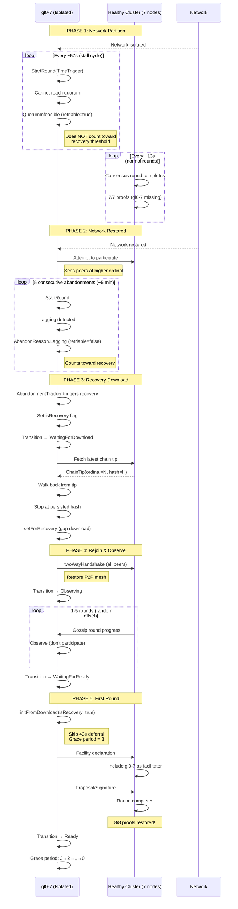

# Scenario A: Single Node Isolation (Kill 1 of 8)

This sequence shows the happy path for recovering a single isolated node.

## Timeline (Production Timings)

| Phase | Duration | Notes |
|-------|----------|-------|
| Partition | Variable | Isolated node loops with QuorumInfeasible |
| Post-restore | ~5 min | 5 × ~57s stall cycles with Lagging abandon |
| Download | ~30s | Gap download (not full history) |
| Observe | ~15-65s | Random 1-5 rounds × ~13s |
| First round | ~13s | Immediate facilitation (isRecovery=true) |
| **Total recovery** | **~6 min** | From network restore to 8/8 proofs |

## Key Observations

1. **QuorumInfeasible is retriable** — isolated node doesn't trigger recovery while partitioned
2. **Lagging is non-retriable** — detection starts after restore when peers are visible at higher ordinals
3. **Gap download** — only fetches missing snapshots, not full history
4. **Immediate facilitation** — `isRecovery=true` skips 43s TimeTick deferral
5. **Grace period** — prevents false fork detection from stale facilitatorsHash
