# Scenario B: Three Node Isolation (Kill 3 of 8)

This sequence shows recovery when 3 nodes are partitioned from a cluster of 8.

```mermaid
sequenceDiagram
    participant Minority as Minority (3 nodes)
    participant Majority as Majority (5 nodes)
    participant Network as Network

    Note over Minority,Majority: PHASE 1: Network Partition

    Network-->>Minority: Network partitioned
    
    Note over Minority: 3 nodes form minority fork<br/>(different hashes)
    Note over Majority: 5 nodes = minQuorum<br/>Keep producing

    loop Majority produces snapshots
        Majority->>Majority: Consensus round
        Majority->>Majority: 5/5 proofs
    end

    loop Minority attempts consensus
        Minority->>Minority: StartRound
        Minority->>Minority: 3 < minQuorum (5)
        Minority->>Minority: QuorumInfeasible
        Note right of Minority: May produce 1-2 minority<br/>snapshots before stall kicks in
    end

    Note over Minority,Majority: PHASE 2: Network Restored

    Network-->>Minority: Network restored

    Note over Minority,Majority: Fork detection fires 22-32s after restore<br/>(natural stagger from gossip timing<br/>+ forkConfirmationWindow gate, default 30s,<br/>on the consensus channel)

    loop EventGossipDaemon heartbeat (~10s)
        Minority->>Majority: Sample chain tips
        Majority-->>Minority: ChainTip(ordinal, hash)
    end

    Minority->>Minority: ForkRecoveryDetector.<br/>detectForkDivergence()
    Note right of Minority: Tier 1: majority of peers at our<br/>ordinal report a different hash<br/>(running fork)

    Minority->>Minority: RUNNING FORK detected

    Note over Minority,Majority: PHASE 3: Staggered Recovery

    Note over Minority: Random observe offsets<br/>prevent thundering herd

    par Node 1 recovery
        Minority->>Minority: Node 1: Transition → WaitingForDownload
        Minority->>Majority: Node 1: Gap download
        Minority->>Minority: Node 1: Observe 2 rounds
        Minority->>Majority: Node 1: Rejoin as facilitator
    and Node 2 recovery
        Minority->>Minority: Node 2: Transition → WaitingForDownload
        Minority->>Majority: Node 2: Gap download
        Minority->>Minority: Node 2: Observe 4 rounds
        Minority->>Majority: Node 2: Rejoin as facilitator
    and Node 3 recovery
        Minority->>Minority: Node 3: Transition → WaitingForDownload
        Minority->>Majority: Node 3: Gap download
        Minority->>Minority: Node 3: Observe 1 round
        Minority->>Majority: Node 3: Rejoin as facilitator
    end

    Note over Minority,Majority: PHASE 4: Gradual Cluster Growth

    Majority->>Majority: Round N: 5/5 proofs (3 recovering)
    
    Note over Majority: Node 3 rejoins first (1 round offset)
    Majority->>Majority: Round N+1: 6/6 proofs
    
    Note over Majority: Node 1 rejoins (2 round offset)
    Majority->>Majority: Round N+2: 7/7 proofs
    
    Note over Majority: Node 2 rejoins (4 round offset)
    Majority->>Majority: Round N+4: 8/8 proofs

    Note over Minority,Majority: RECOVERY COMPLETE<br/>8/8 proofs restored
```



## Timeline (Production Timings)

| Phase | Duration | Notes |
|-------|----------|-------|
| Partition | Variable | Majority keeps producing |
| Fork detection | 22-32s | Natural stagger from gossip timing |
| Download (each) | ~30s | Gap download, not full history |
| Observe stagger | 13-65s | Random 1-5 rounds per node |
| Full recovery | ~9 min | From partition to 8/8 proofs |

## Key Observations

1. **Majority keeps producing** — 5 nodes ≥ minQuorum (5), cluster stays live
2. **Minority may produce snapshots** — 1-2 minority snapshots possible before stall
3. **Fork detection via hash** — Same ordinal, different hash triggers recovery
4. **Natural stagger** — Gossip timing creates 22-32s detection spread
5. **Random observe offsets** — Prevents thundering herd on rejoin
6. **Gradual growth** — Facilitator count: 5 → 6 → 7 → 8

## Why Running Fork Detection Works

The minority nodes and majority nodes are at similar ordinals, but their snapshot hashes differ:

```
Majority: ordinal=100, hash=0xABC (produced by 5-node consensus)
Minority: ordinal=100, hash=0xDEF (produced before stall or isolation)
```

When minority nodes sample chain tips:
1. They see majority peers at the same ordinal with different hash
2. Strict majority (>50%) of sampled peers have hash != local hash
3. Tier 1 RUNNING_FORK fires immediately on the gossip channel — no
   confirmation-window delay (the same-ordinal hash divergence is
   self-evident, no risk of cascading every node simultaneously since
   only the minority side observes it)
4. The `onForkDetected` callback stores `RecoveryPeerHint = majorityPeers`
   so the recovery download targets the canonical chain
