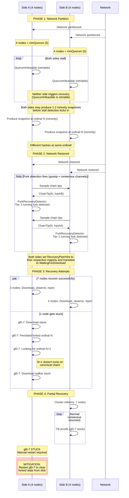

# Scenario C: Symmetric Partition (Kill 4 of 8) — Known Limitation

This sequence shows a symmetric partition where both sides lose quorum. **7/8 nodes recover, 1 gets stuck.**



## Timeline

| Phase | Duration | Notes |
|-------|----------|-------|
| Partition | Variable | Neither side has quorum |
| Fork detection | ~10-30s | After network restore |
| 7/8 recovery | ~6-9 min | Standard recovery path |
| 1/8 stuck | ∞ | Download walker deadlock |
| **Manual intervention** | Required | Restart stuck node |

## Root Cause: Observe Deadlock

When both partitions lose quorum (4+4 with minQuorum=5), neither side can produce snapshots during the partition. However, **before stall detection kicks in**, each side may produce 1-2 minority snapshots.

The stuck node's state:
1. Persisted a forked snapshot at ordinal N with hashA
2. Recovery download fetches majority chain (hashB at ordinal N)
3. Download walker looks for N+1 as successor to N (hashA)
4. **N+1 (hashA) was never produced** — the canonical chain has N+1 (hashB)
5. Walker is stuck looking for a non-existent ordinal

```
Local state:           ... → N(hashA) → ?
Canonical chain:       ... → N(hashB) → N+1(hashB) → ...

Download walker expects: N(hashA).next = N+1(hashA)
But N+1(hashA) doesn't exist!
```

## Why Other Nodes Recover

Most nodes either:
1. Didn't persist the forked snapshot before stall kicked in
2. Were on the side that became the majority (their hashes match canonical)
3. Had their forked snapshot at an ordinal that the canonical chain also has

The stuck node is unlucky: it persisted a forked snapshot at exactly the ordinal where the chains diverged.

## Mitigation Strategies

### Immediate
- **Restart the stuck node** — clears disk state, allows fresh download

### Future Improvements
- **Download validation** — detect when walker can't find expected successor
- **Fallback to full download** — if gap download fails, try from genesis
- **Forked ordinal detection** — compare local hash vs majority hash at each ordinal during download
