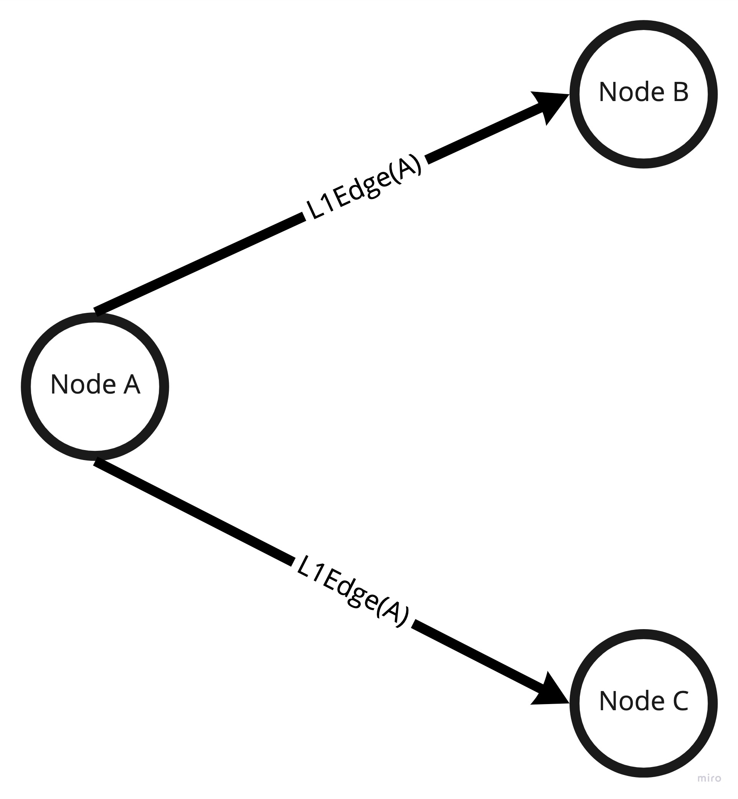
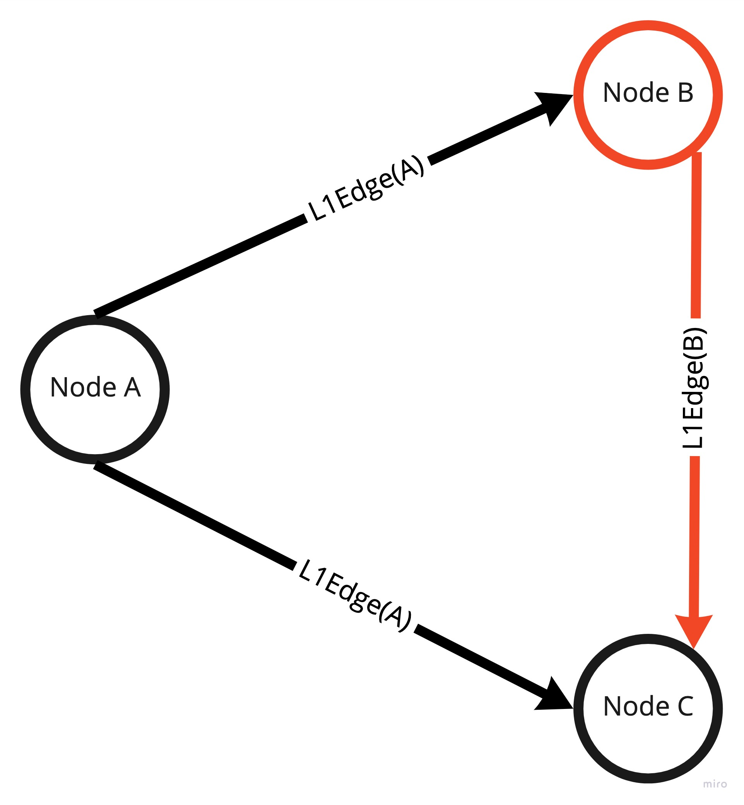
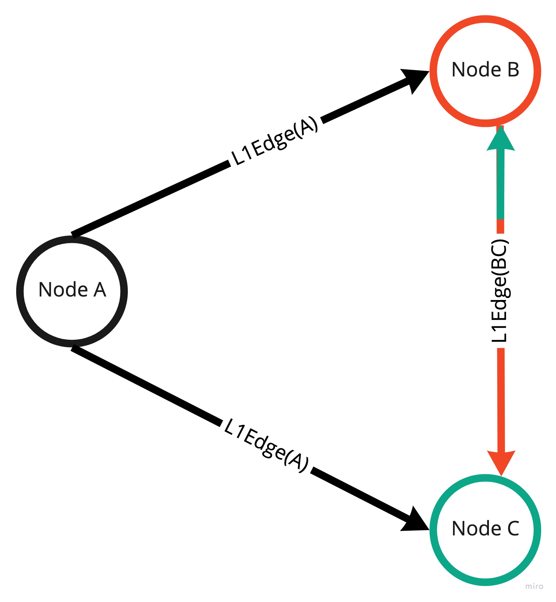
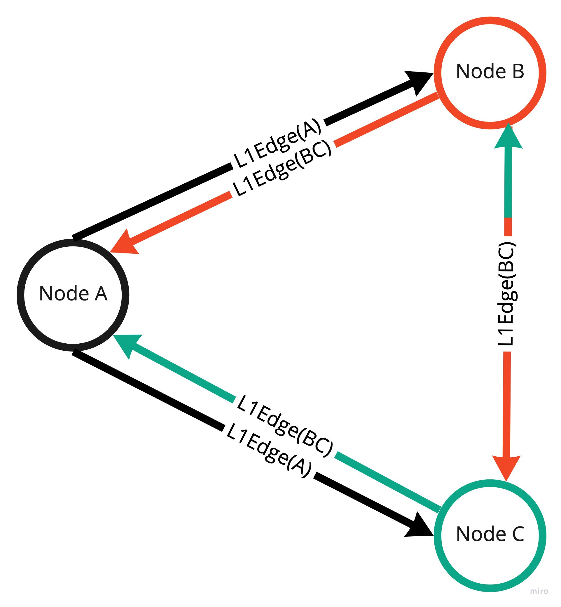
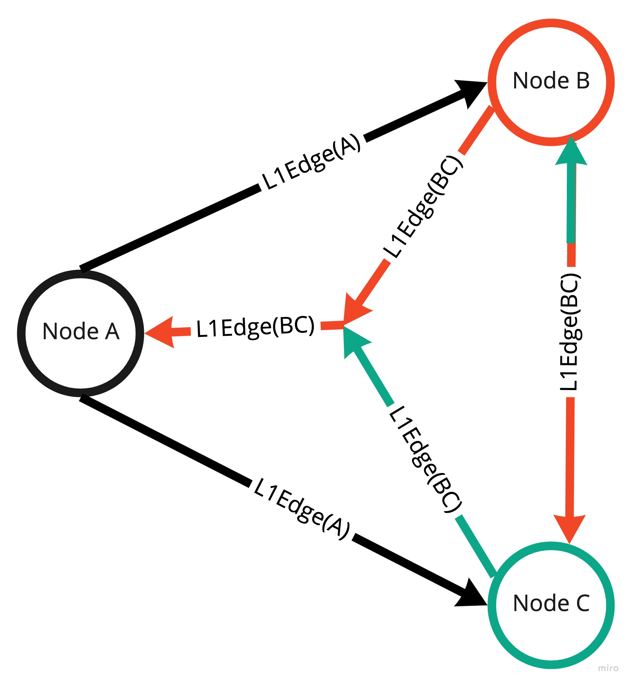
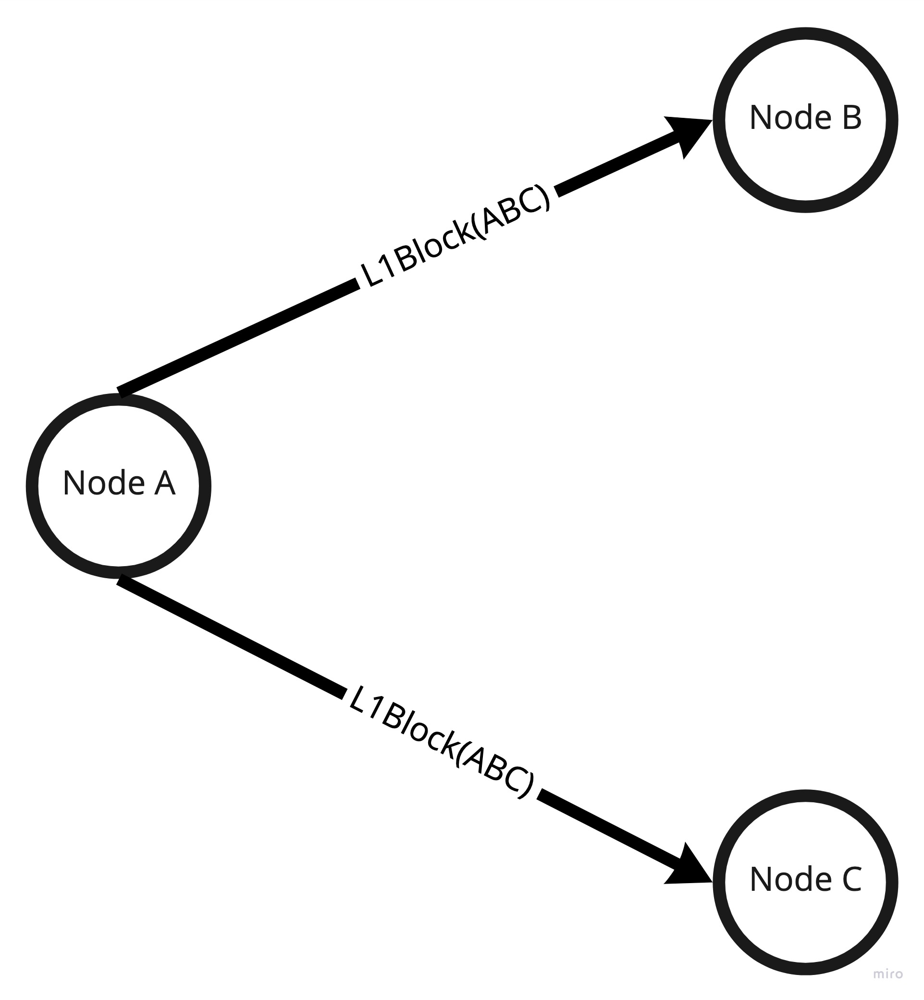

# L1 Protocol

## Concept explanation

L1 is the inner layer of the L0 protocol. The main purpose of that part is to form a tetrahedron of edges during
consensus process and produce a block which is then consumed by the L0 layer.

Base input for L1 protocol is an `L1Edge` formed from a set of `L1Transaction` (`L1Edge`s are created continuously over time
as the process is implemented as `Pipe[IO, L1Transaction, L1Edge`).
The consensus owner selects 2 facilitators and forms `L1Edge(A)` with each facilitator. `L1Edge(A)` stands for `L1Edge` which
contains all transactions proposed by _Node A_. By forming `L1Edge` _Node A_ sends proposals
and forces _Node B_ and _Node C_ to participate in consensus round.

Depending on which edge is formed faster either _Node B_ or _Node C_ starts forming a triangle (first dimension of a tetrahedron).
Let's assume that `L1Edge` from _Node A_ to _Node B_ was formed first. In that case _Node B_ is forced to create another `L1Edge(B)`
with _Node C_. It also means that _Node B_ proposes transactions to _Node C_.

In the meantime edge formed from _Node A_ to  _Node C_ forced _Node C_ to ask _Node B_ for proposal which means that
_Node B_ and _Node C_ need to exchange proposals between each other bidirectionally. Such structure starts forming the second dimension
of a tetrahedron. The whole process is asynchronous so forming edges to _Node B_ and _Node C_ happens in parallel.

Once _Node B_ and _Node C_ exchanged the proposals then these nodes need to send accumulated proposals back to the consensus
owner (_Node A_). That being said both facilitators form `L1Edge` back to _Node A_ which forms a complete structure of 2 triangles.

The role of _Node A_ is to validate if `L1Edge` from _Node B_ and _Node C_ contains the same transactions inside. If so then
the consensus owner can confirm that facilitators exchanged proposals properly. That being said both `L1Edges` are equal, so it forms a single edge back from facilitators and forms a tetrahedron.

The last step is to create a block by the consensus owner and send it to facilitators and other nodes in the network.

## Implementation explanation

The L1 protocol is based on the concept of recursive structures and [droste](https://github.com/higherkindness/droste "droste") library or to be more specific on
[hylomorphism](https://en.wikipedia.org/wiki/Hylomorphism_(computer_science) "Hylomorphism").
All the steps needed to perform a consensus are implemented via `CoalgebraM[StateM, L1ConsensusF, Ω]`. Each step is a unique type
of recursive scheme so the whole process is just a recursive structure of steps which is then executed by folding the structure
via `AlgebraM[StateM, L1ConsensusF, Either[CellError, Ω]]` .`Coalgebra` and `Algebra` are needed to execute a hylomorphism `scheme.hyloM(L1ConsensusStep.algebra, L1ConsensusStep.coalgebra)`.
Technically speaking hylomorphism is just a catamorphism after anamorphism. That being said anamorphic part creates (unfolds) the structure
and catamorphic part runs (folds) that structure to create a block. By traversing over the structure of steps it executes the steps and folds
to either `L1Block` or `CellError` in case of failure.
