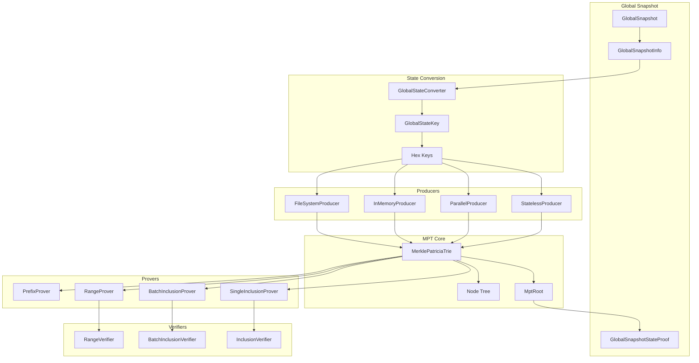
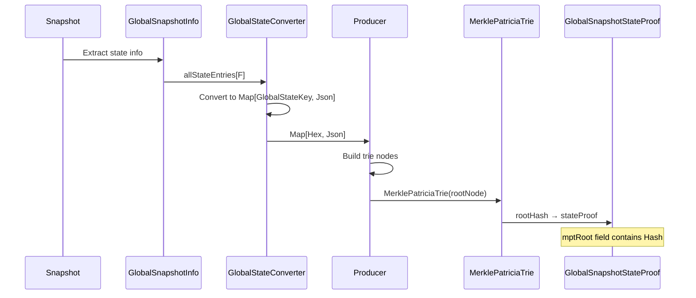
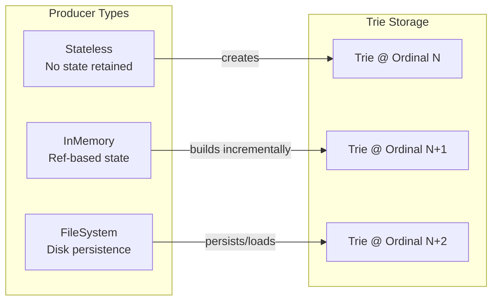

# MPT Architecture Overview

The Merkle Patricia Trie (MPT) is Tessellation's state commitment structure for the v4.0 release. It replaces the legacy per-field hash approach with a unified trie that enables efficient inclusion proofs.

> **Status:** Targeting IntegrationNet · TestNet stable since 2026-02-06

## High-Level Architecture



## Component Responsibilities

### State Layer

| Component | Responsibility |
|-----------|---------------|
| `GlobalSnapshotInfo` | Contains all state fields (balances, txRefs, metagraphs, etc.) |
| `GlobalStateConverter` | Transforms state fields to key-value pairs |
| `GlobalStateKey` | Structured key with namespace, field ID, and user addressing |

### MPT Core

| Component | Responsibility |
|-----------|---------------|
| `MerklePatriciaTrie` | Immutable trie wrapper with root node |
| `MerklePatriciaNode` | ADT: Leaf, Branch, Extension nodes |
| `MptRoot` | Type-safe wrapper for the root hash |
| `CompactNibblePath` | Memory-efficient nibble storage |

### Producers

| Producer | Use Case |
|----------|----------|
| `StatelessProducer` | One-shot trie creation from data |
| `ParallelProducer` | Parallel trie construction for large datasets |
| `InMemoryProducer` | Stateful producer for incremental updates |
| `FileSystemProducer` | Persistent storage with ordinal snapshots |

### Provers & Verifiers

| Prover/Verifier | Capability |
|-----------------|------------|
| `SingleInclusionProver` | Prove single key exists |
| `BatchInclusionProver` | Prove multiple keys (deduplicates witnesses) |
| `RangeProver` | Prove all keys in [start, end] range |
| `PrefixProver` | Prove all keys with a given prefix |

## Data Flow: Snapshot → MPT Root



## Key Design Decisions

### 1. Immutable Nodes with Pre-computed Digests

Nodes compute their hash at construction time. This:
- Eliminates caching/invalidation complexity
- Ensures hash is always available in O(1)
- Makes nodes safe for concurrent access

```scala
// Node digest is computed during construction
MerklePatriciaNode.Leaf[F](remaining, dataDigest).map { leaf =>
  leaf.digest // Always available, pre-computed
}
```

### 2. Compact Nibble Paths

Paths use `CompactNibblePath` instead of `Seq[Nibble]` for ~20-40x memory savings:

```
64-nibble path (32-byte hash):
- Seq[Nibble]: 64 objects × ~16 bytes = ~1KB + collection overhead
- CompactNibblePath: 32 bytes + ~8 bytes overhead = ~40 bytes
```

### 3. Namespaced Keys

Keys are structured with namespaces to partition state:

```
Key Structure:
┌────────────────┬──────────┬───────────────────┬──────────────┐
│ Network        │ Field ID │ Contract          │ User         │
│ (Hypergraph/   │ (8 hex)  │ (Optional addr)   │ (Address)    │
│  Metagraph)    │          │                   │              │
└────────────────┴──────────┴───────────────────┴──────────────┘
```

### 4. Commitment-based Hashing

Node hashes are computed over commitment structures, not raw data:

```scala
// Leaf commitment (what gets hashed)
case class Leaf(remaining: Seq[Nibble], dataDigest: Hash)

// Branch commitment (includes child digests)
case class Branch(pathsDigest: Map[Nibble, Hash])

// Extension commitment
case class Extension(shared: Seq[Nibble], childDigest: Hash)
```

## State Proof Selector

The system supports both legacy and MPT proof formats, selected by ordinal:

```scala
sealed trait StateProofFormat
case object LegacyFormat extends StateProofFormat
case object MerklePatriciaFormat extends StateProofFormat

trait StateProofSelector {
  def select(ordinal: SnapshotOrdinal): StateProofFormat
}
```

This enables backward compatibility during migration.

## Memory Architecture



## Related Documentation

- [Data Structures](./data-structures.md) - Detailed node types and encoding
- [Proof System](./proof-system.md) - How proofs work
- [Integration Guide](./integration.md) - Snapshot integration details
