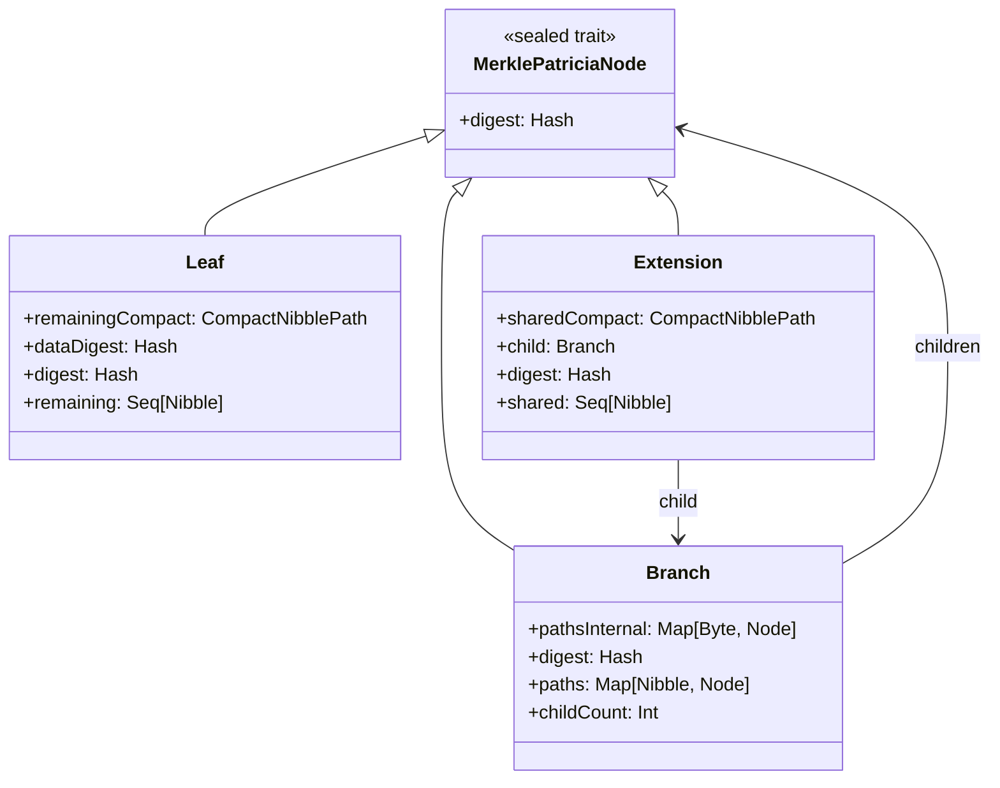
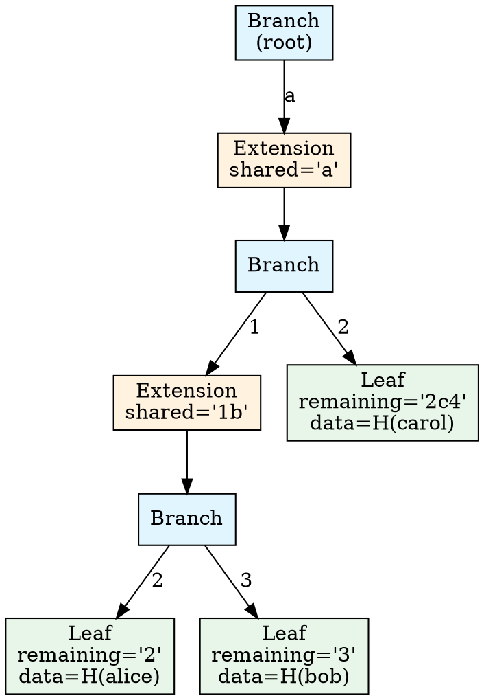
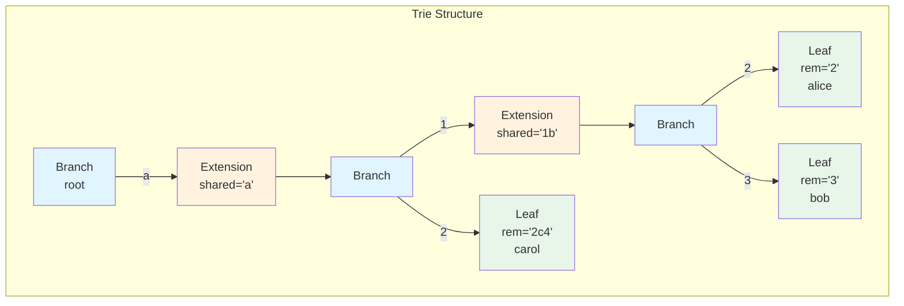
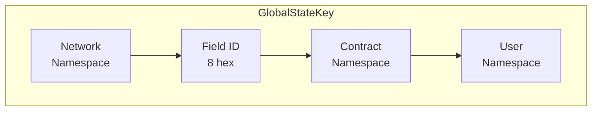
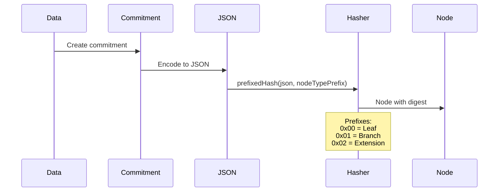

# MPT Data Structures

This document details the node types, key encoding, and memory layout of Tessellation's MPT implementation.

## Node Types

The MPT uses three node types, forming an algebraic data type:



### Leaf Node

Stores a key-value pair at the end of a path.

```scala
case class Leaf(
  remainingCompact: CompactNibblePath,  // Remaining key suffix
  dataDigest: Hash,                      // Hash of the value
  digest: Hash                           // Node hash (pre-computed)
)
```

**Example**: For key `abc123...` storing balance data:
- `remaining` = remaining nibbles after traversal
- `dataDigest` = hash of the JSON-encoded balance

### Branch Node

A 16-way branching point (one slot per hex digit 0-f).

```scala
case class Branch(
  pathsInternal: Map[Byte, MerklePatriciaNode],  // Byte-keyed for efficiency
  digest: Hash
)
```

**Memory optimization**: Uses `Map[Byte, Node]` internally, converting to `Map[Nibble, Node]` only when needed.

### Extension Node

Compresses sequences of single-child branches.

```scala
case class Extension(
  sharedCompact: CompactNibblePath,  // Shared path prefix
  child: Branch,                      // Always points to a Branch
  digest: Hash
)
```

**Example**: If keys `abc1...`, `abc2...`, `abc3...` exist, an Extension with `shared = "abc"` compresses the common prefix.

## Trie Structure Example

Consider a trie with keys:
- `a1b2` → "alice"
- `a1b3` → "bob"
- `a2c4` → "carol"





## Nibble and Path Encoding

### Nibble

A nibble is a 4-bit value (0-15), representing one hex digit.

```scala
class Nibble(val value: Byte) extends AnyVal  // value ∈ [0, 15]
```

**Conversion**:
- Byte `0xAB` → Nibbles `[0xA, 0xB]`
- Hex string `"abc"` → Nibbles `[10, 11, 12]`

### CompactNibblePath

Memory-efficient nibble storage packing 2 nibbles per byte.

```scala
class CompactNibblePath(
  packed: Array[Byte],  // 2 nibbles per byte
  length: Int           // Number of nibbles
)
```

**Memory comparison** for a 64-nibble path:

| Format | Memory Usage |
|--------|-------------|
| `Seq[Nibble]` | ~1KB (64 objects + collection overhead) |
| `CompactNibblePath` | ~40 bytes (32 packed + overhead) |

**Operations**:
```scala
val path = CompactNibblePath.fromHexString("abc123")
path(0)           // 10 (nibble 'a')
path.head         // 10
path.tail         // CompactNibblePath("bc123")
path.take(3)      // CompactNibblePath("abc")
path.drop(2)      // CompactNibblePath("c123")
path ++ other     // Concatenation
path.toHex        // Hex("abc123")
```

## GlobalStateKey Structure

Keys are structured for efficient state partitioning:



### Namespace Types

```scala
sealed trait PartitionNamespace

case object HypergraphNamespace           // Global state
case class MetagraphNamespace(addr)       // Metagraph-specific
case class AddressNamespace(addr)         // User address
case class HashNamespace(hash)            // Hash-indexed
```

### Field IDs

```scala
object GlobalStateFieldId {
  case object Balances                    // 2
  case object LastTxRefs                  // 1
  case object LastStateChannelSnapshotHashes  // 0
  case object ActiveAllowSpends           // 7
  case object ActiveTokenLocks            // 8
  case object ActiveDelegatedStakes       // 13
  // ... 19 total field types
}
```

### Key Serialization

Keys serialize to hex strings for trie insertion:

```
┌──────────────────────────────────────────────────────────────┐
│ Namespace Type (2 hex) + Namespace Hash (64 hex)             │
├──────────────────────────────────────────────────────────────┤
│ Field ID (8 hex)                                             │
├──────────────────────────────────────────────────────────────┤
│ Contract Namespace (2-66 hex)                                │
├──────────────────────────────────────────────────────────────┤
│ User Namespace (2-66 hex)                                    │
└──────────────────────────────────────────────────────────────┘

Example: Balance for address DAG123...
  00                        // Hypergraph namespace type
  00000002                  // Field ID 2 (Balances)
  00                        // Empty contract namespace
  01<hash(DAG123...)>       // Address namespace with hashed address
```

## Commitment Structures

Nodes hash over commitment structures, not raw data:

```scala
sealed trait MerklePatriciaCommitment

object MerklePatriciaCommitment {
  // Leaf: path suffix + data hash
  case class Leaf(remaining: Seq[Nibble], dataDigest: Hash)
  
  // Branch: child nibble → child digest
  case class Branch(pathsDigest: Map[Nibble, Hash])
  
  // Extension: shared prefix + child digest
  case class Extension(shared: Seq[Nibble], childDigest: Hash)
}
```

### Hashing Process



## Hash Computation

Each node type has a distinct prefix to prevent collision attacks:

```scala
private[mpt] val LeafPrefix: Array[Byte] = Array(0: Byte)
private[mpt] val BranchPrefix: Array[Byte] = Array(1: Byte)
private[mpt] val ExtensionPrefix: Array[Byte] = Array(2: Byte)

// Hash computation
Hasher[F].prefixedHash(commitment.asJson, LeafPrefix)
```

## Determinism: Order-Independent Root

The trie root is a pure function of the key/value set: any two nodes holding the same entries compute the same root regardless of the order in which keys were inserted. This is a correctness requirement, since the root participates in stateProof agreement across the cluster.

Incremental updates preserve this property by reproducing the canonical full-build structure. Before applying a batch, `FileSystemMerklePatriciaProducer` sorts both removes and inserts by `CompactNibblePath` ordering so the in-place mutation follows the same key order a full rebuild would (`FileSystemMerklePatriciaProducer.scala:158, 190-191`). The `MptInsertionOrderDeterminismSuite` guards this invariant.

## Serialization Format

Nodes serialize to JSON for persistence and wire format:

```json
// Leaf
{
  "type": "Leaf",
  "contents": {
    "remaining": "abc123",
    "dataDigest": "0x...",
    "digest": "0x..."
  }
}

// Branch  
{
  "type": "Branch",
  "contents": {
    "paths": {
      "a": { /* child node */ },
      "b": { /* child node */ }
    },
    "digest": "0x..."
  }
}

// Extension
{
  "type": "Extension", 
  "contents": {
    "shared": "abc",
    "child": { /* branch node */ },
    "digest": "0x..."
  }
}
```

## Related Documentation

- [Architecture Overview](./architecture.md) - High-level design
- [Proof System](./proof-system.md) - How proofs work
