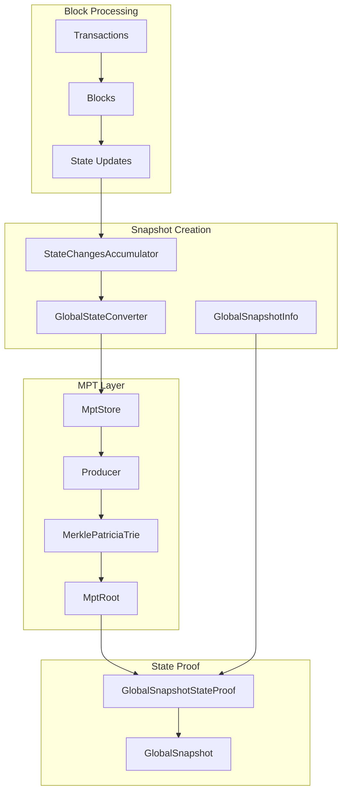
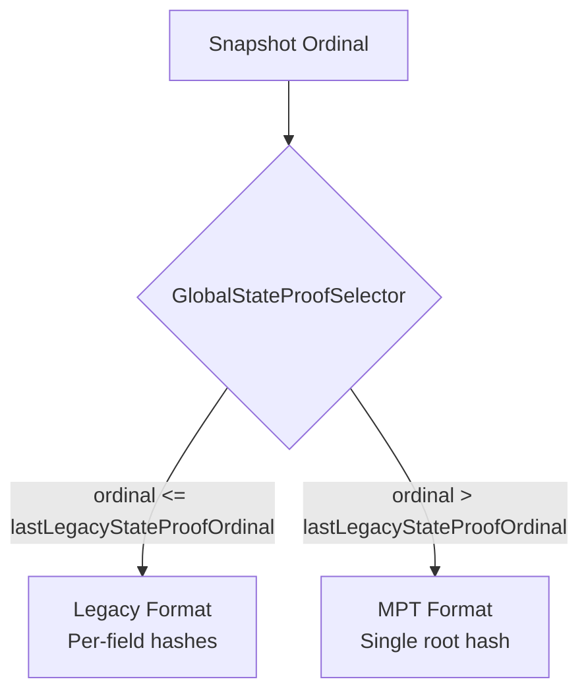
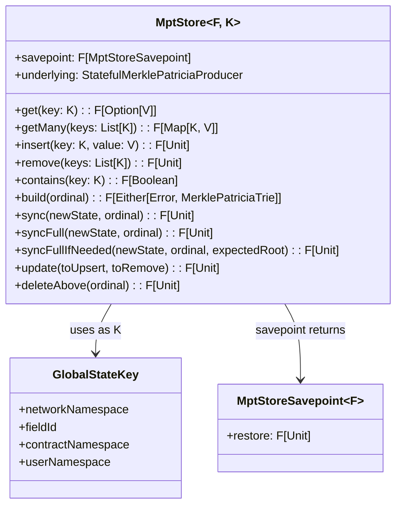
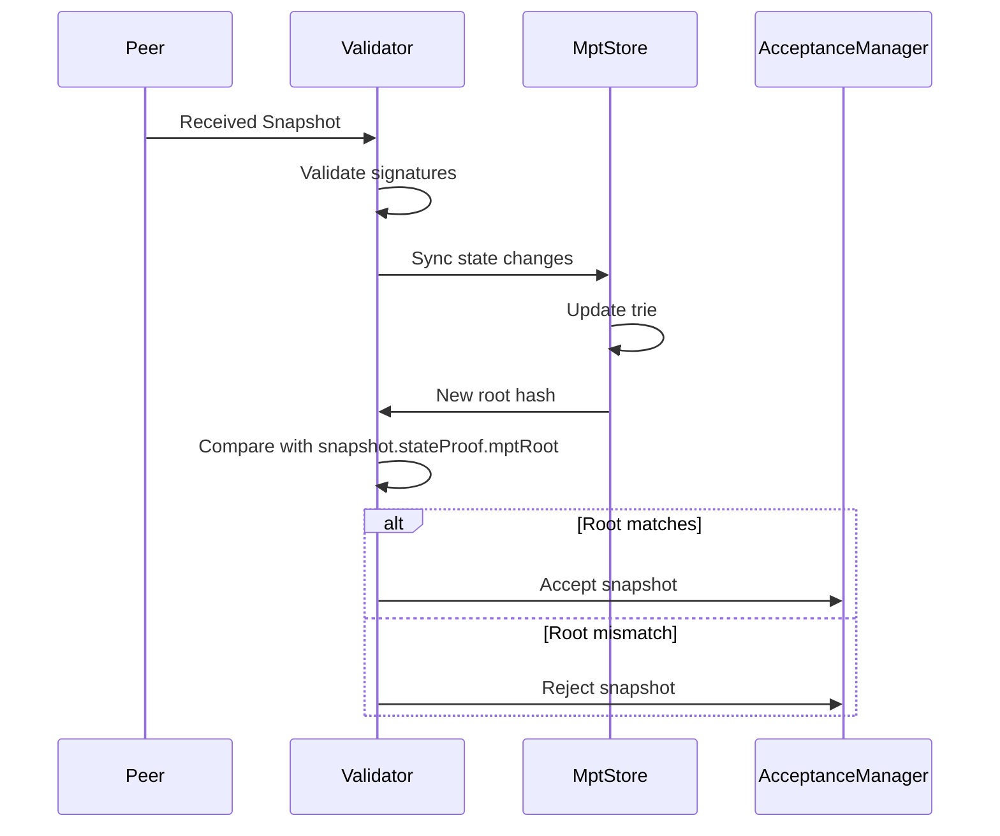

# MPT Integration Guide

This document explains how the MPT integrates with Tessellation's snapshot system.

## Activation Ordinals

MPT activation is gated per environment by the `last-legacy-state-proof-ordinal`
HOCON key. The selector treats an ordinal **at or below** the configured value as
legacy and any ordinal **above** it as MPT (see [State Proof Selector](#state-proof-selector)).
The values are already committed in `application.conf:115-120`:

| Network | `last-legacy-state-proof-ordinal` | First MPT ordinal |
|---------|-----------------------------------|-------------------|
| MainNet | 5960000 | 5960001 |
| TestNet | 3070000 | 3070001 |
| IntegrationNet | 5075000 | 5075001 |
| dev | 0 | 1 |

These are live config values, not TBD placeholders. The transition point is the
boundary above; to change it, edit `last-legacy-state-proof-ordinal` for the
environment and redeploy. Omitting an environment defaults to `Long.MaxValue`, so
MPT never activates (see the wiring in `TessellationIOApp.scala:117-118`).

## Snapshot State Flow



## State to MPT Pipeline

### Step 1: Accumulate Changes

During block processing, state changes accumulate:

```scala
case class StateChangesAccumulator(
  balances: SortedMap[Address, Balance],
  lastTxRefs: SortedMap[Address, TransactionReference],
  // ... other state changes
  removedAllowSpendKeys: Set[(Option[Address], Address)],
  // ... removal tracking
)
```

### Step 2: Convert to Key-Value Pairs

The converter transforms state to `Map[GlobalStateKey, Json]`:

```scala
import GlobalStateConverter.syntax._

// Full state conversion
val entries: F[Map[GlobalStateKey, Json]] = 
  globalSnapshotInfo.allStateEntries[F]

// Incremental from accumulator
val delta: F[Map[GlobalStateKey, Json]] = 
  accumulator.toStateEntries[F]
```

### Step 3: Build/Update MPT

```scala
// Stateless: build from scratch. GlobalStateKey -> Hex is effectful
// (GlobalStateKey.toHex[F](key)), and makeParallel returns the trie directly
// (it raises on failure rather than returning an Either).
val trie: F[MerklePatriciaTrie] = entries.flatMap { kv =>
  kv.toList
    .traverse { case (key, json) => GlobalStateKey.toHex[F](key).map(_ -> json) }
    .flatMap(hexPairs => MerklePatriciaTrie.makeParallel[F, Json](hexPairs.toMap))
}

// Stateful: incremental updates
mptStore.syncFromStateChanges(accumulator, ordinal)
val root: F[Either[MerklePatriciaError, MptRoot]] = producer.build.map(_.map(_.rootHash))
```

### Step 4: Create State Proof

```scala
// Direct call: requires an implicit StateProofSelector in scope.
val stateProof: F[GlobalSnapshotStateProof] =
  globalSnapshotInfo.stateProof(ordinal)

// Producer-aware path (used by the L0 acceptance/consensus path): build a
// StateProofBuilder, then call buildProof. The producer-aware overload is on the
// builder, NOT on stateProof - there is no stateProof(producer, ordinal).
val proof: F[GlobalSnapshotStateProof] =
  GlobalSnapshotInfo
    .stateProofBuilder(Some(producer))   // implicit GlobalStateProofSelector
    .buildProof(globalSnapshotInfo, ordinal)
```

`stateProof(ordinal)` selects legacy vs MPT via the implicit `StateProofSelector`;
`stateProofBuilder` takes an `Option[StatefulMerklePatriciaProducer]` and is used at
`GlobalSnapshotAcceptanceManager.scala:200,1161`. See
`GlobalSnapshotInfo.scala:181-230` and `StateProofBuilder.scala:19-35`.

## State Proof Selector

A `StateProofSelector` maps an ordinal to a `SnapshotFormat` (`LegacyFormat` or
`MerklePatriciaFormat`). There are two implementations
(`StateProofSelector.scala:17-39`):

```scala
sealed trait SnapshotFormat
case object LegacyFormat extends SnapshotFormat
case object MerklePatriciaFormat extends SnapshotFormat

trait StateProofSelector {
  def select(ordinal: SnapshotOrdinal): SnapshotFormat
}

// Global snapshots: boundary is the LAST legacy ordinal (at-or-below = legacy).
class GlobalStateProofSelector(lastLegacyStateProofOrdinal: SnapshotOrdinal)
    extends StateProofSelector {
  def select(ordinal: SnapshotOrdinal): SnapshotFormat =
    if (ordinal.value.value <= lastLegacyStateProofOrdinal.value.value) LegacyFormat
    else MerklePatriciaFormat
}

// Currency snapshots: no MPT migration; ALWAYS legacy.
class CurrencyStateProofSelector extends StateProofSelector {
  def select(ordinal: SnapshotOrdinal): SnapshotFormat = LegacyFormat
}
```

The boundary is `lastLegacyStateProofOrdinal`, the **last** ordinal that stays
legacy, not a first-MPT cutoff. The comparison is `<=`: an ordinal equal to the
boundary is still legacy; only ordinals strictly above it produce MPT proofs.



`CurrencyStateProofSelector` returns `LegacyFormat` for every ordinal, so currency
(metagraph) snapshots never switch to MPT proofs.

### Configuration

The `GlobalStateProofSelector` boundary is driven by the `last-legacy-state-proof-ordinal`
HOCON key, a per-environment map from `AppEnvironment` to `SnapshotOrdinal`
(`application.conf:115-120`):

```hocon
last-legacy-state-proof-ordinal {
  mainnet: 5960000,
  testnet: 3070000,
  integrationnet: 5075000,
  dev: 0
}
```

This parses into `SharedConfig.lastLegacyStateProofOrdinal` and is threaded into the
implicit selector via
`cfg.lastLegacyStateProofOrdinal.getOrElse(cfg.environment, SnapshotOrdinal.unsafeApply(Long.MaxValue))`
(`TessellationIOApp.scala:117-118`). If an environment is absent from the map the
default is `Long.MaxValue`, so every ordinal stays legacy and MPT never activates.

## GlobalSnapshotStateProof Structure

The case class has 17 fields (`GlobalSnapshotStateProof.scala:55-74`). The three
required legacy hashes and the currency merkle root carry a `Proof` suffix; the rest
are `Option[Hash]` for the per-field legacy proofs, with `mptRoot` last:

```scala
case class GlobalSnapshotStateProof(
  // Legacy proofs (populated in legacy mode)
  lastStateChannelSnapshotHashesProof: Hash,
  lastTxRefsProof: Hash,
  balancesProof: Hash,
  lastCurrencySnapshotsProof: Option[MerkleRoot],
  activeAllowSpends: Option[Hash],
  activeTokenLocks: Option[Hash],
  tokenLockBalances: Option[Hash],
  lastAllowSpendRefs: Option[Hash],
  lastTokenLockRefs: Option[Hash],
  updateNodeParameters: Option[Hash],
  activeDelegatedStakes: Option[Hash],
  delegatedStakesWithdrawals: Option[Hash],
  activeNodeCollaterals: Option[Hash],
  nodeCollateralWithdrawals: Option[Hash],
  priceState: Option[Hash],
  lastGlobalSnapshotsWithCurrency: Option[Hash],

  // MPT field (populated in MPT mode)
  mptRoot: Option[Hash]  // Single root for all state
) extends StateProof
```

In MPT mode the legacy per-field proofs are typically empty and only `mptRoot` is
populated; in legacy mode the per-field proofs are filled and `mptRoot` is `None`.

## MptStore Integration

The `MptStore` provides a typed interface over the producer
(`MptStore.scala:26-48`):



Note: `build` takes a `SnapshotOrdinal` (there is no no-arg `build`) and returns
`Either[MerklePatriciaError, MerklePatriciaTrie]`. A mutation `Semaphore` serializes
the heavy methods (`syncFull` / `sync` / `update` / `deleteAbove` / `savepoint`); the
internal `insert` / `remove` / `clear` / `build` are not externally invoked and are
not lock-wrapped (`MptStore.scala:58-78`).

### Divergence Guards: savepoint and content-aware sync

Two post-v4.0.0 mechanisms protect the trie root from a same-ordinal retry emitting a
divergent root:

- **savepoint / restore** (`MptStore.scala:325-335`): `savepoint` captures the
  producer state plus the last-synced ordinal; the returned `MptStoreSavepoint.restore`
  rolls the store back. This undoes partial proposal mutations when artifact validation
  fails (e.g. a stateProof divergence on an abandoned round).

- **syncFullIfNeeded(newState, ordinal, expectedRoot)** (`MptStore.scala:242-288`):
  a content-aware re-sync. The ordinal tag alone is not trusted - an abandoned-round
  mutation or a savepoint restore can leave the in-memory entry set stale while the tag
  persists. When `expectedRoot` is supplied, the store calls `build(ordinal)` (so
  pending inserts/removes are applied) and compares the rebuilt root to `expectedRoot`;
  on mismatch (or a `Left` build) it forces a full `syncFull` to avoid emitting a
  divergent root. With `expectedRoot = None` the matching ordinal tag is treated as a
  plain no-op.

### Typed Accessors

```scala
// From GlobalStateConverter.syntax._
mptStore.getBalance(address)           // F[Option[Balance]]
mptStore.getTxRef(address)             // F[Option[TransactionReference]]
mptStore.getStateChannelHash(addr)     // F[Option[Hash]]
mptStore.getDelegatedStakes(address)   // F[Option[SortedSet[DelegatedStakeRecord]]]
mptStore.getCurrencySnapshot(addr)     // F[Option[Signed[CurrencySnapshot]]]
```

## Producer Types in Context

### Stateless Producer

Used for one-shot trie creation (validation, comparison):

```scala
// Create trie from snapshot info (each key is hashed to Hex via GlobalStateKey.toHex)
val trie: F[MerklePatriciaTrie] = info.allStateEntries[F].flatMap { entries =>
  entries.toList
    .traverse { case (key, json) => GlobalStateKey.toHex[F](key).map(_ -> json) }
    .flatMap(hexPairs => MerklePatriciaTrie.makeParallel[F, Json](hexPairs.toMap))
}
```

### InMemory Producer

A test / one-shot producer. `InMemoryMerklePatriciaProducer` extends only
`StatefulMerklePatriciaProducer`, not the persistence trait
(`InMemoryMerklePatriciaProducer.scala:19-26`), so it does not participate in
`persist` / `deleteAbove` / `applyCutoff`. Production L0 acceptance and consensus use
the persistent `FileSystemMerklePatriciaProducer` (below) wired through `MptStore`.

```scala
val producer: F[StatefulMerklePatriciaProducer[F]] = 
  MerklePatriciaProducer.inMemory[F](initialState)

// Incremental updates
producer.insert(newData)
producer.remove(keysToRemove)
val trie = producer.build
```

### FileSystem Producer

Used for persistent state with ordinal tracking:

```scala
val producer: F[StatefulWithPersistenceMerklePatriciaProducer[F]] = 
  FileSystemMerklePatriciaProducer.make[F](basePath)

// Persist at ordinal
producer.persist(ordinal)

// Load from ordinal
producer.load(ordinal)

// Cleanup old states
producer.applyCutoff(keepAboveOrdinal)
```

## Snapshot Acceptance Flow



This sequence is the happy path. In practice the store also guards against stale
in-memory state on retries: before a proposal mutates the trie a `savepoint` is taken
so a failed same-ordinal round can `restore`, and `syncFullIfNeeded(..., expectedRoot)`
forces a full resync when the rebuilt root does not match the expected stateProof root
despite a matching ordinal tag. See
[Divergence Guards](#divergence-guards-savepoint-and-content-aware-sync).

## Proof Validation in Consensus

Light clients can verify state claims:

```scala
def verifyBalanceClaim(
  address: Address,
  claimedBalance: Balance,
  proof: MerklePatriciaInclusionProof,
  snapshotRoot: Hash
): F[Boolean] = {
  val verifier = MerklePatriciaInclusionVerifier.make[F](snapshotRoot)
  verifier.confirm(proof).map(_.isRight)
}
```

## Key Namespacing Strategy

State is partitioned for efficient querying:

```
Hypergraph State (global):
  00 + fieldId + 00 + userHash
  Examples:
    - Balance: 00 00000002 00 01<addressHash>
    - TxRef:   00 00000001 00 01<addressHash>

Metagraph State (per-metagraph):
  01<metagraphHash> + fieldId + 00 + 00
  Examples:
    - Currency snapshot: 01<mgHash> 00000005 00 00
    - State channel hash: 01<mgHash> 00000000 00 00

Contract State (per-contract per-user):
  00 + fieldId + 01<contractHash> + 01<userHash>
  Examples:
    - AllowSpend: 00 00000007 01<contractHash> 01<userHash>
```

## Migration from Legacy

### Timeline

The per-environment activation ordinals are committed in
`application.conf:115-120` (see [Activation Ordinals](#activation-ordinals)); the
boundary for each network is its `last-legacy-state-proof-ordinal` value. To move a
network's transition, edit that key and redeploy.

### Dual-Mode Operation

Both formats are supported; `stateProof(ordinal)` branches on the implicit selector
(`GlobalSnapshotInfo.scala:181-187`):

```scala
def stateProof[F[_]: Parallel: Async: Hasher: JsonSerializer](ordinal: SnapshotOrdinal)(
  implicit stateProofSelector: StateProofSelector
): F[GlobalSnapshotStateProof] =
  stateProofSelector.select(ordinal) match {
    case LegacyFormat =>
      lastCurrencySnapshots.merkleTree[F].flatMap(stateProof(_))
    case MerklePatriciaFormat =>
      GlobalSnapshotInfo.mptStateProof[F](this)
  }
```

### Transition Boundary

The network coordinates on the `last-legacy-state-proof-ordinal` boundary:

1. At-or-below the boundary: legacy proofs.
2. Above the boundary: MPT proofs.
3. Validators reject the wrong format for the ordinal.

The boundary values are live config, not TBD. See
[Activation Ordinals](#activation-ordinals) and the
[State Proof Selector](#state-proof-selector).

## Error Handling

```scala
sealed trait MerklePatriciaError

case class InvalidData(message: String)     // Bad input data
case class OperationError(message: String)  // Insert/remove failure

// In the producer-aware proof path, the MPT build returns an Either:
producer.buildForOrdinal(ordinal).flatMap {
  case Left(err: MerklePatriciaError) =>
    // Handle MPT construction failure
  case Right(trie) =>
    // Use trie.rootHash
}
```

## Performance Tuning

### Batch Size

Large state updates are batched:

```scala
private val BatchSize = 5000

entries.grouped(BatchSize).traverse { batch =>
  store.sync(batch, ordinal) >> Async[F].cede
}
```

### Parallel Construction

For large initial state:

```scala
MerklePatriciaTrie.makeParallel[F, Json](data)
// Uses ParallelMerklePatriciaProducer internally
```

## Related Documentation

- [Architecture Overview](./architecture.md) - High-level design
- [API Reference](./api-reference.md) - Detailed API documentation
