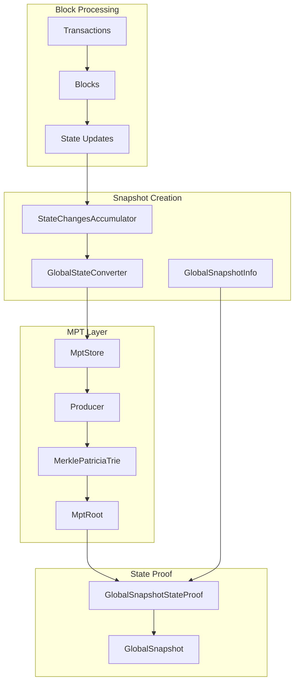
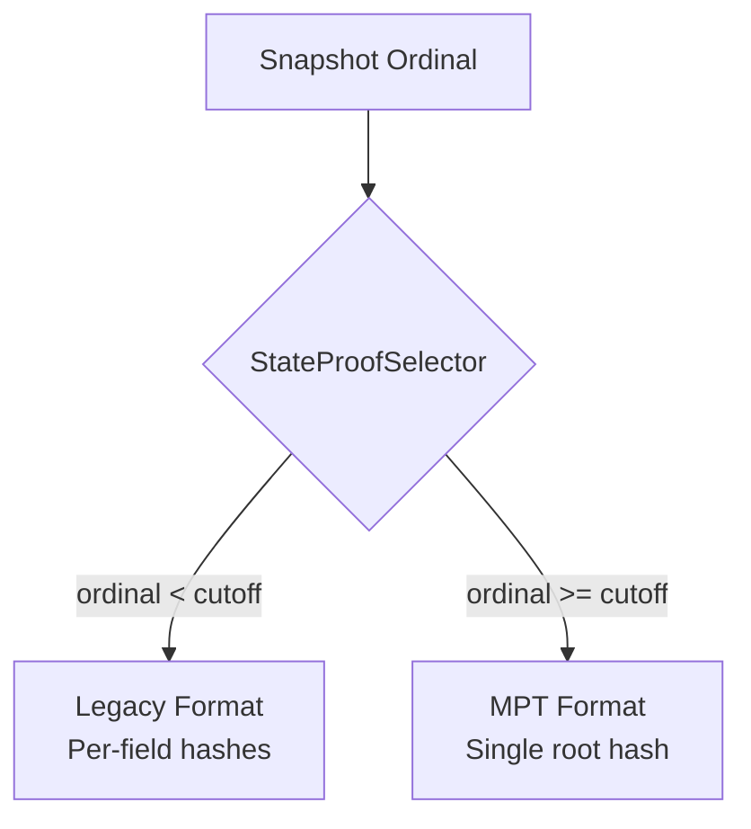
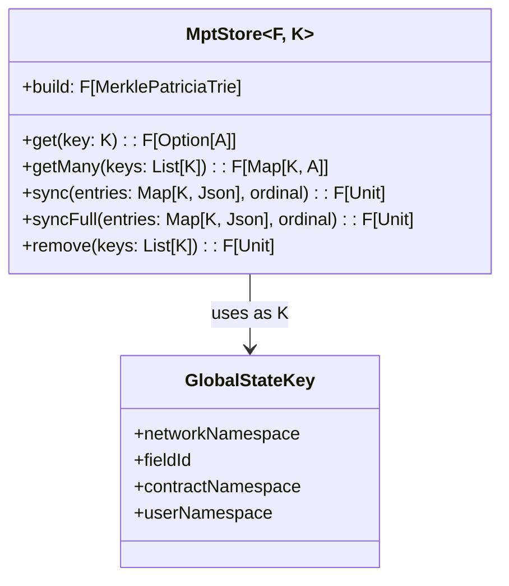
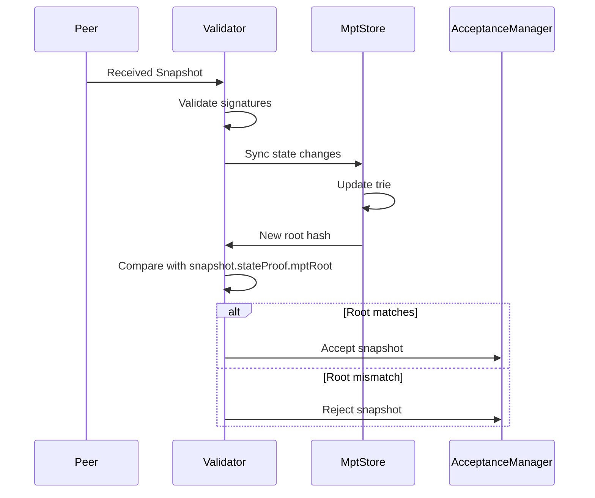

# MPT Integration Guide

This document explains how the MPT integrates with Tessellation's snapshot system.

## Snapshot State Flow



## State to MPT Pipeline

### Step 1: Accumulate Changes

During block processing, state changes accumulate:

```scala
case class StateChangesAccumulator(
  balances: SortedMap[Address, Balance],
  lastTxRefs: SortedMap[Address, TransactionReference],
  // ... other state changes
  removedAllowSpendKeys: Set[(Option[Address], Address)],
  // ... removal tracking
)
```

### Step 2: Convert to Key-Value Pairs

The converter transforms state to `Map[GlobalStateKey, Json]`:

```scala
import GlobalStateConverter.syntax._

// Full state conversion
val entries: F[Map[GlobalStateKey, Json]] = 
  globalSnapshotInfo.allStateEntries[F]

// Incremental from accumulator
val delta: F[Map[GlobalStateKey, Json]] = 
  accumulator.toStateEntries[F]
```

### Step 3: Build/Update MPT

```scala
// Stateless: build from scratch
val trie: F[MerklePatriciaTrie] = entries.flatMap { kv =>
  MerklePatriciaTrie.makeParallel[F, Json](hexMap)
}

// Stateful: incremental updates
mptStore.syncFromStateChanges(accumulator, ordinal)
val root: F[MptRoot] = producer.build.map(_.rootHash)
```

### Step 4: Create State Proof

```scala
val stateProof: F[GlobalSnapshotStateProof] = 
  globalSnapshotInfo.stateProof(ordinal)
// or with pre-built producer:
  globalSnapshotInfo.stateProof(producer, ordinal)
```

## State Proof Selector

The system supports both legacy and MPT formats:



### Configuration

```scala
trait StateProofSelector {
  def select(ordinal: SnapshotOrdinal): StateProofFormat
}

// Implementation determines cutoff
class CutoffBasedSelector(cutoffOrdinal: SnapshotOrdinal) extends StateProofSelector {
  def select(ordinal: SnapshotOrdinal): StateProofFormat =
    if (ordinal.value < cutoffOrdinal.value) LegacyFormat
    else MerklePatriciaFormat
}
```

## GlobalSnapshotStateProof Structure

```scala
case class GlobalSnapshotStateProof(
  // Legacy fields (populated in legacy mode)
  lastStateChannelSnapshotHashes: Hash,
  lastTxRefs: Hash,
  balances: Hash,
  lastCurrencySnapshots: Option[MerkleRoot],
  activeAllowSpends: Option[Hash],
  // ... other legacy hashes
  
  // MPT field (populated in MPT mode)
  mptRoot: Option[Hash]  // Single root for all state
)
```

## MptStore Integration

The `MptStore` provides a typed interface over the producer:



### Typed Accessors

```scala
// From GlobalStateConverter.syntax._
mptStore.getBalance(address)           // F[Option[Balance]]
mptStore.getTxRef(address)             // F[Option[TransactionReference]]
mptStore.getStateChannelHash(addr)     // F[Option[Hash]]
mptStore.getDelegatedStakes(address)   // F[Option[SortedSet[DelegatedStakeRecord]]]
mptStore.getCurrencySnapshot(addr)     // F[Option[Signed[CurrencySnapshot]]]
```

## Producer Types in Context

### Stateless Producer

Used for one-shot trie creation (validation, comparison):

```scala
// Create trie from snapshot info
val trie = info.allStateEntries[F].flatMap { entries =>
  MerklePatriciaTrie.makeParallel[F, Json](entries.toHexMap)
}
```

### InMemory Producer

Used for L0 node state tracking:

```scala
val producer: F[StatefulMerklePatriciaProducer[F]] = 
  MerklePatriciaProducer.inMemory[F](initialState)

// Incremental updates
producer.insert(newData)
producer.remove(keysToRemove)
val trie = producer.build
```

### FileSystem Producer

Used for persistent state with ordinal tracking:

```scala
val producer: F[StatefulWithPersistenceMerklePatriciaProducer[F]] = 
  FileSystemMerklePatriciaProducer.make[F](basePath)

// Persist at ordinal
producer.persist(ordinal)

// Load from ordinal
producer.load(ordinal)

// Cleanup old states
producer.applyCutoff(keepAboveOrdinal)
```

## Snapshot Acceptance Flow



## Proof Validation in Consensus

Light clients can verify state claims:

```scala
def verifyBalanceClaim(
  address: Address,
  claimedBalance: Balance,
  proof: MerklePatriciaInclusionProof,
  snapshotRoot: Hash
): F[Boolean] = {
  val verifier = MerklePatriciaInclusionVerifier.make[F](snapshotRoot)
  verifier.confirm(proof).map(_.isRight)
}
```

## Key Namespacing Strategy

State is partitioned for efficient querying:

```
Hypergraph State (global):
  00 + fieldId + 00 + userHash
  Examples:
    - Balance: 00 00000002 00 01<addressHash>
    - TxRef:   00 00000001 00 01<addressHash>

Metagraph State (per-metagraph):
  01<metagraphHash> + fieldId + 00 + 00
  Examples:
    - Currency snapshot: 01<mgHash> 00000005 00 00
    - State channel hash: 01<mgHash> 00000000 00 00

Contract State (per-contract per-user):
  00 + fieldId + 01<contractHash> + 01<userHash>
  Examples:
    - AllowSpend: 00 00000007 01<contractHash> 01<userHash>
```

## Migration from Legacy

### Dual-Mode Operation

During migration, both formats are supported:

```scala
def stateProof[F[_]](ordinal: SnapshotOrdinal)(
  implicit selector: StateProofSelector
): F[GlobalSnapshotStateProof] =
  selector.select(ordinal) match {
    case LegacyFormat =>
      // Compute individual field hashes
      computeLegacyProof()
    case MerklePatriciaFormat =>
      // Build MPT and use root
      allStateEntries.buildMpt.map(root => GlobalSnapshotStateProof(..., mptRoot = Some(root)))
  }
```

### Cutoff Ordinal

The network coordinates on a cutoff ordinal:
1. Before cutoff: Legacy proofs required
2. At/after cutoff: MPT proofs required
3. Validators reject wrong format for ordinal

## Error Handling

```scala
sealed trait MerklePatriciaError

case class InvalidData(message: String)     // Bad input data
case class OperationError(message: String)  // Insert/remove failure

// In state proof context
globalSnapshotInfo.stateProof(producer, ordinal).flatMap {
  case Left(err: MerklePatriciaError) => 
    // Handle MPT construction failure
  case Right(trie) =>
    // Use trie root
}
```

## Performance Tuning

### Batch Size

Large state updates are batched:

```scala
private val BatchSize = 5000

entries.grouped(BatchSize).traverse { batch =>
  store.sync(batch, ordinal) >> Async[F].cede
}
```

### Parallel Construction

For large initial state:

```scala
MerklePatriciaTrie.makeParallel[F, Json](data)
// Uses ParallelMerklePatriciaProducer internally
```

## Related Documentation

- [Architecture Overview](./architecture.md) - High-level design
- [API Reference](./api-reference.md) - Detailed API documentation
