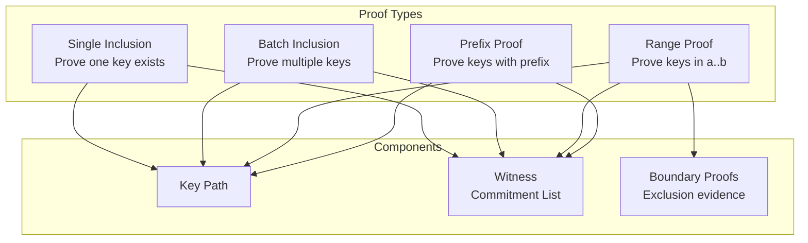
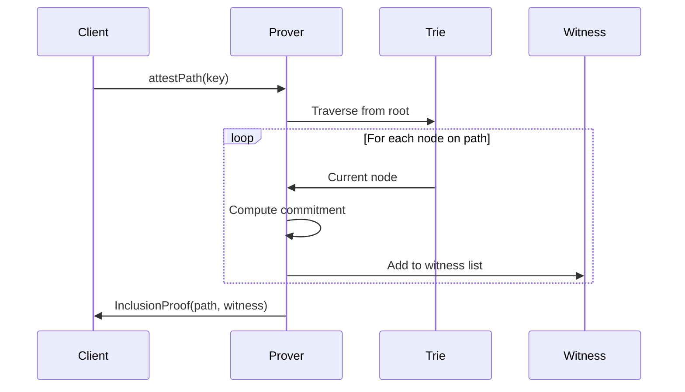
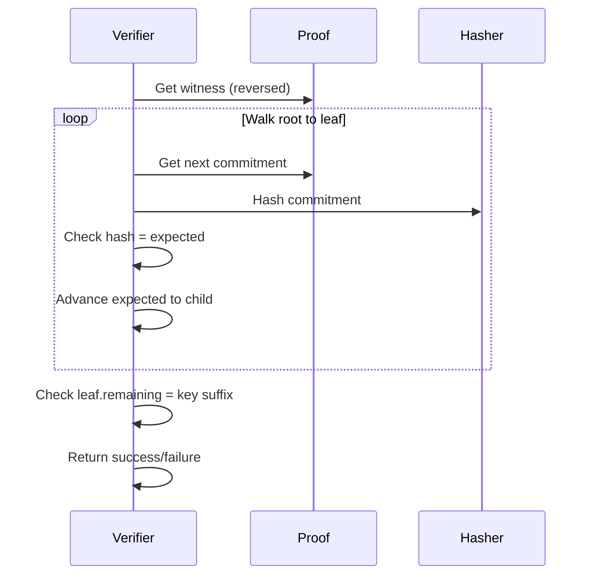
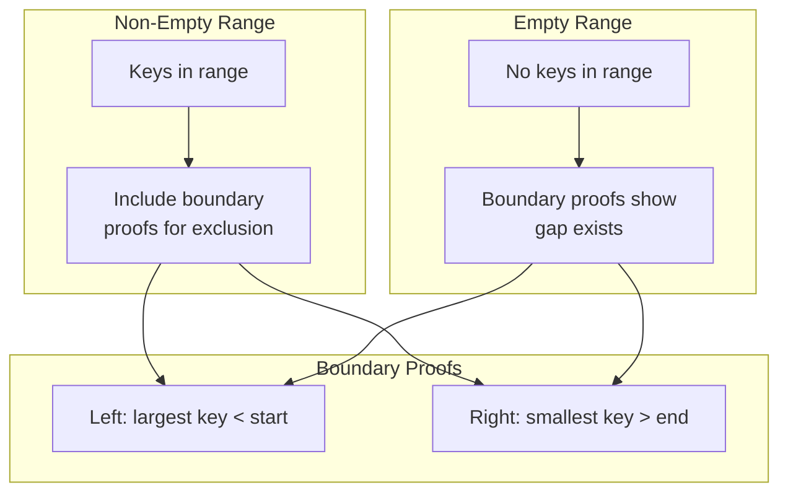
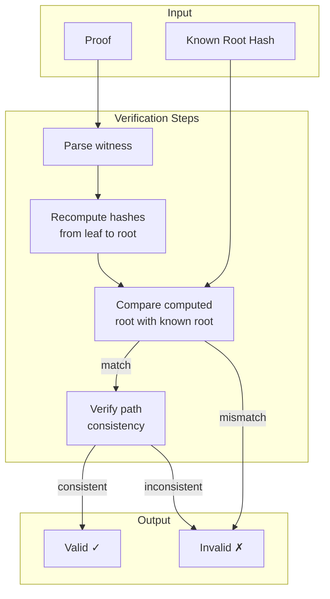

# MPT Proof System

The proof system enables light clients and external verifiers to confirm state without downloading the entire trie.

## Proof Types Overview



## Single Inclusion Proof

Proves that a specific key exists in the trie with a specific value.

### Structure

```scala
case class MerklePatriciaInclusionProof(
  path: Hex,                              // Key being proven
  witness: List[MerklePatriciaCommitment] // Path from leaf to root
)
```

### Proof Generation



### Example Walkthrough

For key `a1b2` in the example trie:

```
Traversal:
1. Root Branch → take 'a' edge → Extension
2. Extension (shared='a') → Branch
3. Branch → take '1' edge → Extension  
4. Extension (shared='1b') → Branch
5. Branch → take '2' edge → Leaf
6. Leaf (remaining='2') ← target found!

Witness (collected bottom-up):
[
  Leaf(remaining="2", dataDigest=H(alice)),
  Branch({2→H(leaf_alice), 3→H(leaf_bob)}),
  Extension(shared="1b", childDigest=H(branch)),
  Branch({1→H(ext_1), 2→H(leaf_carol)}),
  Extension(shared="a", childDigest=H(branch_a)),
  Branch({a→H(ext_a)})  // root
]
```

### Verification



## Batch Inclusion Proof

Proves multiple keys exist, with witness deduplication.

### Structure

```scala
case class MerklePatriciaBatchInclusionProof(
  paths: List[Hex],                       // Keys being proven (sorted)
  witness: List[MerklePatriciaCommitment] // Deduplicated commitments
)
```

### Deduplication

When proving keys `a1b2` and `a1b3`, they share most of their path:

```
Without deduplication:
  Proof for a1b2: [leaf2, branch_1b, ext_1b, branch_a, ext_a, root]
  Proof for a1b3: [leaf3, branch_1b, ext_1b, branch_a, ext_a, root]
  Total: 12 commitments

With deduplication:
  Combined: [leaf2, leaf3, branch_1b, ext_1b, branch_a, ext_a, root]
  Total: 7 commitments (42% reduction)
```

### Usage

```scala
val prover = MerklePatriciaBatchInclusionProver.make[F](trie)
val paths = List(Hex("a1b2..."), Hex("a1b3..."))
val proof: F[Either[Error, MerklePatriciaBatchInclusionProof]] = 
  prover.attestPaths(paths)
```

## Range Proof

Proves all keys within a lexicographic range exist (or proves the range is empty).

### Structure

```scala
case class MerklePatriciaRangeProof(
  startPath: Hex,
  endPath: Hex,
  inclusionProofs: List[MerklePatriciaInclusionProof],
  exclusionBoundaries: Option[RangeExclusionBoundaries]
)

case class RangeExclusionBoundaries(
  leftBoundary: Option[MerklePatriciaInclusionProof],   // Key just before range
  rightBoundary: Option[MerklePatriciaInclusionProof]   // Key just after range
)
```

### Range Proof Scenarios



### Example: Range Query

Query: All keys in range `["a100", "a200"]`

```
Trie contents:
  a0ff → value1
  a150 → value2  ← in range
  a175 → value3  ← in range
  a250 → value4

Result:
  inclusionProofs: [proof(a150), proof(a175)]
  exclusionBoundaries:
    leftBoundary: proof(a0ff)   // Proves no key in (a0ff, a150)
    rightBoundary: proof(a250)  // Proves no key in (a175, a250)
```

## Prefix Proof

Proves all keys matching a prefix.

### Structure

Uses `MerklePatriciaBatchInclusionProof` with all matching keys.

### Example

Query: All keys with prefix `a1`

```scala
val prover = MerklePatriciaPrefixProver.make[F](trie)
val proof = prover.attestPrefix(Hex("a1"))
// Returns batch proof for all keys starting with "a1"
```

## Verification Flow



## Error Types

```scala
sealed trait MerklePatriciaProofError

// Key not in trie
case class PathNotFound(path: String)

// Unexpected node type during traversal
case class InvalidNodeType(message: String)

// General proof generation failure
case class ProofGenerationError(message: String)
```

```scala
sealed trait MerklePatriciaVerificationError

// Witness structure invalid
case class InvalidWitness(message: String)

// Path doesn't match witness
case class InvalidPath(message: String)

// Hash mismatch
case class InvalidNodeCommitment(message: String)
```

## API Usage

### Generating Proofs

```scala
import io.constellationnetwork.security.mpt.prover._
import io.constellationnetwork.security.mpt.MerklePatriciaTrie

// Create prover from trie
val singleProver = MerklePatriciaSingleInclusionProver.make[F](trie)
val batchProver = MerklePatriciaBatchInclusionProver.make[F](trie)
val rangeProver = MerklePatriciaRangeProver.make[F](trie)
val prefixProver = MerklePatriciaPrefixProver.make[F](trie)

// Generate proofs
val singleProof = singleProver.attestPath(Hex("abc123..."))
val batchProof = batchProver.attestPaths(List(Hex("abc..."), Hex("def...")))
val rangeProof = rangeProver.attestRange(Hex("a000"), Hex("afff"))
val prefixProof = prefixProver.attestPrefix(Hex("abc"))
```

### Verifying Proofs

```scala
import io.constellationnetwork.security.mpt.verifier._

// Create verifier with known root
val verifier = MerklePatriciaInclusionVerifier.make[F](knownRoot)

// Verify
val result: F[Either[VerificationError, Unit]] = verifier.confirm(proof)
```

### Syntax Extensions

```scala
import MerklePatriciaSingleInclusionProver.syntax._
import MerklePatriciaInclusionVerifier.syntax._

// Implicit prover/verifier in scope
val proof = Hex("abc123").attestInclusion[F]
val valid = proof.confirm[F]
```

## Performance Characteristics

| Operation | Complexity | Notes |
|-----------|-----------|-------|
| Single proof generation | O(log n) | Path length = key length |
| Single proof verification | O(log n) | Recomputes hashes |
| Batch proof generation | O(k log n) | k = number of keys |
| Batch proof size | O(k log n) | With deduplication |
| Range proof generation | O(m log n) | m = keys in range |

## Security Properties

1. **Binding**: Cannot create valid proof for non-existent key
2. **Completeness**: Can always create proof for existing key
3. **Soundness**: Invalid proof will fail verification with overwhelming probability
4. **Prefix collision resistance**: Node type prefixes prevent cross-type hash collisions

## Related Documentation

- [Data Structures](./data-structures.md) - Node and commitment types
- [Integration Guide](./integration.md) - How proofs integrate with snapshots
