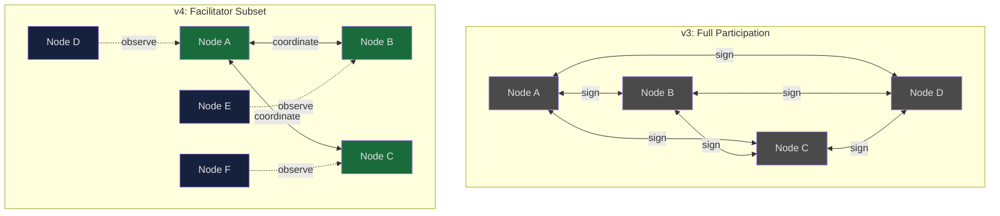
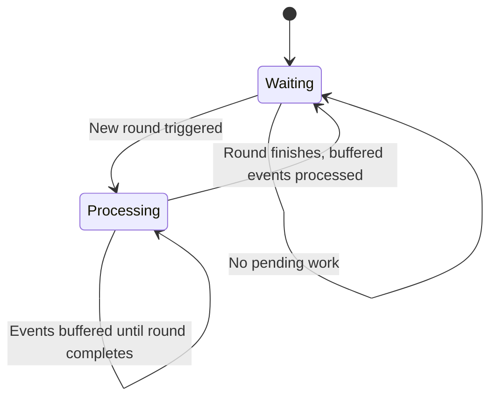
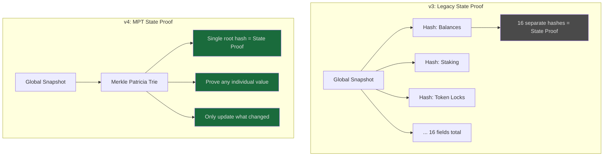

# Tessellation v4: The Consensus That Scales

Every distributed system hits a wall. For Tessellation, that wall was consensus traffic. When every node must sign every round, network overhead grows quadratically. Double the nodes, quadruple the traffic. It works at 50 nodes. It strains at 200. It doesn't work at 2,000.

Tessellation v4 tears down that wall.

---

## From Everyone Signs to Facilitator Subsets

In previous versions, every consensus round required **every ready node** to participate in signing. Every peer communicated with every other peer. The math is unforgiving: more nodes means exponentially more messages flying across the network.

v4 introduces **facilitator subsets**. Instead of the entire network coordinating each round, a selected group of peers handles block production. The rest of the network observes and validates the result. Consensus still reaches agreement across the full network, but the expensive coordination step involves only a fraction of the nodes.

This is the single most impactful change in v4. It removes the quadratic scaling bottleneck and opens the door to a much larger validator set.

*v3 requires every node to communicate with every other node. v4 selects a facilitator subset (green) while remaining nodes (blue) observe and validate. Traffic grows linearly instead of quadratically.*

### Getting Selection Right

Choosing who's in the subset each round isn't trivial. The selection must be **deterministic** (all nodes agree on the same subset without extra coordination) and **fair** (every eligible node gets roughly equal participation over time). Rewards don't change, but participation in the coordination step does.

The initial subset implementation used a distance-based approach called XOR selection. Simple and deterministic, but real-world testing revealed a bias: certain bits dominated the sort order, creating invisible clusters. Some peers were selected together round after round while others were consistently left out.

The solution: **rendezvous hashing** (also known as Highest Random Weight). Each peer gets a unique score every round based on a cryptographic hash of the round's entropy combined with that peer's identity. Sort the scores, take the top N, and you get a mathematically uniform selection with no clustering or favoritism between rounds.

For the technically curious, the details are in [PR #1455](https://github.com/Constellation-Labs/tessellation/pull/1455) and related facilitator fixes in [PR #1436](https://github.com/Constellation-Labs/tessellation/pull/1436) and [PR #1452](https://github.com/Constellation-Labs/tessellation/pull/1452).

### What This Means for Node Operators

Facilitator subsets make the network faster and more scalable, but they raise the stakes for individual node availability.

In the old model, if your node went down for a few minutes, the rest of the network barely noticed because everyone was already signing everything. With subsets, when you're selected as a facilitator and you're offline, the round proceeds without you. You miss your turn.

**Maintaining high availability is now directly tied to your role in consensus.** Nodes that stay healthy and responsive participate fairly. Nodes that drop in and out will find their absence noticed. The network doesn't punish downtime with slashing, but it does move on without you.

The flipside is equally important: when your node *is* available, it participates on a level playing field.  Fair rotation means reliable operators are rewarded with consistent participation.

---

## A Predictable Consensus Engine

Beyond the subset architecture, v4 rebuilds the consensus engine around an explicit **state machine** ([PR #1373](https://github.com/Constellation-Labs/tessellation/pull/1373)). Two states: waiting for work, and processing a round.

Why does this matter? In previous versions, consensus state was implicit, scattered across multiple conditions and flags. Edge cases crept in: a trigger arriving while a round was already running, a timeout firing after completion but before cleanup. These bugs were hard to reproduce locally but surfaced under real network load.

Now, every event routes through the state machine and behaves differently depending on what the node is currently doing. If a round is in progress, incoming triggers are buffered and processed cleanly when the round completes. Nothing dropped, nothing raced.

*The consensus state machine. Events that arrive mid-round are buffered instead of racing, eliminating a class of subtle timing bugs.*

It's the kind of change that doesn't show up in benchmarks. It shows up in uptime.

Additional consensus improvements include better [fork detection](https://github.com/Constellation-Labs/tessellation/pull/1365) using snapshot hashes directly, smarter [peer fallback with retries](https://github.com/Constellation-Labs/tessellation/pull/1442) when preferred peers are unavailable, and [optimized gossip](https://github.com/Constellation-Labs/tessellation/pull/1449) that reduces unnecessary network chatter while improving how quickly information spreads.

---

## Merkle Patricia Tries: The Foundation for Verification

This is the change with the longest tail of future impact.

Previously, global snapshot state proofs consisted of **16 individual hash fields**, each covering a slice of state like balances, staking, or token locks. Verifying state meant reconstructing all 16 hashes. Proving that a single account's balance existed in a snapshot? Not possible without the entire state.

v4 introduces a **Merkle Patricia Trie (MPT)** that organizes all global state into a single tree structure with one root hash. If you've heard of Ethereum's state trie, it's the same concept, adapted for Tessellation's snapshot model.

*MPT replaces 16 hash fields with a single root hash. The tree structure enables proofs for individual pieces of state, not just "all or nothing."*

The key improvements:

- **Inclusion proofs.** You can prove that a specific account balance, token lock, or staking position exists in a snapshot without needing the entire state. Just the branch of the tree from root to your data point.
- **Incremental updates.** When a new snapshot arrives, only the changed entries are applied to the trie. No full rebuild. This keeps processing efficient even as global state grows.
- **Light client foundation.** A mobile wallet or browser extension could verify account state by requesting a small proof from any full node, without trusting that node or downloading everything.

The transition is ordinal-gated. At a specific snapshot number, the proof format switches from legacy to MPT. It's already been running stable on Testnet (since February 6) and IntegrationNet (since February 19). MainNet transition is [scheduled for March 11](https://github.com/Constellation-Labs/tessellation/pull/1460).

The implementation spans several PRs, starting with the [core MPT integration](https://github.com/Constellation-Labs/tessellation/pull/1339) and refined through [incremental updates](https://github.com/Constellation-Labs/tessellation/pull/1384), [parallel optimization](https://github.com/Constellation-Labs/tessellation/pull/1396), and [the MptStore migration](https://github.com/Constellation-Labs/tessellation/pull/1448).

---

## Performance Under the Hood

A distributed network's event loop is sacred. If any single operation takes too long, everything downstream stalls. Gossip slows. Consensus rounds time out. Peers assume you're offline.

v4 systematically hunted down the operations that were hogging the event loop ([PR #1374](https://github.com/Constellation-Labs/tessellation/pull/1374)):

- **Cryptographic operations** like signing and hashing now run on dedicated threads instead of blocking the main event loop.
- **Data serialization** (converting internal data to network-ready formats) now yields control periodically, preventing long processing chains from starving other work.
- **Caching improvements** reduced redundant computation on frequently accessed cryptographic results.
- **Gossip protocol** rebalanced so nodes talk to more peers per round but less frequently, and cap how much data they request in a single exchange. This prevents one slow peer from backing up the whole system.

These aren't glamorous changes. They're the kind of work that keeps a network running at 3 AM on a Saturday.

---

## Delegated Staking Improvements

Token locks, the on-chain primitive for delegated staking, were introduced in v3. v4 makes them significantly more flexible.

The headline addition is [incremental staking](https://github.com/Constellation-Labs/tessellation/pull/1375): you can now increase an existing delegated stake without unlocking and re-locking. Token locks can also be replaced during withdrawal, which matters when managing collateral across multiple validators.

These improvements, combined with the MPT migration, mean delegated staking state is now tracked in the new trie structure alongside all other global state.

---

## Observability and Tooling

Two additions worth highlighting:

**[ClickHouse structured logging](https://github.com/Constellation-Labs/tessellation/pull/1390)** gives node operators centralized, queryable logs. Instead of searching through text files across multiple nodes, structured events flow into ClickHouse where they can be filtered, aggregated, and dashboarded. It's opt-in and configurable via environment variables.

**[DAG Transaction Generator](https://github.com/Constellation-Labs/tessellation/pull/1444)** is a load testing tool for measuring transaction throughput. When you're tuning a metagraph or stress-testing a cluster, synthetic load on demand is essential. Combined with [new detailed metrics](https://github.com/Constellation-Labs/tessellation/pull/1440), the operational toolkit for running the network is significantly more mature.

---

## Breaking Changes: What You Need to Know

v4 has breaking changes. They're intentional.

**Java 21 is now required** (up from Java 11). This is a decade-long jump in runtime capability: better threading, improved garbage collection, modern security. Node operators and metagraph developers need to update their Docker images, CI pipelines, and local environments.

**The global snapshot format changes** at the MPT transition ordinal. Metagraph operators must update their Tessellation dependency to v4 before the transition hits MainNet. Metagraph snapshot formats are *not* affected, and no application code changes are needed for MPT. But the updated dependency is required to remain compatible with the network.

The full migration checklist, including build tool updates and a step-by-step walkthrough, is in the [metagraph upgrade guide](https://github.com/Constellation-Labs/tessellation/blob/develop/docs/release/metagraph-upgrade-guide.md). The [mainnet release notes](https://github.com/Constellation-Labs/tessellation/pull/1460) have the complete timeline and ordinal configuration.

---

## What This Unlocks

The pieces fit together.

**For node operators**: facilitator subsets remove the scaling ceiling. Fair selection via rendezvous hashing means your participation is proportional to your availability, not luck. The consensus state machine eliminates edge-case failures. Running a reliable node is now both more rewarding and more important than ever.

**For metagraph developers**: the MPT foundation means future versions can expose state inclusion proofs through APIs, enabling light clients, cross-metagraph verification, and mobile-first architectures that verify state directly instead of trusting a middleman.

**For the network as a whole**: the quadratic traffic bottleneck is gone. ClickHouse logging, detailed metrics, and load testing tools give operators real visibility into what their nodes are doing. The path from hundreds of validators to thousands is now an engineering challenge, not an architectural impossibility.

v4 doesn't just make Tessellation faster. It makes it ready for a network much larger than what came before.

---

**Source code and releases**: [github.com/Constellation-Labs/tessellation](https://github.com/Constellation-Labs/tessellation)

**MainNet release notes**: [PR #1460](https://github.com/Constellation-Labs/tessellation/pull/1460)

**Metagraph upgrade guide**: [metagraph-upgrade-guide.md](https://github.com/Constellation-Labs/tessellation/blob/develop/docs/release/metagraph-upgrade-guide.md)

**Community**: Join the conversation on [Discord](https://discord.gg/constellation). The node operator and developer channels are where questions get answered fastest.

---

# Social Media Excerpts

## LinkedIn Post

**Tessellation v4 ships, and it rewrites how consensus scales.**

The core framework powering the Constellation Network just landed its most significant release. The headline: consensus no longer requires every node to communicate with every other node.

Previous versions used full participation: every validator signed every round, creating traffic that scaled quadratically with node count. That puts a hard ceiling on network size.

v4 introduces facilitator subsets. A deterministic group of peers coordinates each round, selected using rendezvous hashing for mathematically fair rotation. No clustering, no bias. The rest of the network validates the result. Traffic grows linearly instead of quadratically.

Also in this release: Merkle Patricia Tries replace 16-field state proofs with a single root hash, laying the foundation for light client support and efficient state verification. A rebuilt consensus state machine eliminates timing bugs. Systematic performance work keeps the event loop responsive under load.

Breaking changes are real: Java 21 required, new snapshot format at transition ordinal. But the migration path is documented and metagraph application code is unaffected.

For node operators: availability now directly determines your consensus participation. Keep your nodes healthy and you'll participate fairly. The network moves on without nodes that aren't ready.

126 commits. 12 release candidates. Validated on Testnet and IntegrationNet. Now heading to MainNet.

Full writeup: [link]

---

## X/Twitter Thread Opener

Tessellation v4 eliminates the N-to-N consensus bottleneck that capped network growth. Facilitator subsets, Merkle Patricia Trie state proofs, and a rebuilt consensus engine. Here's what actually changed and why it matters.

---

## X/Twitter Thread

**1/** Tessellation v4 just shipped. The most important change: consensus no longer requires every node to talk to every other node. The quadratic scaling wall is gone.

**2/** v4 introduces facilitator subsets. Each round, a small group coordinates block production. The rest observe and validate. Network traffic grows linearly, not quadratically. This is how you go from hundreds of validators to thousands.

**3/** Selecting the subset fairly was its own challenge. The first approach (XOR distance) had a subtle bias that clustered certain nodes together. The fix: rendezvous hashing. Every peer scored, top N selected. Mathematically uniform, zero favoritism between rounds.

**4/** For node operators: this changes the game. Your availability now directly determines your consensus participation. Stay up and healthy, you participate fairly. Go offline during your round, the network moves on. No slashing, but no waiting for you either.

**5/** Second major change: Merkle Patricia Tries replace the old 16-field state proofs. One root hash covers all global state, and it enables proving any individual piece of state without downloading everything. That's the foundation for light clients.

**6/** Translation: a mobile wallet could verify your balance against a small cryptographic proof instead of trusting a full node. "Don't trust, verify" is now architecturally possible on Constellation.

**7/** Under the hood: rebuilt consensus state machine eliminates timing bugs, crypto operations no longer block the event loop, gossip protocol is smarter about what it requests. Plus ClickHouse logging and a load testing tool for operators.

**8/** Breaking changes: Java 21 required (up from 11), new snapshot format at transition ordinal. Migration guide is ready. If you run a metagraph, update before March 11. Release notes: github.com/Constellation-Labs/tessellation/pull/1460
